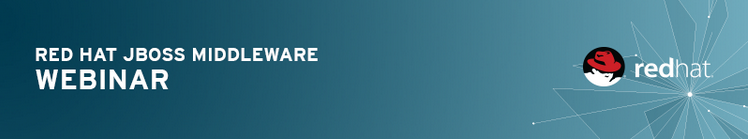
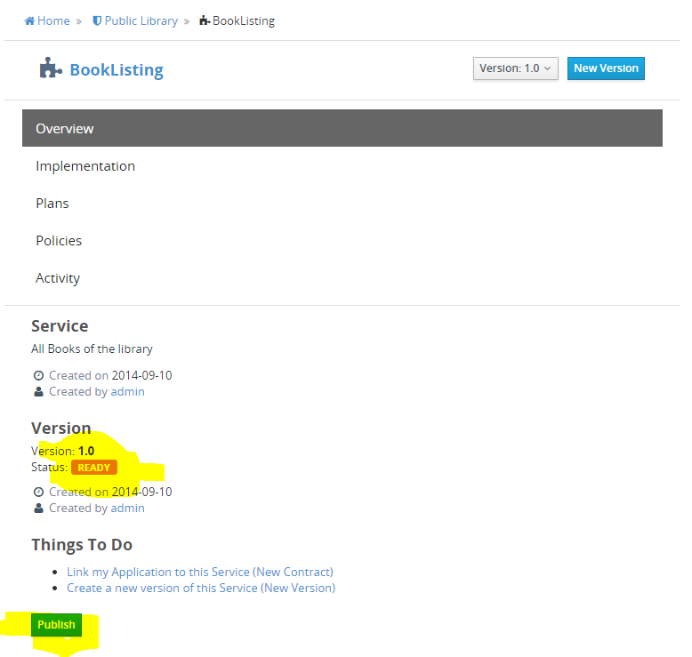
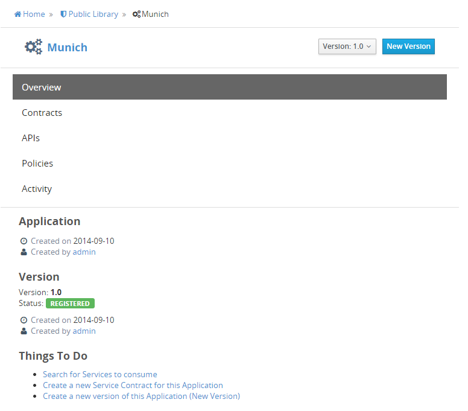
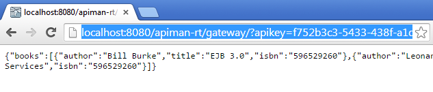

I gave a brief introduction about the Overlord project family yesterday. Today it's time to test-drive a bit. The API Management sub-project released a 1.0.0.Alpha1 two days ago and introduces the first set of features according to the <a href="https://developer.jboss.org/wiki/APIMan18-MonthRoadmap" target="_blank">18-Month roadmap</a>.
 
 <b>What is APIMan exactly?</b>
 
 It is an API management system which can either be embedded with existing frameworks or applications or even run as a separate system. So far, so good. But what is API Management and why should you care about it? Fact is, that today's applications grow in size and complexity and get distributed more widely. Add more consumers to the mix like mobile devices, TVs or the whole bunch of upcoming IoT devices and think about how you would implement access control or usage consistently over a whole bunch of applications. A nightmare candidate. But don't worry too much. This is where API Management comes in. APIMan provides a&nbsp;flexible, policy-based runtime governance for your APIs. It allows API providers to offers the same API through multiple plans, allowing different levels of service to different API consumers. Sounds complicated still? Let's give it a try.
 
 <b>The Library REST-Service</b>
 
 Imagine that a public library has a nice RESTful service which lists books. It's running somewhere and usually is not really access restricted. Now someone came up with the idea to build an amazing mobile app which can find out if a book is in the library or not. A next step should be to add the option to reserve a book for a couple of hours, which the old system really can't do for now. Instead of heavily tweaking the older version of the library applications we're going to use APIMan to provide a consistent API to the mobile application and let it manage the authentication for now. The API I'm using here is a simple resteasy example. You can use whatever web-service endpoint you have to play around with.
 
 <b>Getting Started on WildFly 8.1</b>
 
 The project can be built and deployed on a variety of runtime platforms, but if you want to see it in action as quickly as possible you just need to fork and clone the <a href="https://github.com/Governance/apiman" target="_blank">APIMan GitHub repository</a>&nbsp;and simply build it with Maven 3.x. If you use the "run-all-wildfly8" profile, you're ready to instantly test drive it, because it does not only build the project, but also downloads and configures latest WildFly 8.1 and finally starts it for you. It takes a while to build and then start up, so you'd better bring some patience.
 
 So, all you have to do to explore it is to fire up the admin console at&nbsp;http://localhost:8080/apiman-dt-ui/ and use one of the&nbsp;following users to log-in (the "!" is part of the password, btw):
 
<ul style="line-height: 0.6em;">
 <li>admin/admin123!</li>
 <li>bwayne/bwayne123!</li>
 <li>ckent/ckent123!</li>
 <li>dprince/dprince123!</li>
</ul>

 

 <b>Test-Driving The Quickstart</b>
 
 The documentation is a bit weak for now so I will give you a short walk through the console.
 
 Open the console and log-in with the admin user. Now you can "Create a new Organisation" let's call it "Public Library" for now. The newly created organization shows you some tabs (Applications, Services, Plans, Members). Switch to the services tab and click on the button "New Service". Enter "BookListing" as a name, leave the 1.0 as Version and you might give it a description for informational purpose.
 

 

 After you click the "Create Service" button you are redirected to the overview page. Switch to the "Implementation" and fill in the final API Endpoint. In my case this would be:http://localhost:9080/jaxb-json/resteasy/library/books/badger (note: it is deployed on a different WildFly instance) Click "Save" when you're done.
 
 

 

 If you switch back to the overview page, you see, that the service is in status "Created" and the Publish button is still grayed out. In order to reach this goal, we need to add some more information to APIMan. The next step is to add a so called Plan to the Organisation. Switch back to it and select the Plan tab and click the "New Plan" button. Plans basically allow to group individual policies and assign them to services. Call it "InternetBlackList" and create it by clicking the accompanying button. From the "Plan" overview select "Policies" and "Add Policy" by clicking the button. Define an "IP Blacklist Policy" and enter a potentially malicious IP address you don't want the service to be accessed by.
 
 

 

 
 To be able to publish our service, we need to link the newly created Plan to the BookListing service. Navigate back there and select the Plans tab. Select the "InternetBlackList" plan and click "Save". Reviewing the "Overview" page on the Service now finally shows the "Ready" state and let's us publish it.
 
 

 

 
 Now that it is published, we can actually use it. But we'll take one additional step here and link the service to an application via a contract. Creating a Contract allows you to connect an Application to a Service via a particular Plan offered by the Service. You would want to do this so that your Application can invoke the Service successfully.
 
 Create an application by navigating back to the Public Library Organization and clicking the "New App" button. Call it "Munich", leave the 1.0 as a version and enter a description if you like to; Click "Create Application". The one step left to do is to link the service and the application. This is done via a contract. Select the "Contracts" page and create a "New Contract" with the button. Enter "book" in the "Find a Service" field and search for our BookListing service. Select it. Now you can create the Contract.
 
 

 

 
 The last step is to register the newly created application in the "Overview" page.
 

 

 
 That was it. We now have a published service and a registered application. If you navigate to the API page of the application you can see the managed endpoints for the application. If you hover over the service, you get a "copy" button which let's you copy the URL of the managed endpoint funneled through the APIMan gateway.
 
 

 

 
 If you try to access the service through the specified BlackListed IP address, you will now get an error. If not, you get proxied to the service by the gateway.
 
 

 

 Notice the apikey query-string? This is the key with which the gateway locates your service and proxies your call to the managed endpoint. If you don't want to sent it as part of the query string you can also use a custom HTTP header called X-API-Key.
 
 <b>What's Next?</b>
 
 That was a very quick and incomplete walk through. But you hopefully got an idea about the basic concepts behind it. APIMan and the other Overlord sub-projects are evolving quickly. They are happy to <a href="http://www.projectoverlord.io/getinvolved/contribute.html" target="_blank">receive contributions</a> and if you like what you've seen or have other feedback, don't hesitate to get in touch with the project. If you want to see the more API like approach you can also watch and listen to the following screencast. It is a bit outdated, but still helpful.
 
 

 <iframe allowfullscreen frameborder="0" height="236" src="//www.youtube.com/embed/0rSTGyY-Qwc" width="420"></iframe>

