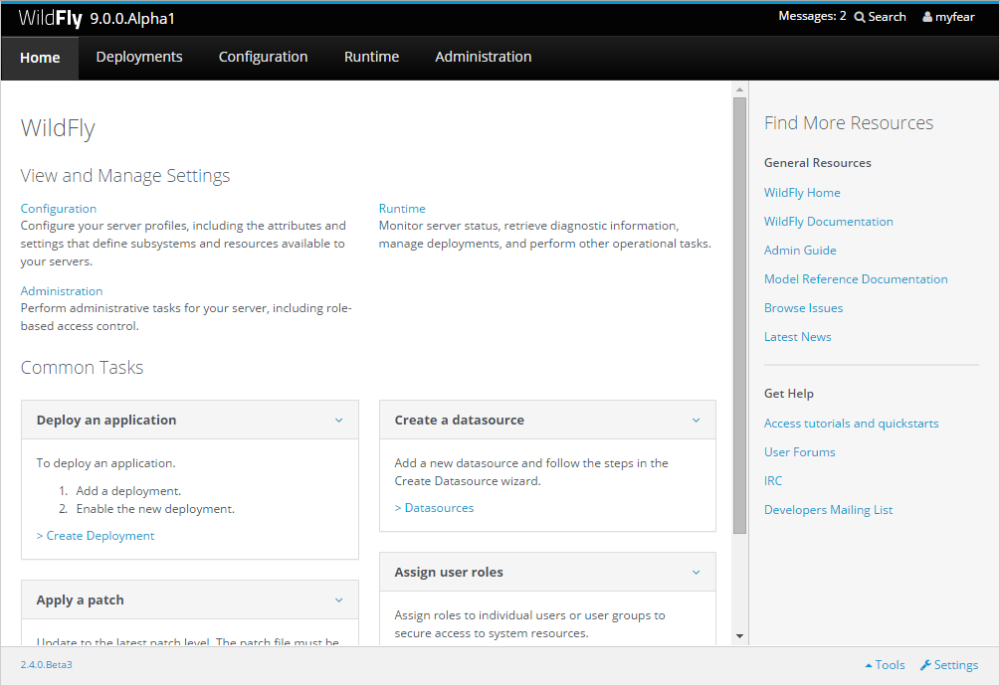

Everybody heard the news probably. The first WildFly 9.0.0.Alpha1 release came out Monday. You can <a href="" target="_blank">download it from the wildfly.org</a> website The biggest changes are that it is built by a new feature provisioning tool which is layered on the now separate core distribution and also contains a new <a href="https://repository.jboss.org/nexus/content/groups/developer/org/wildfly/wildfly-web-dist/9.0.0.Alpha1/wildfly-web-dist-9.0.0.Alpha1.zip" target="_blank">Servlet Distribution</a>&nbsp;(only a 25 MB ZIP)&nbsp;which is based on it. It is called "web lite" until there'll be a better name.
 
 The architecture now supports server suspend mode which is also known as graceful shutdown. For now only Undertow and EJB3 use this so far. Additional subsystems still need to be updated. The management APIs also got notification support. Overall <a href="https://issues.jboss.org/secure/ReleaseNote.jspa?projectId=12313721&amp;version=12324890" target="_blank">256 fixes and improvements</a> were included in this release. But let's put all the awesomeness aside for a second and talk about what this post should be about.
 
 <b>Administration Console</b>
 
 WildFly 9 got a brushed up admin console. After you downloaded, unzipped and started the server you only need to add a user (bin/add-user.sh/.bat) and point your browser to&nbsp;<a href="" target="_blank">http://localhost:9990/</a> to see it.
 

 

 
 With some minor UI tweaks this is looking pretty hot already. BUT there's another console out there called hawtio! And what is extremely hot is, that it already has some very first support for WildFly and EAP and here are the steps to make it work.
 
 <b>Get Hawtio!</b>
 
 You can use <a href="http://hawt.io/getstarted/index.html" target="_blank">hawtio</a> from a Chrome Extension or in many different containers - or outside a container in a stand alone executable jar. If you want to deploy hawtio as a console on WildFly make sure to look at the <a href="http://www.christianposta.com/blog/?p=403" target="_blank">complete how-to written by Christian Posta</a>. The easiest way is to just <a href="https://oss.sonatype.org/content/repositories/public/io/hawt/hawtio-app/1.4.19/hawtio-app-1.4.19.jar" target="_blank">download latest executable 1.4.19 jar</a>&nbsp;and start it on the command line:
 
<pre style="background-color: whitesmoke; border-bottom-left-radius: 4px; border-bottom-right-radius: 4px; border-top-left-radius: 4px; border-top-right-radius: 4px; border: 1px solid rgb(204, 204, 204); box-sizing: border-box; color: #333333; font-family: Menlo, Monaco, Consolas, 'Courier New', monospace; font-size: 13px; line-height: 1.42857143; margin-bottom: 10px; overflow: auto; padding: 9.5px; word-break: break-all; word-wrap: break-word;"><code style="background-color: transparent; border-bottom-left-radius: 0px; border-bottom-right-radius: 0px; border-top-left-radius: 0px; border-top-right-radius: 0px; box-sizing: border-box; color: inherit; font-family: Menlo, Monaco, Consolas, 'Courier New', monospace; font-size: inherit; padding: 0px; white-space: pre-wrap;">java -jar hawtio-app-1.4.19.jar --port 8090</code></pre> The port parameter lets you specify on which port you want the console to run. As I'm going to use it with WildFly which also uses the hawtio default port this is just directly using another free port.
 
 Next thing to do is to install the JMX to JSON bridge, on which hawtio relies to connect to remote processes. Instead of directly using JMX which is blocked on most networks anyway the <a href="" target="_blank">Jolokia </a>project bridges JMX MBeans to JSON and hawtio operates on them. Download latest <a href="http://jolokia.org/download.html" target="_blank">Jolokia WAR agent</a> and deploy it to WildFly. Now you're almost ready to go. Point your browser to the hawtio console (<a href="" target="_blank">http://localhost:8090/hawtio/</a>) and switch to the connect tab. Enter the following settings:
 

 

 And press the "Connect to remote server" button below. Until today there is not much to see here. Beside a very basic server information you have the deployment overview and the connector status page.
 

 

 But the good news is: Hawtio is open source and you can fork it from GitHub and add some more features to it. The WildFly/EAP console is in a <a href="https://github.com/hawtio/hawtio/tree/master/hawtio-web/src/main/webapp/app/jboss" target="_blank">hawtio-web subproject</a>. Make sure to check out the <a href="http://hawt.io/contributing/index.html" target="_blank">contributor guidelines</a>.