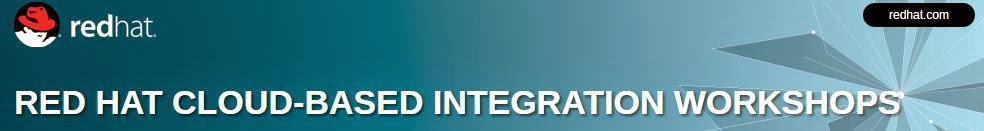

Attend Red Hat's complementary, hands-on technical workshop and experience Red Hat JBoss Fuse and OpenShift. Learn how middleware and cloud solutions bridge the theory with reality. Come and learn about <a href="" target="_blank">OpenShift</a>, <a href="" target="_blank">JBoss Fuse</a>, <a href="" target="_blank">Fabric8</a>&nbsp;and&nbsp;<a href="" target="_blank">HawtIO</a>, and how these technologies can help you implement a successful DevOps strategy with Automation, Continuous Delivery, and a deep understanding of your middleware. 
 
 

 

 
 After attending this FREE 1-day workshop you’ll be able to: 
 
<ul>
 <li>Learn how integration Platform-as-a-Service (iPaaS) connects on premise and cloud solutions, and reap the operational efficiencies that OpenShift brings combined with the messaging and routing/mediation/transformation of Red Hat JBoss Fuse.</li>
 <li>Work with hands-on labs based on real-world case studies led by experienced solution architects.</li>
 <li>Learn how to use open source integration and messaging software safely and securely in your enterprise.</li>
</ul><b>Locations:</b>
 
 October 22, 2014 – San Francisco
 
 October 23, 2014 – Los Angeles
 
 October 28, 2014 – Chicago
 
 October 29, 2014 – New York
 
 November 4, 2014 – Houston
 
 December 2, 2014 – Boston
 
 December 3, 2014 – Atlanta
 
 
 Please make sure to bring a laptop with a minimum of 2GB of RAM (4GB if using a virtual machine) and <a href="https://engage.redhat.com/jboss-fuse-for-xpaas-me-201409091054?sc_cid=70160000000e2nNAAQ" target="_blank">register at the official event website</a>.