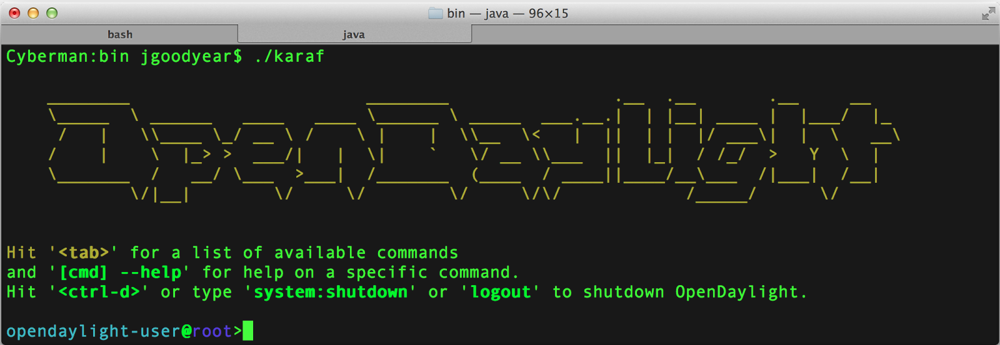

<i>This is a guest blog post by Jamie Goodyear (<a href="" target="_blank">blog</a>,&nbsp;<a href="https://twitter.com/icbts" target="_blank">@icbts</a>). He is an open source advocate, Apache developer, and computer systems analyst with <a href="" target="_blank">Savoir Technologies</a>; he has designed, critiqued, and supported architectures for large organizations worldwide. He holds a Bachelor of Science degree in Computer Science from Memorial University of Newfoundland.</i>
 <i> </i> <i>Jamie has worked in systems administration, software quality assurance, and senior software developer roles for businesses ranging from small start-ups to international corporations. He has attained committer status on Apache Karaf, ServiceMix, and Felix, Project Management Committee member on Apache Karaf, and is an Apache Software Foundation member. His first printed publication was co-authoring Instant OSGi Starter, Packt Publishing, with Johan Edstrom followed by Learning Apache Karaf, Packt Publishing, with Johan Edstrom and Heath Kesler. His third and latest publication is <a href="https://www.packtpub.com/application-development/apache-karaf-cookbook" target="_blank">Apache Karaf Cookbook</a>, Packt Publishing, with Johan Edstrom, Heath Kesler, and Achim Nierbeck.</i>
 
 
 I like Micro Service Architectures.
 
 
 There are many descriptions of what constitutes a micro service, and many specifications that could be described as following the pattern. In short, I tend to describe them as being the smallest unit of work that an application can do as a service for others. Bringing together these services we’re able to build larger architectures that are modular, light weight, and resilient to change.
 
 
 From the point of view of modern systems architecture the ability to provision small applications with full life cycle control is our idea platform. Operators need only deploy the services they need, updating them in place, spinning up additional instances as required. Another way of describing this is as Applications as a Service (AaaS). Take particular small services such as Apache Camel routes or Apache CXF endpoints and bring them up and down with out destroying the whole application. Apache Karaf IS the platform to do micro services.
 
 
 To make micro services easier, Karaf provides many helpful features right out of the box;
 
 
<ul>
 <li>A collection of well tested libraries and frameworks to help taken the guess work out of assembling a platform for your applications.</li>
 <li>Provisioning of libraries or applications via a variety of mechanisms such as Apache Maven.</li>
 <li>Feature descriptors to allow deployment of related services &amp; resources together.</li>
 <li>Console and web-based commands to help make fine grained control easy, and</li>
 <li>Simplified integration testing via Pax Exam.</li>
</ul>
 
 One of my favourite micro service patterns is to use Apache Camel with a Managed Service Factory (MSF) on Apache Karaf. Camel provides a simple DSL for wiring together Enterprise Integration Patterns, moving data from endpoint A to endpoint B as an example. A Managed Service Factory is an Modular Pattern for configuration driven deployments of your micro services - it ties together ConfigAdmin, the OSGi Service Registry, and our application code.
 
 

 

 For instance, a user could create a configuration to wire their Camel route, using a MSF, unique PIDs will be generated per a configuration. This pattern is truly powerful. Create 100 configurations, and 100 corresponding micro services (Camel routes) will be instantiated. Only one set of code however requires maintenance.
 
 
 Let’s take a close look at the implementation of the Managed Service Factory. The ManagedServiceFactory is responsible for managing instantiations (configurationPid), creating or updating values of instantiated services, and finally, cleaning up after service instantiations. Read more on the <a href="http://www.osgi.org/javadoc/r5/cmpn/org/osgi/service/cm/ManagedServiceFactory.html" target="_blank">ManagedServiceFactory API</a>.
 
 
<pre style="background-color: whitesmoke; border-bottom-left-radius: 4px; border-bottom-right-radius: 4px; border-top-left-radius: 4px; border-top-right-radius: 4px; border: 1px solid rgb(204, 204, 204); box-sizing: border-box; color: #333333; font-family: Menlo, Monaco, Consolas, 'Courier New', monospace; font-size: 13px; line-height: 1.42857143; margin-bottom: 10px; overflow: auto; padding: 9.5px; word-break: break-all; word-wrap: break-word;"><code style="background-color: transparent; border-bottom-left-radius: 0px; border-bottom-right-radius: 0px; border-top-left-radius: 0px; border-top-right-radius: 0px; box-sizing: border-box; color: inherit; font-family: Menlo, Monaco, Consolas, 'Courier New', monospace; font-size: inherit; padding: 0px; white-space: pre-wrap;">public class HelloFactory implements ManagedServiceFactory \{ @Override public String getName() \{ return configurationPid; \} @Override public void updated(String pid, Dictionary dict) throws ConfigurationException \{ // Create a dispatching engine for given configuration. \} @Override public void deleted(String pid) \{ // Delete corresponding dispatch engine for given configuration. \} //We wire in blueprint public void init() \{\} public void destroy() \{\} public void setConfigurationPid(String configurationPid) \{\} public void setBundleContext(BundleContext bContext) \{\} public void setCamelContext(CamelContext camelContext) \{\} \}</code></pre> 
 

 We override the given ManageServiceFactory interface to work with DispatchEngines. The DispatchEngine is a simple class that contains code for instantiating a Camel route using a given configuration.

 
<pre style="background-color: whitesmoke; border-bottom-left-radius: 4px; border-bottom-right-radius: 4px; border-top-left-radius: 4px; border-top-right-radius: 4px; border: 1px solid rgb(204, 204, 204); box-sizing: border-box; color: #333333; font-family: Menlo, Monaco, Consolas, 'Courier New', monospace; font-size: 13px; line-height: 1.42857143; margin-bottom: 10px; overflow: auto; padding: 9.5px; word-break: break-all; word-wrap: break-word;"><code style="background-color: transparent; border-bottom-left-radius: 0px; border-bottom-right-radius: 0px; border-top-left-radius: 0px; border-top-right-radius: 0px; box-sizing: border-box; color: inherit; font-family: Menlo, Monaco, Consolas, 'Courier New', monospace; font-size: inherit; padding: 0px; white-space: pre-wrap;">public class HelloDispatcher \{ public void start() \{ // Create routeBuilder using configuration, add to CamelContext. // Here ‘greeting’ and ‘name’ comes from configuration file. from(“timer://helloTimer?fixedRate=true&amp;period=1000"). routeId("Hello " + name). log(greeting + " " + name); \} public void stop() \{ // remove route from CamelContext. \} \}</code></pre>

  

 

 
 
 When we deploy these classes as a bundle into Karaf we obtain a particularly powerful Application as a Service. Each configuration we provision to the service instantiates a new Camel router (these configuration files quite simply consist of Greeting and Name). Camel’s Karaf commands allow for fine grained control over these routes, providing the operator with simple management.
 
 
 Complete code for the above example is available via <a href="https://github.com/jgoodyear/ApacheKarafCookbook/tree/master/chapter2/chapter2-recipe6" target="_blank">github</a>, and is explored in detail in Packt Publishing’s <a href="https://www.packtpub.com/application-development/apache-karaf-cookbook" target="_blank">Apache Karaf Cookbook</a>.
 
 
 Micro Service Architectures such as above unleash the power of OSGi for common applications such as a Camel route or CXF endpoint. These are not the only applications which benefit however. I’d like to share one of our Karaf success stories that highlights how Apache Karaf helped bring structure to an existing large scale micro service based project.
 
 
 Imagine having hundreds of bundles distributed over dozens of interconnected projects essentially being deployed in a plain OSGi core and left to best luck to successfully boot properly. This is the situation that OpenDaylight, a platform for SDN and NFV, found themselves in a few months ago.
 
 

 

 
 Using Karaf Feature descriptors each project was able to organize their dependencies, bundles, and other resources into coherent structures. Custom commands were developed to interact with their core services. Integration testing of each project into the project’s whole were automated. Finally all of these projects have been integrated into their own custom distribution.
 
 
 Their first Karaf-based release, Helium, is due out very soon. We’re all looking forward to welcoming the SDN &amp; NFV community to Karaf.
 
 
 While Apache Karaf 3.0.x line is maintained as our primary production target, the community has been busy as ever developing the next generation of Karaf containers.
 
 
 The 4.0.x line will ship with OSGi Rev5 support via Felix 4.4.1 and Equinox 3.9.1-v20140110-1610, and a completely refactored internal framework based on Declarative Services instead of Blueprint. From a users point of view these changes will yield a smaller, more efficient Karaf core. There will be a Blueprint feature present in Karaf so that you can easily install Blueprint based applications. You will always be capable of using Blueprint in Karaf. So the main difference from a user perspective is that you’d need to depend on the Blueprint service if you need it. 
 
 
 This has been a very brief overview of Micro Service Architectures on Apache Karaf, and Karaf’s future direction. I’d suggest anyone interested in Micro Services to visit the <a href="http://www.osgi.org/Main/HomePage" target="_blank">OSGi Alliance website</a>, and join <a href="" target="_blank">Apache Karaf community</a>. For those whom whom would like to dive into an advanced custom Karaf distribution have a look into <a href="https://github.com/savoirtech/aetos" target="_blank">Aetos</a>. Apache Karaf is also part of <a href="" target="_blank">JBoss Fuse</a>.