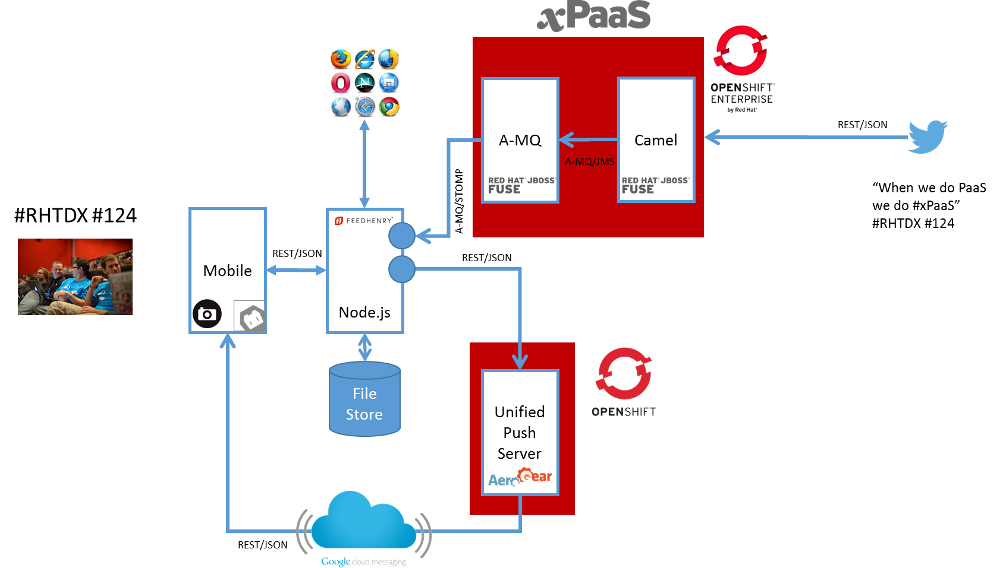

If everything went fine, I just got off the stage and ended the demo part of Mike's (@mpiech) demo. <a href="http://blog.eisele.net/2014/08/everything-developers-need-to-know-about-redhat-xpaas.html" target="_blank">We talked a lot about xPaaS</a>. The different pieces of the puzzle that we integrated and about our newest acquisition FeedHenry. I think, that all this is worth a more detailed blog post about the inner workings of the demo.
 
 <b>Background</b>
 
 RedHat released a new version of <a href="http://www.redhat.com/en/about/press-releases/red-hat-launches-new-release-openshift-enterprise-and-adds-private-ipaas" target="_blank">OpenShift Enterprise 2.2</a> on the 10/10/14. This version also adds support for the private integration solutions (iPaaS) Fuse. Beside this, we recently acquired <a href="http://blog.eisele.net/2014/09/red-hat-to-acquire-feedhenry.html" target="_blank">FeedHenry</a> (mPaaS) and it was about time to show how those technologies actually integrate and help customers build solutions for tomorrows applications. I've been using the following overview in my latest talks to outline what a decent integration with all the different PaaS platforms might look like.
 
<table align="center" cellpadding="0" cellspacing="0" class="tr-caption-container" style="margin-left: auto; margin-right: auto; text-align: center;">
 <tbody>
  <tr>
   <td style="text-align: center;"></td>
  </tr>
  <tr>
   <td class="tr-caption" style="text-align: center;">Architecting large Enterprise Java Applications (<a href="http://www.slideshare.net/myfear/architecting-large-enterprise-java-projects" target="_blank">Slideshare</a>)</td>
  </tr>
 </tbody>
</table> On a very high level it contains exactly the parts and setup we used for today's demo. Which is the following:
 

 

 
 I have to admit that it is far more complicated, than what we came up with in the demo on stage, but let's not complain and get over the different parts in more details.
 
 <b>Mobile App</b>
 
 The mobile part of the demo was build using Cordova this is very well supported by FeedHenry, from their application console you can create builds for iOS and Android, but also easily test it locally. We used the&nbsp;FeedHenry&nbsp;client side javascript library which beside many other things allows us to generate statistics for the application management&nbsp;console, this can be very helpful when you have a production issue and try to diagnose the problem, for instance. Using Cordova together with Node is really nice, no need to switch paradigms and you can rapidly try out new ideas.
 
 <b>FeedHenry Mobile Application Platform</b>
 
 FeedHenry is a cloud-based mobile application platform to design, develop, deploy and mobile applications. The platform provides specific services for security, notification and data synchronization. You can build hybrid apps for mobile devices and it covers the complete development lifecycle. You can think of it as an Xcode IDE in the cloud which has three different components for applications. Obviously the mobile app, a server backend which you can built on top of Node.js and so-called mPaaS services which can be re-used across different applications. The interesting part of the demo are the two services.
 
 One which connects to JBoss A-MQ for xPaaS running on OSE via TCP/STOMP protocol and the other one connecting to an AeroGear unified Push Server instance running on OpenShift Online via REST.
 
 The new AeroGear MBaaS Integration Services leverages the &nbsp;Node.js module already developed by the AeroGear team and provides a simple, secure way to integrate Push Notifications into your FeedHenry apps. The service itself is quick and painless to set up – simply provide the details of your AeroGear installation and credentials for the AeroGear app you want to use and you are ready to go. Using the service is just as easy – as a standard FeedHenry MBaaS service, you can call it in exactly the same way as you would any other MBaaS service – with a clean, crisp FeedHenry API call.
 
 <b>AeroGear UnifiedPush Server on Openshift Online</b>
 
 The AeroGear project is a one stop solution for all your Push Notification needs – covering Native iOS &amp; Android, Cordova Hybrid as well as Simple Push for Web. It is available to use right now from the <a href="https://marketplace.openshift.com/apps/9907#!overview" target="_blank">OpenShift Marketplace</a> – so feel free to give it a whirl.
 
 <b>JBoss Fuse and A-MQ for xPaaS on OpenShift Enterprise</b>
 

 

 JBoss Fuse for xPaaS and JBoss A-MQ for xPaaS are based on Red Hat’s traditional on-premise integration and messaging offerings, Red Hat JBoss Fuse and Red Hat JBoss A-MQ. The latest versions of both products, announced at Red Hat Summit 2014, introduced features such as full support for AMQP 1.0, a vast library of connectors, improved high availability, and the ability to manage processes. In this particular example both instances running are managed via the Fuse Fabric. And the deployment of the Camel route to receive the twitter stream of tweets actually was done via a profile on the fabric. Distributing those applications and infrastructures gets insanely easy by doing it like that.
 
 At the end, the Camel rout isn't very magical. Just a few lines of code for a log and a little conversion to JSON to make it easier for the FeedHenry A-MQ endpoint to consume it on the Node.js end. This screenshot was taken before the demo happened, I hope that we have some higher numbers after the keynote.
 
 The A-MQ side is even more simple. A basic standalone broker setup with just one queue called "tweets" like you already might have guessed. We are using two different client connectors. The Camel instance pushes messages via OpenWire and the FeedHenry service listens to them using STOMP. We're actually not sending around binary content here, so this was the easiest setup.
 
 To be clear at this point: The Twitter integration is a nice showcase which we used to have a contact point with the audience. In real life scenarios you're going to connect heavyweight stuff with Fuse. Like SAP, Oracle EBS, you name them. 
 
 <b>Takeaway</b>
 
 The beauty of this is the overly complex architecture. We could have taken many shorter ways to make it work, but on the other hand, it was a very good exercise. In less than two weeks the RedHat and FeedHenry teams made both technical integrations possible. And we are very proud to have integrated this first chunk of services and help to better understand for what the different products are meant to be used.
 
 <b>My Thank You's</b>
 
 Even if I had the pleasure to be on stage for the demo, I only did the very simple backend part. There are a bunch of folks, I'd like to mention here:
 
 - John Frizelle and Conor O'Neill for being our 24/7 contact into FeedHenry. There's not a single thing those two couldn't solve.
 
 - Jay Balunas, Erik-Jan De Wit, Sebastien Blanc and Matthias Wessendorf for developing the mobile bit's and pieces and writing the Node.js service that we now have available in FeedHenry
 
 - Ben Parees, Grant Shipley, Marek Jelen, Hiram Chirino for all their efforts aroun OpenShift Online AND the Enterprise deployment that we used for the demo
 
 - Mike and Arun for all their support around the demo and their patience because we didn't have it ready until the very last minute.
 
 - Christian Posta for holding my hand with all kinds of stupid Fuse questions
 
 <b>Further Readings</b>
 
 If you are curious, you can just get started with reading some more about what we did. Please keep in mind, that the acquisition is quite new and we still don't have a publicly available version of FeedHenry ready for you to play with. But this is in the works. Keep your eyes open.
 
<ul>
 <li><a href="" target="_blank">FeedHenry and Red Hat Pushing ahead with Integrations</a></li>
 <li><a href="http://www.redhat.com/en/about/press-releases/red-hat-launches-new-release-openshift-enterprise-and-adds-private-ipaas" target="_blank">New JBoss xPaaS offerings help developers integrate SaaS, PaaS, and on-premise applications</a></li>
 <li><a href="http://aerogear.org/news/2014/11/11/aerogear-feedhenry-integration/index.html" target="_blank">FeedHenry meets AeroGear UnifiedPush Server!</a></li>
</ul>