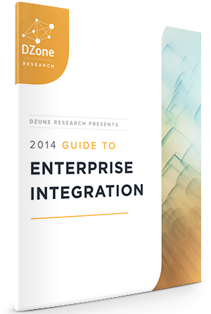

 

 DZone made it again. Another one of their famous guides got published yesterday. This time it is all about Enterprise Integration. It contains articles by industry experts and the complete result from a survey of over 500 practitioners and developers which is probably the most interesting part. So, looking at the distribution of the different integration solutions:
 
 
 "Out of all integration frameworks (EIP), ESBs, and
 
 integration suites, Spring Integration is the most popular (42%) and <b>Apache Camel is a close second (38%)</b>. [...]
 
 Overall, 63% of respondents use an integration framework (e.g. Spring Integration, Camel) and 53% use an ESB or Integration Suite (e.g. Mule ESB, Biztalk), while 18% say they use neither. Note that 69% of respondents are from large organizations, where bigger integration scenarios would be more common."
 
 (Source: <a href="http://dzone.com/research/guide-to-enterprise-integration" target="_blank">DZone 2014 Guide to EI</a>)
 
 
 There is still some way to go to make Apache Camel and the JBoss Fuse offerings even more attractive to users, but we are listening and I would be happy to hear what you need or would like us to do to further foster adoption of the integration bits (either upstream or productized). Reach out to me via email or in comments to this blog post.
 
 
 Find a brief introduction to Fuse by Sameer Parulkar (<a href="https://twitter.com/sparulkar" target="_blank">@sparulkar</a>) on page 21. And I nearly forgot to mention, that I had the pleasure to contribute an article about "The Future of Developing &amp; Integrating Applications" which can be found on page 22. Here is a short teaser:
 
 
 "Think about how far software development has come in just the past five years. It’s hard to believe &nbsp;that there was a time when generations of developers spent months or years setting up infrastructures
 
 and integrating different applications and backends with each other."
 
 (Source:&nbsp;<a href="http://dzone.com/research/guide-to-enterprise-integration" target="_blank">DZone 2014 Guide to EI</a>)
 
 <a href="http://dzone.com/research/guide-to-enterprise-integration" target="_blank">Get your version for free today!</a>