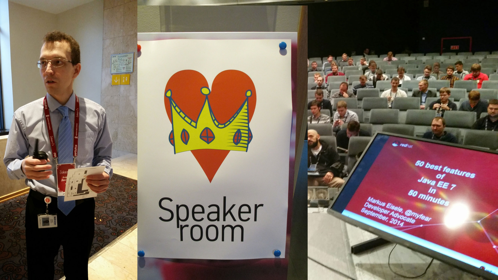

 

 I am traveling a lot lately and catching up with the trip reports is not easy. One of my favorite trips lately was my visit in St. Petersburg, Russia for <a href="" target="_blank">Jokerconf</a>. It is one of the most technical and Java centered conferences I've seen in a while. The session schedule is an endless list of high quality speakers and topics. Given that, I was honored to present about Java EE and JavaScript while the organizers try to cover even more topics and platforms in the Java space.
 
 The biggest challenge was probably the preparation in this case. I had to get a visa and prepare for travel into a country which language isn't exactly near my own or even English. But the organizers did an amazing job and supported their international speakers. A big thank you for that, because without it it probably wouldn't have happened at all.
 
 <b>The Venue</b>
 
 It is held in the Raddisson Park In Hotel which is a very large hotel roughly 4 km away from the airport. It's no surprise that it has a full blown conference venue build into it and there was everything you could wish for. The room sizes ranged from normal to the very large theater like keynote room.
 
 

 

 <b>My Sessions</b>
 
 I gave two presentations about the "<a href="https://speakerdeck.com/myfear/50-best-features-of-java-ee-7-at-jokerconf" target="_blank">Best Features of Java EE 7</a>" and "<a href="https://speakerdeck.com/myfear/javascript-in-the-enterprise-at-jokerconf" target="_blank">JavaScript in the Enterprise</a>". Both very well attended and I got some questions afterwards. Find the slides for the sessions on my speakerdeck account. I am very much looking forward to attend next years version.
 
 <b>Pictures</b>
 
 I tried to capture some impressions from the conference in a <a href="https://plus.google.com/100362024804331957185/posts/VSaQc8QQ57p">Google Plus story</a>. There is also a <a href="https://plus.google.com/photos/100362024804331957185/albums/6072905704620994833" target="_blank">JokerConf album</a> on Google Plus if you want to get even more. It was fun to bring some WildFly, Java EE and JBoss to Russia! Thank you for having me!
 
 

 

 