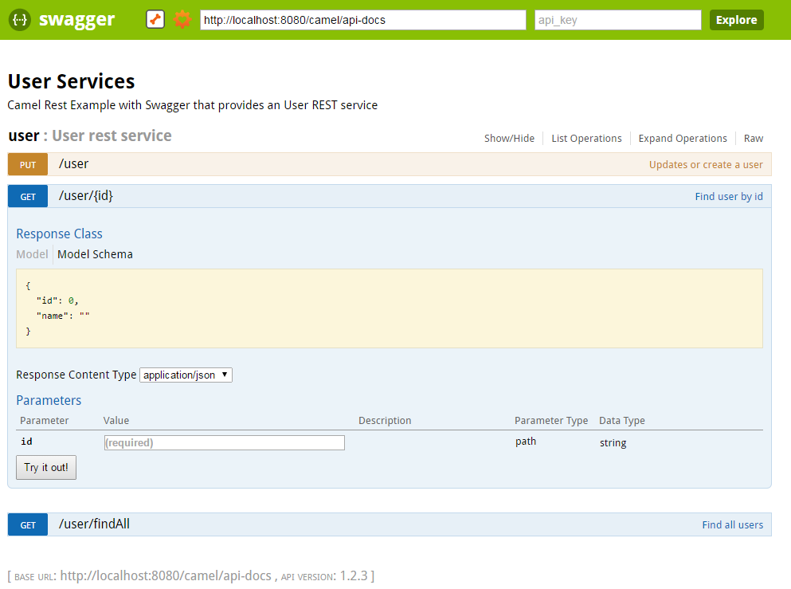

 

 Camel comes with a bunch of features out of the box. One of them is the Swagger integration. Unfortunately, most of the already-there features heavily rely on Spring. But this should not stop us from using them in plain Java EE 7 applications, because it sometimes is just the more lightweight variant of doing things. But I don't want to start a discussion about this again. Instead, I think that there is a technology choice for all situations and if you run across a project you just want to use Camel with Java EE 7 and you need REST services and want to document them with Swagger, this is the right post for you.
 
 <b>Bootstrapping Camel in EE 7</b>
 
 The first thing you need, is to bootstrap Camel in a singleton startup bean. I already wrote an <a href="http://blog.eisele.net/2014/08/bootstrapping-apache-camel-in-java-ee7.html" target="_blank">article, about how to do this</a>. The other option is to actually use the <a href="http://blog.eisele.net/2014/12/wildfly-camel-subsystem-for-wildfly-integrates-javaee-getting-started.html" target="_blank">wildfly-camel subsystem</a> which is also available, but this requires you to be on JBoss WildFly 8.x.
 
 <b>Swagger And Camel Rest Dependencies</b>
 
 The Swagger integration in Camel as of today is supported for Spring applications only. So, to make this work, we do have to implement a bit and configure a bit more than usual. But I promise, that it is not too complicated and done in a minute. Let's start:
 
 First thing to add to the basic Camel EE 7 example are the additional dependencies for camel:
 
<pre style="background-color: whitesmoke; border-radius: 4px; border: 1px solid rgb(204, 204, 204); box-sizing: border-box; color: #333333; font-family: Menlo, Monaco, Consolas, 'Courier New', monospace; font-size: 13px; line-height: 1.42857143; margin-bottom: 10px; overflow: auto; padding: 9.5px; word-break: break-all; word-wrap: break-word;"><code style="background-color: transparent; border-radius: 0px; box-sizing: border-box; color: inherit; font-family: Menlo, Monaco, Consolas, 'Courier New', monospace; font-size: inherit; padding: 0px; white-space: pre-wrap;"> &nbsp; &lt;dependency&gt; &nbsp; &nbsp; &nbsp; &nbsp; &nbsp; &nbsp; &lt;groupId&gt;org.apache.camel&lt;/groupId&gt; &nbsp; &nbsp; &nbsp; &nbsp; &nbsp; &nbsp; &lt;artifactId&gt;camel-servlet&lt;/artifactId&gt; &nbsp; &nbsp; &nbsp; &nbsp; &lt;/dependency&gt; &nbsp; &nbsp; &nbsp; &nbsp; &lt;dependency&gt; &nbsp; &nbsp; &nbsp; &nbsp; &nbsp; &nbsp; &lt;groupId&gt;org.apache.camel&lt;/groupId&gt; &nbsp; &nbsp; &nbsp; &nbsp; &nbsp; &nbsp; &lt;artifactId&gt;camel-metrics&lt;/artifactId&gt; &nbsp; &nbsp; &nbsp; &nbsp; &lt;/dependency&gt; &nbsp; &nbsp; &nbsp; &nbsp; &lt;dependency&gt; &nbsp; &nbsp; &nbsp; &nbsp; &nbsp; &nbsp; &lt;groupId&gt;org.apache.camel&lt;/groupId&gt; &nbsp; &nbsp; &nbsp; &nbsp; &nbsp; &nbsp; &lt;artifactId&gt;camel-swagger&lt;/artifactId&gt; &nbsp; &nbsp; &nbsp; &nbsp; &lt;/dependency&gt; &nbsp; &nbsp; &nbsp; &nbsp; &lt;dependency&gt; &nbsp; &nbsp; &nbsp; &nbsp; &nbsp; &nbsp; &lt;groupId&gt;org.apache.camel&lt;/groupId&gt; &nbsp; &nbsp; &nbsp; &nbsp; &nbsp; &nbsp; &lt;artifactId&gt;camel-jackson&lt;/artifactId&gt; &nbsp; &nbsp; &nbsp; &nbsp; &lt;/dependency&gt; </code></pre><b>Returning The Camel Context For Swagger</b>
 
 If we can't use what is there, we need to implement our own CdiRestSwagger-Camel context lookup. There are some things cooking for <a href="https://issues.apache.org/jira/browse/CAMEL-8161" target="_blank">upcoming Camel</a> versions, but for now we have to do it on our own. Which is surprisingly simple, because we need to overwrite one method of the &nbsp;RestSwaggerApiDeclarationServlet. And this does nothing else than simply return the injected CdiCamelContext.
 
<pre style="background-color: whitesmoke; border-radius: 4px; border: 1px solid rgb(204, 204, 204); box-sizing: border-box; color: #333333; font-family: Menlo, Monaco, Consolas, 'Courier New', monospace; font-size: 13px; line-height: 1.42857143; margin-bottom: 10px; overflow: auto; padding: 9.5px; word-break: break-all; word-wrap: break-word;"><code style="background-color: transparent; border-radius: 0px; box-sizing: border-box; color: inherit; font-family: Menlo, Monaco, Consolas, 'Courier New', monospace; font-size: inherit; padding: 0px; white-space: pre-wrap;"> public class CdiRestSwaggerApiDeclarationServlet extends RestSwaggerApiDeclarationServlet \{ &nbsp; &nbsp; @Inject &nbsp; &nbsp; CdiCamelContext context; &nbsp; &nbsp; @Override &nbsp; &nbsp; public CamelContext lookupCamelContext(ServletConfig config) \{ &nbsp; &nbsp; &nbsp; &nbsp; return context; &nbsp; &nbsp; \} \} </code></pre><b>Some Further Configuration</b>
 
 We're not done yet. You still have some more configuration to do. As Camel is designed to run in many different environments and there is no specific Java EE 7 version, it still rely on web.xml configuration for the mapping servlets. Please pay extra attention to the CdiRestSwaggerApiDeclarationServlet init-parameters. In this simple example, I did not bother with finding them out, but still rely on them. So, depending on the final name of your application that you set in the Maven build, this needs to be tweaked.
 
<pre style="background-color: whitesmoke; border-radius: 4px; border: 1px solid rgb(204, 204, 204); box-sizing: border-box; color: #333333; font-family: Menlo, Monaco, Consolas, 'Courier New', monospace; font-size: 13px; line-height: 1.42857143; margin-bottom: 10px; overflow: auto; padding: 9.5px; word-break: break-all; word-wrap: break-word;"><code style="background-color: transparent; border-radius: 0px; box-sizing: border-box; color: inherit; font-family: Menlo, Monaco, Consolas, 'Courier New', monospace; font-size: inherit; padding: 0px; white-space: pre-wrap;"> &nbsp;&lt;context-param&gt; &nbsp; &nbsp; &nbsp; &nbsp; &lt;param-name&gt;contextConfigLocation&lt;/param-name&gt; &nbsp; &nbsp; &nbsp; &nbsp; &lt;!-- to use Java DSL --&gt; &nbsp; &nbsp; &nbsp; &nbsp; &lt;param-value&gt;classpath:camel-config.xml&lt;/param-value&gt; &nbsp;&lt;/context-param&gt; &nbsp; &nbsp; &lt;!-- to setup Camel Servlet --&gt; &nbsp; &nbsp; &lt;servlet&gt; &nbsp; &nbsp; &nbsp; &lt;display-name&gt;Camel Http Transport Servlet&lt;/display-name&gt; &nbsp; &nbsp; &nbsp; &nbsp; &lt;servlet-name&gt;CamelServlet&lt;/servlet-name&gt; &nbsp; &nbsp; &nbsp; &nbsp; &lt;servlet-class&gt;org.apache.camel.component.servlet.CamelHttpTransportServlet&lt;load-on-startup&gt;1&lt;/load-on-startup&gt; &nbsp; &nbsp; &lt;/servlet&gt; &nbsp; &nbsp; &lt;!-- to setup Camel Swagger api servlet --&gt; &nbsp; &nbsp; &lt;servlet&gt; &nbsp; &nbsp; &nbsp; &nbsp; &lt;!-- we are using our own swagger-cdi binding servlet --&gt; &nbsp; &nbsp; &nbsp; &nbsp; &lt;servlet-class&gt;org.apache.camel.component.swagger.CdiRestSwaggerApiDeclarationServlet &nbsp; &nbsp; &nbsp; &nbsp; &lt;init-param&gt; &nbsp; &nbsp; &nbsp; &nbsp; &nbsp; &nbsp; &lt;param-name&gt;base.path&lt;/param-name&gt; &nbsp; &nbsp; &nbsp; &nbsp; &nbsp; &nbsp; &lt;param-value&gt;http://localhost:8080/camel/rest&lt;/param-value&gt; &nbsp; &nbsp; &nbsp; &nbsp; &lt;/init-param&gt; &nbsp; &nbsp; &nbsp; &nbsp; &lt;init-param&gt; &nbsp; &nbsp; &nbsp; &nbsp; &nbsp; &nbsp; &lt;param-name&gt;api.path&lt;/param-name&gt; &nbsp; &nbsp; &nbsp; &nbsp; &nbsp; &nbsp; &lt;param-value&gt; http://localhost:8080/camel/api-docs &lt;/param-value&gt; &nbsp; &nbsp; &nbsp; &nbsp; &lt;/init-param&gt; &nbsp; &nbsp; &nbsp; &nbsp; &lt;init-param&gt; &nbsp; &nbsp; &nbsp; &nbsp; &nbsp; &nbsp; &lt;param-name&gt;api.version&lt;/param-name&gt; &nbsp; &nbsp; &nbsp; &nbsp; &nbsp; &nbsp; &lt;param-value&gt;1.2.3&lt;/param-value&gt; &nbsp; &nbsp; &nbsp; &nbsp; &lt;/init-param&gt; &nbsp; &nbsp; &nbsp; &nbsp; &lt;init-param&gt; &nbsp; &nbsp; &nbsp; &nbsp; &nbsp; &nbsp; &lt;param-name&gt;api.title&lt;/param-name&gt; &nbsp; &nbsp; &nbsp; &nbsp; &nbsp; &nbsp; &lt;param-value&gt;User Services&lt;/param-value&gt; &nbsp; &nbsp; &nbsp; &nbsp; &lt;/init-param&gt; &nbsp; &nbsp; &nbsp; &nbsp; &lt;init-param&gt; &nbsp; &nbsp; &nbsp; &nbsp; &nbsp; &nbsp; &lt;param-name&gt;api.description&lt;/param-name&gt; &nbsp; &nbsp; &nbsp; &nbsp; &nbsp; &nbsp; &lt;param-value&gt;Camel Rest Example with Swagger that provides an User REST service&lt;/param-value&gt; &nbsp; &nbsp; &nbsp; &nbsp; &lt;/init-param&gt; &nbsp; &nbsp; &nbsp; &nbsp; &lt;load-on-startup&gt;2&lt;/load-on-startup&gt; &nbsp; &nbsp; &lt;/servlet&gt; &nbsp; &nbsp; &lt;!-- swagger api declaration --&gt; &nbsp; &nbsp; &lt;servlet-mapping&gt; &nbsp; &nbsp; &nbsp; &nbsp; &lt;servlet-name&gt;ApiDeclarationServlet&lt;/servlet-name&gt; &nbsp; &nbsp; &nbsp; &nbsp; &lt;url-pattern&gt;/api-docs/*&lt;/url-pattern&gt; &nbsp; &nbsp; &lt;/servlet-mapping&gt; &nbsp; &nbsp; &lt;!-- define that url path for the Camel Servlet to use --&gt; &nbsp; &nbsp; &lt;servlet-mapping&gt; &nbsp; &nbsp; &nbsp; &nbsp; &lt;servlet-name&gt;CamelServlet&lt;/servlet-name&gt; &nbsp; &nbsp; &nbsp; &nbsp; &lt;url-pattern&gt;/rest/*&lt;/url-pattern&gt; &nbsp; &nbsp; &lt;/servlet-mapping&gt; &nbsp; &nbsp; &lt;!-- enable CORS filter so people can use swagger ui to browse and test the apis --&gt; &nbsp; &nbsp; &lt;filter&gt; &nbsp; &nbsp; &nbsp; &nbsp; &lt;filter-name&gt;RestSwaggerCorsFilter&lt;/filter-name&gt; &nbsp; &nbsp; &nbsp; &nbsp; &lt;filter-class&gt;org.apache.camel.component.swagger.RestSwaggerCorsFilter&lt;/filter-class&gt; &nbsp; &nbsp; &lt;/filter&gt; &nbsp; &nbsp; &lt;filter-mapping&gt; &nbsp; &nbsp; &nbsp; &nbsp; &lt;filter-name&gt;RestSwaggerCorsFilter&lt;/filter-name&gt; &nbsp; &nbsp; &nbsp; &nbsp; &lt;url-pattern&gt;/api-docs/*&lt;/url-pattern&gt; &nbsp; &nbsp; &nbsp; &nbsp; &lt;url-pattern&gt;/rest/*&lt;/url-pattern&gt; &nbsp; &nbsp; &lt;/filter-mapping&gt; </code></pre><b>Enough Configuration - To The Logic!</b>
 
 When you're done with that, you need some logic. The example I'm using here was taken from the official Camel examples and is called <a href="https://github.com/apache/camel/tree/master/examples/camel-example-servlet-rest-tomcat" target="_blank">camel-example-servlet-rest-tomcat</a>. Please note, that this example contains both, a XML DSL based definition and the Java DSL based definition of the rest-service. I only used the Java DSL and specifically the route defined in the <a href="https://github.com/apache/camel/blob/master/examples/camel-example-servlet-rest-tomcat/src/main/java/org/apache/camel/example/rest/UserRouteBuilder.java" target="_blank">UserRouteBuilder</a> class.
 
 Make sure to add a @Named annotation to the UserService and the User and add the route from the UserRouteBuilder to your startup bean.
 
<pre style="background-color: whitesmoke; border-radius: 4px; border: 1px solid rgb(204, 204, 204); box-sizing: border-box; color: #333333; font-family: Menlo, Monaco, Consolas, 'Courier New', monospace; font-size: 13px; line-height: 1.42857143; margin-bottom: 10px; overflow: auto; padding: 9.5px; word-break: break-all; word-wrap: break-word;"><code style="background-color: transparent; border-radius: 0px; box-sizing: border-box; color: inherit; font-family: Menlo, Monaco, Consolas, 'Courier New', monospace; font-size: inherit; padding: 0px; white-space: pre-wrap;"> &nbsp; &nbsp;context.addRoutes(new UserRouteBuilder()); </code></pre> That is it. Now you can browser your API by accessing&nbsp;http://localhost:8080/camel/api-docs. If you want to use the Swagger UI you have to add it to your application. The example application contains everything in the build section, that is needed to do this. So, have a look at the <a href="https://github.com/myfear/CamelEE7RestSwagger" target="_blank">complete GitHub project</a> to find out how to browse the API with the Swagger UI.
 

  

