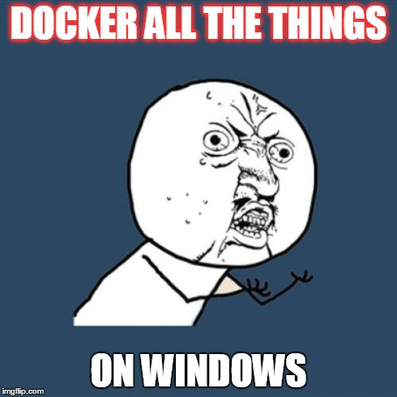
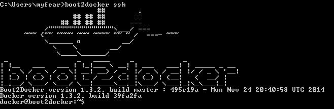
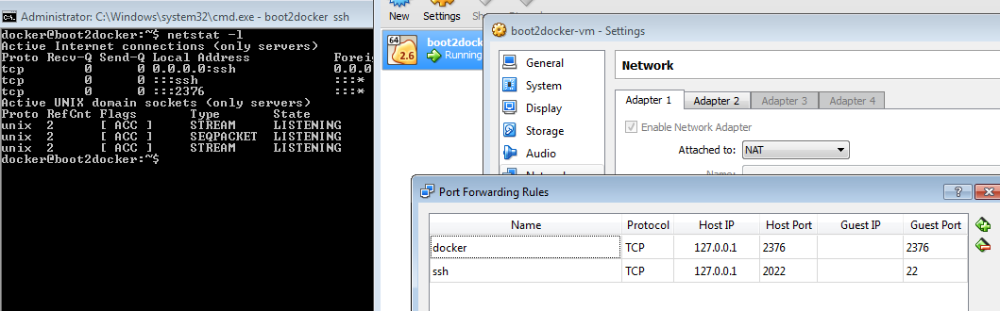

 

 Everybody seems to do Docker these days. And the whole topic gets even more attraction with Microsoft committed to integrate it into Windows. As many middleware developers are running Windows, I thought I give it a try myself and also give some more tips along the way about how to build and run images with the least possible amount of struggle with Docker containers, hosts and guests and command line options. Arun did a very nice <a href="" target="_blank">introduction to Docker</a> on a recent blog-post. I'm skipping this here and directly dive into it.
 
 <b>Installing Boot2Docker</b>
 
 The Docker Engine uses Linux-specific kernel features, so to run it on Windows we need to use a lightweight virtual machine. There is a helper application called <a href="https://github.com/boot2docker/boot2docker" target="_blank">Boot2Docker</a> which makes installing and running everything pretty straight forward. The first step is to download the latest version of the <a href="https://github.com/boot2docker/windows-installer/releases/latest" target="_blank">binary installer</a> and execute it. It will install Oracle <a href="" target="_blank">VirtualBox</a>, <a href="" target="_blank">MSYS-git</a>, the boot2docker Linux ISO, and the Boot2Docker management tool. Next stept is to run the Boot2Docker start script (there's a little whale icon on your desktop after the install). It will setup the Docker host and connect via ssh to the host. If you want to do that again at a later state, you can simply type: boot2docker ssh.
 
 

 

 
 There is no Docker client for Windows based systems for now. So, ssh basically is a workaround which works pretty good and is probably also a well known way. With Microsoft's recently announced new partnership with Docker, this might change soonish. If you want to build your own Docker client, you find some more information in <a href="" target="_blank">Khalid Mouss' blog post</a> about it.
 
 Some tips for you. You need to have the %MSYS-git_INSTALL%/bin directory in your PATH. It contains a &nbsp;cmd line ssh client. If you want to use PUTTY make sure to connect to the Docker host using user "root" and password "tcuser".
 
 If you are running any kind of VPN client, you will absolutely run into trouble. Docker normally runs in Host-only mode and and installed VPN client turns this into NAT. Go to the VirtualBox management console and open the settings for the boot2docker-vm and add a port forwarding rule for the Docker API. We will need this later.
 
 

 

 
 A little warning: The default Docker API port is 2375. In my case this wasn't true, so I had to first find out which port the Docker API is listening on. Do this with netstat on your host. So, I basically used a direct guest to host mapping on 2376 in this example. All done. Now you're ready to launch the hello world example. Just type "docker run hello-world" and wait for a "Hello from Docker.". Now you're good to go.
 
 If you need a complete reference for <a href="http://odewahn.github.io/docker-jumpstart/boot2docker.html" target="_blank">Boot2Docker, this is a very helpful site</a>.
 
 <b>Why Exactly Do We Do Docker?</b>
 
 What is the hype around Docker these days? There is a little history in it and it might on the long run also support microservice deployments by just defining complete packages that can be deployed. Including the infrastructure requirements. Think of Docker containers as application servers which can run defined images. And think of images as large Maven archives which does not only contain your application but also the OS and all the parts that are needed to run your application. Like it or not, but everybody is playing around with it and at the end of the day, it is a way to solve some problems. I'm not telling you, that I fell in love with it instantly, but at least I want it to help me with demos and showcases. And the thought, that I only have to define a bunch of dependencies and Maven Plugins in my Java EE applications and everything magically just runs is something I like. But let's look at what it takes and how to do it.
 
 <b>Already Available Images - e.g. WildFly</b>
 
 Speaking of images: There are a bunch of images ready to go. We at JBoss have a special <a href="" target="_blank">microsite ready for you with all the Docker images</a> that we have ready for you to run. If you want to use any of them you basically just install them in your container and start it. By doing this, you can just have any component running, basically like you would have it running locally on your machine. The only difference is, that it runs in your "Docker Host". If you want to start WildFly all you have to do is to issue the following Docker command: 
 
<pre style="background-color: whitesmoke; border-radius: 4px; border: 1px solid rgb(204, 204, 204); box-sizing: border-box; color: #333333; font-family: Menlo, Monaco, Consolas, 'Courier New', monospace; font-size: 13px; line-height: 1.42857143; margin-bottom: 10px; overflow: auto; padding: 9.5px; word-break: break-all; word-wrap: break-word;"><code style="background-color: transparent; border-radius: 0px; box-sizing: border-box; color: inherit; font-family: Menlo, Monaco, Consolas, 'Courier New', monospace; font-size: inherit; padding: 0px; white-space: pre-wrap;">docker run -it -p 9990:99 jboss/wildfly</code></pre>

 Docker automatically pulls the relevant bits (which might take a while) and starts a container from this image. The port mapping actually is between the host and the container. Remember the VPN problems from above? Make sure to add the port mapping in VirtualBox also if you want to try that out. The outcome is pretty clear: You now have a WildFly running in a container. Map the needed ports and just use it as you would normally use a remote instance. If you want even more images, you can browse and search the <a href="https://registry.hub.docker.com/search?q=library" target="_blank">Docker Hub</a>. There's plenty out there already.

 Using Docker like that is not exactly the idea behind it. Actually, the image should contain not only the base component but also a completely configured application in it.&nbsp;

  

 <b>Building You Own Images - All The Different Ways</b>

 Therefore you need to build your own images. There are different ways of doing that. You can either&nbsp;update a container created from an image and commit the results to an image. Or create your own <a href="" target="_blank">Dockerfile</a>&nbsp;to specify instructions to create an image or you can use a build tool like Maven to create your image. The Dockerfile approach is very powerful and requires quite a bit of typing and vi-magic. I was looking for an easy way to create an image from Maven. Because, this is what I use for projects anyway.
  
  <b>Building A Docker Image With Maven</b>
  
  There are many different Maven plugins out there which actually offer this kind of feature I was looking for. At the end of the day, the Fabric8 team was using the <a href="https://github.com/rhuss/docker-maven-plugin" target="_blank">Maven-Docker-Plugin</a> made by&nbsp;<a href="https://github.com/rhuss" target="_blank">Roland Huß</a>. The plugin can build and publish images but also start and stop containers for integration testing and development. I struggled a bit with setting it up and I am still playing around with the best ways to integrate it into my applications, so this is basically a first first list of my findings and solutions and no complete user-guide. Please look at the <a href="https://github.com/rhuss/docker-maven-plugin/tree/master/samples" target="_blank">samples</a> and the <a href="https://github.com/rhuss/docker-maven-plugin/blob/master/doc/manual.md" target="_blank">official user guide</a> of the plugin for more details. I will build a complete example in one of my next blog posts and walk you through it.
  
  <i>DOCKER_HOST Environment variable</i>
  
  First thing for this plugin to work is obviously the DOCKER_HOST environment variable. As the whole experience of Windows is a bit clumsy for now, this variable isn't set when you start your vm. Good news is, that you already figured everything you need to know out by installing and doing the port mapping. So, you basically just set it:
  
 <pre style="background-color: whitesmoke; border-radius: 4px; border: 1px solid rgb(204, 204, 204); box-sizing: border-box; color: #333333; font-family: Menlo, Monaco, Consolas, 'Courier New', monospace; font-size: 13px; line-height: 1.42857143; margin-bottom: 10px; overflow: auto; padding: 9.5px; word-break: break-all; word-wrap: break-word;"><code style="background-color: transparent; border-radius: 0px; box-sizing: border-box; color: inherit; font-family: Menlo, Monaco, Consolas, 'Courier New', monospace; font-size: inherit; padding: 0px; white-space: pre-wrap;">set DOCKER_HOST=tcp://127.0.0.1:2376</code></pre> Make sure to point your general &lt;configuration&gt; section in the maven-docker-plugin to the same
  
 <pre style="background-color: whitesmoke; border-radius: 4px; border: 1px solid rgb(204, 204, 204); box-sizing: border-box; color: #333333; font-family: Menlo, Monaco, Consolas, 'Courier New', monospace; font-size: 13px; line-height: 1.42857143; margin-bottom: 10px; overflow: auto; padding: 9.5px; word-break: break-all; word-wrap: break-word;"><code style="background-color: transparent; border-radius: 0px; box-sizing: border-box; color: inherit; font-family: Menlo, Monaco, Consolas, 'Courier New', monospace; font-size: inherit; padding: 0px; white-space: pre-wrap;">&lt;dockerHost&gt;https://127.0.0.1:2376&lt;/dockerHost&gt;</code></pre>
  <i>Certificates and HTTPS Connections</i>
  
  Since 1.3.0 Docker remote API requires communication via SSL and authentication with certificates when used with boot2docker. So, you need to configure the certificates. Find them in the .boot2docker/certs folder and make sure to also add this path to your plugin configuration.
  
 <pre style="background-color: whitesmoke; border-radius: 4px; border: 1px solid rgb(204, 204, 204); box-sizing: border-box; color: #333333; font-family: Menlo, Monaco, Consolas, 'Courier New', monospace; font-size: 13px; line-height: 1.42857143; margin-bottom: 10px; overflow: auto; padding: 9.5px; word-break: break-all; word-wrap: break-word;"><code style="background-color: transparent; border-radius: 0px; box-sizing: border-box; color: inherit; font-family: Menlo, Monaco, Consolas, 'Courier New', monospace; font-size: inherit; padding: 0px; white-space: pre-wrap;">&lt;certPath&gt;C:/Users/myfear/.boot2docker/certs/boot2docker-vm&lt;/certPath&gt;</code></pre>
  

 That's it for now. Let me know if you also have experiences about how to work with Docker on Windows.