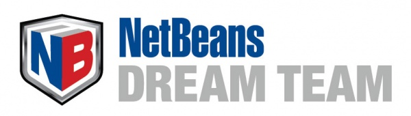

 

 The NetBeans Dream Team is a community-driven group of highly skilled NetBeans users and contributors. They participate at NetBeans developer events, on mailing lists and developer forums, providing new, interesting and informative content as well as developing new and creative ways to promote and enhance NetBeans. And as of today, I'm accepted as a new member to this <a href="http://wiki.netbeans.org/NetBeansDreamTeam" target="_blank">exclusive group of passionate people</a>.
 
 This might look a little odd, as most of my readers know that I am working at Red Hat and we have our "own" IDE. This is a good time to remember all of you about what open source is and that contributing isn't limited to companies or products. As long as the software is great, there is always a chance to work together. And looking at NetBeans and Red Hat/JBoss technologies a lot has been done in the past and many other parts are evolving.
 
 <b>WildFly Integration</b>
 
 Emmanuel Hugonnet (<a href="http://www.twitter.com/ehsavoie" target="_blank">@ehsavoie</a>) is the maintainer of the <a href="" target="_blank">WildFly</a> Plugin for NetBeans. Since NetBeans 8.0.1 this is built into the core and available for everybody to use WildFly directly from NetBeans. If you want to know more, make sure watch <a href="http://blog.eisele.net/2014/08/developer-interviews-di-1-ehsavoie.html" target="_blank">my developer interview with him</a>.
 
 <b>OpenShift Integration</b>
 
 Cojan van Ballegooijen (<a href="https://twitter.com/cvanball" target="_blank">@cvanball</a>) is working on tooling to integrate Red Hat <a href="" target="_blank">OpenShift</a> as a Cloud service into NetBeans. You can contribute to his efforts by just <a href="https://github.com/cvanball/OpenShift4NetBeans" target="_blank">forking the repository</a> and sending patches.
 
 <b>And There Is More</b>
 
 I am convinced, that there is a lot more to do. A Camel integration would be a perfect next step. I might start doing one myself. If you are interested, I would love to organize a little project around it.
 
 
 A big thanks to the NB team and the dream team members for accepting me. It will be a pleasure to work with you.