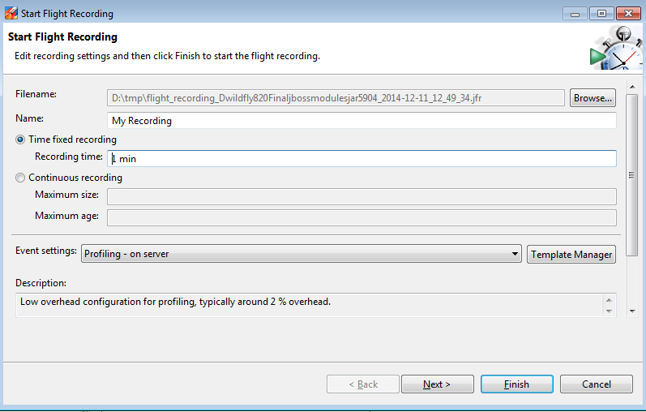

<a href="http://www.oracle.com/technetwork/java/javaseproducts/mission-control/index.html" target="_blank">Java Mission Control</a>&nbsp;(JMC) enables you to monitor and manage Java applications without introducing the performance overhead normally associated with these types of tools. It uses data which is already getting collected for normal dynamic optimization of the JVM resulting in a very lightweight approach to observe and analyze problems in the application code. The JMC consists of three different types of tools. A JMX browser which let's you browse all available JVM instances on a machine and a JMX console which let's you browse through the JMX tree on a connected JVM. Last but not least the most interesting aspect is the Java Flight Recorder (JFR). This is exactly the part of the tooling which does the low overhead profiling of JVM instances.
 
 <b>Disclaimer: A Word On Licensing</b>
 
 The tooling is part of the <a href="http://www.oracle.com/technetwork/java/javase/downloads/index.html" target="_blank">Oracle JDK</a> downloads. In particular the JMC 5.4 is part of JDK 8u20 and JDK 7u71 and is distributed under the Oracle Binary Code License Agreement for Java SE Platform products and commercially available features for Java SE Advanced and Java SE Suite. IANAL, but as far as I know this allows for using it for your personal education and potentially also as part of your developer tests. Make sure to check back with whomever you know that could answer this question. This blog post looks at it as a small little how-to and assumes, that you know what you are doing from a license perspective.
 
 <b>Adding Java Optional Parameters</b>
 
 Unlocking the JFR features requires you to put in some optional parameters to your WildFly 8.x/EAP 6.x configuration. Find the&nbsp;&nbsp;$JBOSS_HOME/bin/standalone.conf|conf.bat and add the following parameters: 
 
<pre style="background-color: whitesmoke; border-radius: 4px; border: 1px solid rgb(204, 204, 204); box-sizing: border-box; color: #333333; font-family: Menlo, Monaco, Consolas, 'Courier New', monospace; font-size: 13px; line-height: 1.42857143; margin-bottom: 10px; overflow: auto; padding: 9.5px; word-break: break-all; word-wrap: break-word;"><code style="background-color: transparent; border-radius: 0px; box-sizing: border-box; color: inherit; font-family: Menlo, Monaco, Consolas, 'Courier New', monospace; font-size: inherit; padding: 0px; white-space: pre-wrap;">-XX:+UnlockCommercialFeatures -XX:+FlightRecorder</code></pre>
 
 You can now use jcmd command like described in this <a href="https://access.redhat.com/solutions/662203" target="_blank">knowledge-base entry</a> to start a recording. Another way is actually to start a recording directly from JMC.
 
 <b>Starting A Recording From JMC</b>
 

 

 First step is to start JMC. Find it in the %JAVA_HOME%/bin folder. After it started you can use the JVM Browser to find the WildFly/EAP instance you want to connect to. Right click on it to see all the available options. You can either start the JMX Console or start a Flight Recording. The JMX console is a bit fancier than the JConsole and allows for a bunch of metrics and statistics. It also allows you to set a bunch of triggers and browser MBeans and whatnot. Please look <a href="http://docs.oracle.com/javacomponents/jmc-5-4/jmc-user-guide/intro.htm#CEGIAGIG" target="_blank">at the documentation</a> for all the details. What is really interesting is the function to start a Flight Recording. If you select this option, a new wizard pops up and lets you tweak the settings a bit. Beside having to select a folder where the recording gets stored you also have the choice between different recording templates.
 
 

 

 
 A one minute recording with the "Server Profiling" template with barely any load on the server results in a 1.5 MB file. So, better keep an eye on the volume you're storing all that stuff at.
 
 You can also decide the profiling granularity for a bunch of parameters further down the dialogues. But at the end, you click "Finish" and the recording session starts. You can decide to push it to the background and keep working while the data gets captured.
 
 <b>Analyzing Flight Recorder Files</b>
 
 This is pretty easy. You can open the recording with JMC and click through the results. If you enabled the default recording with the additional parameter:
 
<pre style="background-color: whitesmoke; border-radius: 4px; border: 1px solid rgb(204, 204, 204); box-sizing: border-box; color: #333333; font-family: Menlo, Monaco, Consolas, 'Courier New', monospace; font-size: 13px; line-height: 1.42857143; margin-bottom: 10px; overflow: auto; padding: 9.5px; word-break: break-all; word-wrap: break-word;"><code style="background-color: transparent; border-radius: 0px; box-sizing: border-box; color: inherit; font-family: Menlo, Monaco, Consolas, 'Courier New', monospace; font-size: inherit; padding: 0px; white-space: pre-wrap;">-XX:FlightRecorderOptions=defaultrecording=true</code></pre>
 
 you can also directly dump the recording via the JVM browser. It is easy to pick a time-frame that you want to download the data for or alternatively you can also decide to download the complete recording.
 
 

 

 