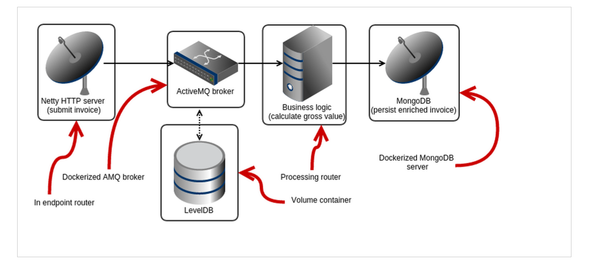

Fridays seem to be the Developer Interview day. Today I welcome Henryk Konsek (<a href="https://twitter.com/hekonsek" target="_blank">@hekonsek</a>). Henryk is a software engineer at Red Hat (JBoss) who has been working with Java-related technologies for many years. His area of expertise is middleware and integration technologies. He authored the "<a href="https://www.packtpub.com/application-development/instant-apache-servicemix-how-instant" target="_blank">Instant Apache ServiceMix How-to</a>" book at Packt and is working with Red Hat customers on all kinds of solutions around integration technologies.
 
 
 We've had a great chat about Apache Camel, Fabric, MongoDB, Docker and Microservices. If you want to learn more, <a href="" target="_blank">follow his blog</a> or watch <a href="https://github.com/hekonsek" target="_blank">his work on GitHub</a>.
 
 
 Sit back, relax and get a #Coffee+++! Thanks, Henryk for taking the time!
 
 

 <iframe allowfullscreen frameborder="0" height="315" src="//www.youtube.com/embed/qwhN4NNuznc" width="560"></iframe>

 
 The <a href="https://github.com/hekonsek/apachecon-demo" target="_blank">source code of the demo</a> can be found on GitHub and Henryk was so kind to provide a general overview diagram about the demo he was doing:
 

 

 