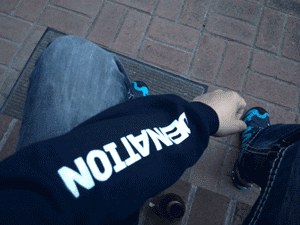

 

 You have heard about DevNation before, did you? It is a 3-day technical, open source, polyglot conference for full-stack application developers and maintainers. The inaugural edition was held last year in San Francisco and delivered a promising start. You can find <a href="http://blog.eisele.net/2014/04/trip-report-devnation-2014.html" target="_blank">my trip report on this blog</a>. While I've just been one among others in this incredible speaker lineup, the one things that changed for me working for Red Hat is, that I now actually have the chance to help shape what DevNation looks like. And it is a real pleasure to work with the whole team on making it even better this year.
 
 <b>Call For Papers - Open Until 28th of January</b>
 
 But first things first: We want you! Give us your best talk you have. DevNation is not just a Red Hat or JBoss conference. It is about all things relevant to software development and operations that you can imagine. Not only Java, but on languages that matter today. If you have something to say about Enterprise Applications, Front-End, Mobile Development, Big Data, Application Integration, DevOps, &nbsp;Continuous Delivery, Performance, Tuning, Platform Development or other cool stuff that you want people to be excited about, this is the place to talk about it. Don't wait any longer: send us your best; the <a href="https://rhs2015.smarteventscloud.com/portal/cfp/cfpLogin.ww" target="_blank">call for papers for the 2015 edition</a> is open until January 28th! More information about the location or highlights from last year can be found on the <a href="" target="_blank">devnation.org website</a>.
 
 
 

 

 <b>Program Committee - Independent, Open, Experienced</b>
 
 One of the bigger changes this year is, that we're going to have an experienced, well known and Red Hat external program committee supporting the selection process. As the head of it, I am going to work closely with:
 
 
 Simon Maple (<a href="https://twitter.com/sjmaple" target="_blank">@sjmaple</a>)
 
 Rabea Gransberger (<a href="https://twitter.com/rgransberger" target="_blank">@rgransberger</a>)
 
 Christian Kaltepoth (<a href="https://twitter.com/chkal" target="_blank">@chkal</a>)
 
 David Blevins (<a href="https://twitter.com/dblevins" target="_blank">@dblevins</a>)
 
 Tonya Rae Moore (<a href="https://twitter.com/TonyaRaeMoore" target="_blank">@TonyaRaeMoore</a>)
 
 Joel Tosi (<a href="https://twitter.com/joeltosi" target="_blank">@joeltosi</a>)
 
 
 To shape the best program we ever had and set a high bar for all following editions. If you have questions or ideas regarding talks feel free to discuss them with any of us and reach out over twitter or send us an email.
 
 <b>Raising Even More Excitement</b>
 
 The location will be the The <a href="http://www.signatureboston.com/hynes.aspx" target="_blank">Hynes Convention Center</a> in Boston. So, there will be plenty of space for all the amazing sessions, that you're going to see. And we also do have even more cool things planned: Hacking events, Birds-Of-A-Feather sessions, an evening event, keynotes, plenty of room for networking and discussions and even more which we're going to announce shortly on the <a href="" target="_blank">official website</a>. 
 
 
 