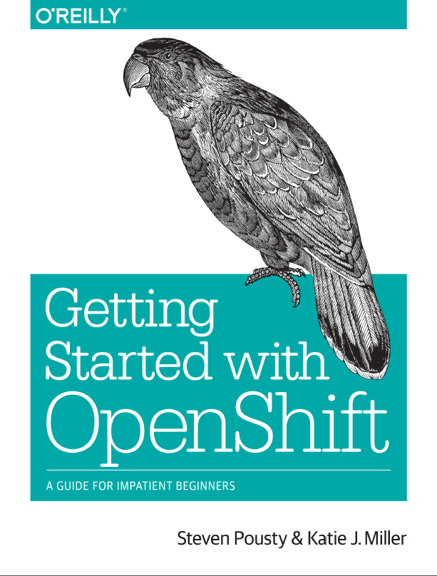

 

 Did you know, that there is a free ebook about <a href="" target="_blank">OpenShift</a>? Free, like in free beer?&nbsp;You’ll learn the steps necessary to build, deploy, and host a complete real-world application on OpenShift, without having to read long, detailed explanations of the technologies involved.
 
 Though the book uses Python, application examples in other languages are available on <a href="https://github.com/openshift-quickstart" target="_blank">GitHub</a>. If you can build web applications, use a command line, and program in <a href="https://developers.openshift.com/en/java-overview.html" target="_blank">Java</a>, <a href="https://developers.openshift.com/en/python-overview.html" target="_blank">Python</a>, <a href="https://developers.openshift.com/en/ruby-overview.html" target="_blank">Ruby</a>, <a href="https://developers.openshift.com/en/node-js-overview.html" target="_blank">Node.js</a>, <a href="https://developers.openshift.com/en/php-overview.html" target="_blank">PHP</a>, <a href="https://developers.openshift.com/en/perl-overview.html" target="_blank">Perl</a>, you’re ready to get started.
 
 You can even run your own JBoss <a href="https://developers.openshift.com/en/wildfly-overview.html" target="_blank">WildFly</a> or <a href="https://developers.openshift.com/en/jbosseap-overview.html" target="_blank">EAP</a> server on it. The book is available in mobi and PDF format and the download has slim 11 MB.
 
 
 It was written by&nbsp;Steve Pousty (<a href="https://twitter.com/TheSteve0" target="_blank">@TheSteve0</a>, <a href="" target="_blank">visit his blog</a>) and&nbsp;Katie Miller (<a href="https://twitter.com/codemiller" target="_blank">@codemiller</a>, <a href="" target="_blank">visit her website</a>).&nbsp;Steve Pousty is a Developer Advocate at Red Hat. Having earned a Ph.D. in Ecology, he’s been mapping since the late 1980s and building applications for over 15 years. Steve has spoken widely on everything from developer evangelism to auto-scaling applications in the cloud.&nbsp;Katie Miller, an OpenShift Developer Advocate at Red Hat, is a polyglot programmer with a penchant for Haskell. A former newspaper journalist, Katie co-founded the Lambda Ladies group for women in functional programming.
 
 <a href="https://www.openshift.com/promotions/ebook" target="_blank">Download your free copy today</a> and get started with Red Hat's <a href="" target="_blank">PaaS</a> offering.
 
 
 Further Readings:
 <a href="https://developers.openshift.com/index.html" target="_blank">Open Shift Developers</a>
 <a href="https://developers.openshift.com/en/getting-started-overview.html" target="_blank">Getting Started Guide</a>
 
 
 