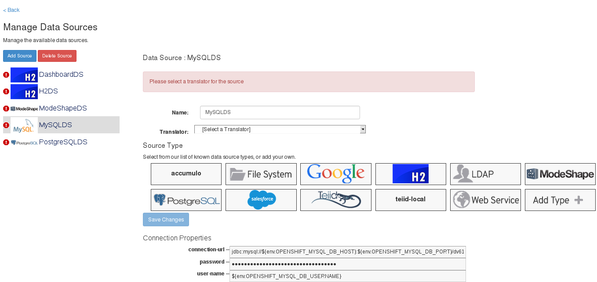

 

 JBoss <a href="" target="_blank">Data Virtualization</a>&nbsp;(JDV) is a data integration solution that sits in front of multiple data sources and allows them to be treated as a single source. &nbsp;Do do that, it offers data abstraction, federation, integration, transformation, and delivery capabilities to combine data from one or multiple sources into reusable and unified logical data models accessible through standard SQL (JDBC, ODBC, Hibernate) and/or web services (REST, OData, SOAP) interfaces.
 
 Yesterday the latest 6.1 Beta was made available for download. It focuses on three major areas which are Big Data, Cloud and Development and Deployment Improvements.
 
 <b>Big Data Improvements</b>
 
 In addition to the Apache Hive support released in 6.0, 6.1 will also offer support for Cloudera Impala for fast SQL query access to data stored in Hadoop. 
 
 Also new in 6.1 is the support for Apache Solr as a data source. &nbsp;With Apache Solr you are able to take advantage of enterprise search capabilities for organized retrieval of structured and unstructured data. Another area of improvements is the updated support for MongoDB as a NoSQL data source. This was already introduced as a Technical Preview in 6.0 and will be fully supported in 6.1.
 
 The <a href="" target="_blank">JBoss Data Grid</a> support has been further expanded and brings the ability to perform writes in addition to reads. With 6.1 it is also possible to take advantage of JDG Library mode as an embedded cache in addition to the support as a remote cache that was previously available.
 
 Newly introduced in this release is the Apache Cassandra support which is included as a not supported, technical preview.
 
 <b>Cloud Improvements</b>
 

 

 The OpenShift cartridge for 6.1 will be updated with a new WebUI that focusses on ease of use for web and mobile developers. &nbsp;This lightweight user interface allows users to quickly access a library of existing data services, or create one of their own in a top-down manner. 
 
 Beside that, the support for the Salesforce.com (SFDC) API has been improved. It now supports the Bulk API with a better RESTful interface and better resource handling and is now able to handle very large data-sets. Finally, the 6.1 version brings full support of JBoss <a href="" target="_blank">Data Virtualization</a> on Amazon EC2 and Google Compute Engine.
 
 <b>Productivity and Deployment Improvments</b>
 
 The consistent centralized security capabilities across multiple heterogeneous data sources got even better by a security audit log dashboard that can be viewed in the dashboard builder. It works with JDV’s RBAC feature and displays who has been accessing what data and when. Beside the large set of already supported data sources, JDV already allowed to create custom integrations, called translators. Those have been reworked and the developer productivity got better by providing features to improve usability including archetype templates that can be used to generate a starting maven project for custom development. &nbsp;When the project is created, it will contain the essential classes and resources to begin adding custom logic. JDV 6.1 will provide support for Azul Zing JVM. &nbsp;Azul Zing is optimized for Linux server deployments and designed for enterprise applications and workloads that require any combination of large memory, high transaction rates, low latency, consistent response times or high sustained throughput. &nbsp;The support for MariaDB as a data source has been added. The Excel support has been further extended and allows to read Microsoft Excel documents on all platforms by using the Apache POI connector.&nbsp; 
 
 
 Find out more:
 
<ul>
 <li>Discuss on the <a href="https://developer.jboss.org/en/products/datavirt" target="_blank">JBoss Data Virtualization Forums</a> </li>
 <li>Get started with one of our many <a href="https://draft.blogger.com/developer-materials?quickstarts" target="_blank">quickstarts</a>. </li>
 <li>View the <a class="external-link" href="https://access.redhat.com/site/documentation/en-US/Red_Hat_JBoss_Data_Virtualization" target="_blank">JBoss Data Virtualization Documentation</a> </li>
 <li>Hava a look at the <a href="" target="_blank">6.1 Beta Documentation</a></li>
</ul>