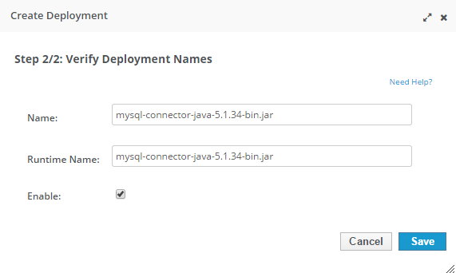
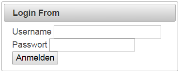

I'm looking at the most popular content on my blog from time to time and try to address your needs the best. So, reading my blog is the one way for my fellow readers to drive the content. Another way is to reach out to me in comments or via email. For today, I am going to revamp my <a href="http://blog.eisele.net/2013/01/jdbc-realm-glassfish312-primefaces342.html" target="_blank">JDBC Realm</a> example with Primefaces and update it to latest WildFly server.
 
 <b>Preparations</b>
 
 First step is to download and unzip latest <a href="" target="_blank">WildFly 8.2.0.Final</a>&nbsp;(I'm using the Java EE7 Full &amp; Web Distribution)&nbsp;to a location of your choice. Also make sure, that you have the <a href="" target="_blank">MySQL Community Server (5.6.22)</a> installed, up and running. I'm going to use <a href="" target="_blank">NetBeans 8.0.2</a> because the version-number just fits nicely with WildFly :) And you also should download latest <a href="" target="_blank">MySQL Connector/J</a> (5.1.34).
 
 <b>Some Basics</b>
 
 WildFly 8.x uses a combination of <a href="" target="_blank">PicketBox</a> and JAAS as the WildFly client and &nbsp;server security mechanism. The configuration is completely covered by the so-called Security Subsystem.&nbsp;The security subsystem operates by using a security context associated with the current request, this security context then makes available to the relevant container a number of capabilities from the configured security domain, the capabilities exposed are an authentication manager, an authorization manager, an audit manager and a mapping manager. More details can be found in the <a href="https://docs.jboss.org/author/display/WFLY8/Security+subsystem+configuration#Securitysubsystemconfiguration-securitydomains" target="_blank">WildFly documentation</a>. The good news is, that you don't have to dig into all the details at once, because I am focusing on the one element of configuration, which is really needed for the deployment specific configuration. These are the <a href="https://docs.jboss.org/author/display/WFLY8/Security+subsystem+configuration#Securitysubsystemconfiguration-securitydomains" target="_blank">security domains</a>. The configuration needs to be done in any of the relevant server configuration files (standalone.xml / standalone-full.xml / etc.). By default, the "other", "jboss-ejb-policy" and the "jboss-web-policy" security domains are configured. Please note, that this is totally relevant for your applications and I am going to look into the configuration into a minute. If you are looking for a way to secure other interfaces, you want to look into how to <a href="https://docs.jboss.org/author/display/AS7/Securing+the+Management+Interfaces" target="_blank">secure the management interfaces</a>. I have a recent blog-post about how to <a href="http://blog.eisele.net/2015/01/ssl-with-wildfly-8-and-undertow.html" target="_blank">setup ssl/tls with undertow</a>.
 
 <b>Add A User</b>
 
 As I'm going to use the admin-console quite a bit, make sure to add an admin-user to the management realm first. The %JBOSS_HOME%/bin/add-user.sh|.bat will guide you through that.
 
 <b>WildFly and MySQL</b>
 

 

 To use database persisted usernames/passwords/roles for authentication and authorization in your application, first thing you need is a database. And this needs to be deployed and configured in WildFly.&nbsp;There are two ways to install a JDBC4-compliant driver: Either deploy it as any other application package or you install it as a module.&nbsp;Any JDBC 4-compliant driver will automatically be recognized and installed into the system by name and version. For non compliant drivers, please refer to the <a href="https://docs.jboss.org/author/display/WFLY8/Admin+Guide#AdminGuide-JDBCDriverInstallation" target="_blank">WildFly documentation</a>.
 
 

 

 Extract the&nbsp;mysql-connector-java-5.1.34-bin.jar from the archive and go to the WildFly admin-console and select "Deployments" and press the "add" button. Now select the jar and enable it on the last wizard step. Now switch to "Configuration" &gt; Connector &gt; Datasources and press the "add" button. Enter a name ("UserDS") and a JNDI name ("java:jboss/datasources/UserDS". On the next page, select the detected driver "mysql-connector-java-5.1.34-bin.jar_com.mysql.jdbc.Driver_5_1" and in the last step, you need to configure the connection url, user and password for the instance. In my case the schema name is "wildfly" and the connection url "jdbc:mysql://localhost:3306/wildfly".
 
 After you successfully tested the connection, go ahead and enable it. Now, you're ready to configure the rest.
 
 <b>Preparing The Database</b>
 
 Before I dive further into the security domain configuration, the database needs some tables for us to work with. At the very bare minimum, those should be able to hold login names, passwords and roles. But the Database login module, which I'm going to use here is very flexible and allows you to configure a SQL query to return those. Which means, you can re-use the same application user-database containing all kinds of user relevant information and just specify the needed SQL for the login module to return the correct information. In this example, it is going to be a very simple setup with two tables which contain exactly the minimum information that are needed by the Database login module.
 
<pre style="background-color: whitesmoke; border-radius: 4px; border: 1px solid rgb(204, 204, 204); box-sizing: border-box; color: #333333; font-family: Menlo, Monaco, Consolas, 'Courier New', monospace; font-size: 13px; line-height: 1.42857143; margin-bottom: 10px; overflow: auto; padding: 9.5px; word-break: break-all; word-wrap: break-word;"><code style="background-color: transparent; border-radius: 0px; box-sizing: border-box; color: inherit; font-family: Menlo, Monaco, Consolas, 'Courier New', monospace; font-size: inherit; padding: 0px; white-space: pre-wrap;">CREATE TABLE Users(username VARCHAR(255) PRIMARY KEY, passwd VARCHAR(255)) CREATE TABLE UserRoles(username VARCHAR(255), role VARCHAR(32)) </code></pre>
 
 Just to be clear here: This is a very simple example. It doesn't contain a lot of checks on the db level and is the most simplistic model, that you could have. I wouldn't use this in production without adding some foreign keys and further constraints to it.
 
 Pre-filling the tables with at least one user for test proposes is the next step. In order to do that, we need to decide on the <a href="http://docs.oracle.com/javase/8/docs/technotes/guides/security/StandardNames.html#MessageDigest" target="_blank">MessageDigest</a> algorithm that should be used. There are many samples on the web which try to imply that MD5 is a feasible way of encrypting anything. This is not true. It has to be at least SHA-256 or higher. JDK 8 introduced SHA-512 but this does not seem to work with this version of WildFly and so I'm falling back to SHA-256. So, we need a way to encrypt the password with SHA-256 before we can add a user. Thankfully, there is a nice little tool buried in PicketBox and you can just use it via the command line:
 
 
<pre style="background-color: whitesmoke; border-radius: 4px; border: 1px solid rgb(204, 204, 204); box-sizing: border-box; color: #333333; font-family: Menlo, Monaco, Consolas, 'Courier New', monospace; font-size: 13px; line-height: 1.42857143; margin-bottom: 10px; overflow: auto; padding: 9.5px; word-break: break-all; word-wrap: break-word;"><code style="background-color: transparent; border-radius: 0px; box-sizing: border-box; color: inherit; font-family: Menlo, Monaco, Consolas, 'Courier New', monospace; font-size: inherit; padding: 0px; white-space: pre-wrap;">java -cp %JBOSS_HOME%\modules\system\layers\base\org\picketbox\main\picketbox-4.0.21.Final.jar org.jboss.security.Base64Encoder &lt;password&gt; &lt;MessageDigest&gt; </code></pre>
 
 And the output is the base64 encoded password. For the password "admin" with the MessageDigest "SHA-256" this is: jGl25bVBBBW96Qi9Te4V37Fnqchz/Eu4qB9vKrRIqRg=
 
 
 Now it's time to do some inserts into the Database:
 
<pre style="background-color: whitesmoke; border-radius: 4px; border: 1px solid rgb(204, 204, 204); box-sizing: border-box; color: #333333; font-family: Menlo, Monaco, Consolas, 'Courier New', monospace; font-size: 13px; line-height: 1.42857143; margin-bottom: 10px; overflow: auto; padding: 9.5px; word-break: break-all; word-wrap: break-word;"><code style="background-color: transparent; border-radius: 0px; box-sizing: border-box; color: inherit; font-family: Menlo, Monaco, Consolas, 'Courier New', monospace; font-size: inherit; padding: 0px; white-space: pre-wrap;">INSERT INTO `wildfly`.`user` (`username`, `passwd`) VALUES ('myfear', 'jGl25bVBBBW96Qi9Te4V37Fnqchz/Eu4qB9vKrRIqRg='); INSERT INTO `wildfly`.`userroles` (`unsername`, `role`) VALUES ('myfear', 'ADMIN');</code></pre> This was the last step outside of WildFly. Back to the server configuration and on to the sample application.
 
 <b>Configuring The Security Domain in WildFly</b>
 
 Make sure, your WildFly instance is shut down and open the configuration xml (e.g. standalone.xml) for editing. Now find the &lt;security-domains&gt; tag and add a new security domain to it:
 
<pre style="background-color: whitesmoke; border-radius: 4px; border: 1px solid rgb(204, 204, 204); box-sizing: border-box; color: #333333; font-family: Menlo, Monaco, Consolas, 'Courier New', monospace; font-size: 13px; line-height: 1.42857143; margin-bottom: 10px; overflow: auto; padding: 9.5px; word-break: break-all; word-wrap: break-word;"><code style="background-color: transparent; border-radius: 0px; box-sizing: border-box; color: inherit; font-family: Menlo, Monaco, Consolas, 'Courier New', monospace; font-size: inherit; padding: 0px; white-space: pre-wrap;">&nbsp;&lt;security-domain name="secureDomain" cache-type="default"&gt; &nbsp; &nbsp; &nbsp; &nbsp; &nbsp; &nbsp; &nbsp; &nbsp; &nbsp; &nbsp; &lt;authentication&gt; &nbsp; &nbsp; &nbsp; &nbsp; &nbsp; &nbsp; &nbsp; &nbsp; &nbsp; &nbsp; &nbsp; &nbsp; &lt;login-module code="Database" flag="required"&gt; &nbsp; &nbsp; &nbsp; &nbsp; &nbsp; &nbsp; &nbsp; &nbsp; &nbsp; &nbsp; &nbsp; &nbsp; &nbsp; &nbsp; &lt;module-option name="dsJndiName" value="java:jboss/datasources/UserDS"/&gt; &nbsp; &nbsp; &nbsp; &nbsp; &nbsp; &nbsp; &nbsp; &nbsp; &nbsp; &nbsp; &nbsp; &nbsp; &nbsp; &nbsp; &lt;module-option name="principalsQuery" value="select passwd from Users where username=?"/&gt; &nbsp; &nbsp; &nbsp; &nbsp; &nbsp; &nbsp; &nbsp; &nbsp; &nbsp; &nbsp; &nbsp; &nbsp; &nbsp; &nbsp; &lt;module-option name="rolesQuery" value="select role, 'Roles' from UserRoles where username=?"/&gt; &nbsp; &nbsp; &nbsp; &nbsp; &nbsp; &nbsp; &nbsp; &nbsp; &nbsp; &nbsp; &nbsp; &nbsp; &nbsp; &nbsp; &lt;module-option name="hashAlgorithm" value="SHA-256"/&gt; &nbsp; &nbsp; &nbsp; &nbsp; &nbsp; &nbsp; &nbsp; &nbsp; &nbsp; &nbsp; &nbsp; &nbsp; &nbsp; &nbsp; &lt;module-option name="hashEncoding" value="base64"/&gt; &nbsp; &nbsp; &nbsp; &nbsp; &nbsp; &nbsp; &nbsp; &nbsp; &nbsp; &nbsp; &nbsp; &nbsp; &lt;/login-module&gt; &nbsp; &nbsp; &nbsp; &nbsp; &nbsp; &nbsp; &nbsp; &nbsp; &nbsp; &nbsp; &lt;/authentication&gt; &nbsp; &nbsp; &nbsp; &nbsp; &nbsp; &nbsp; &nbsp; &nbsp; &lt;/security-domain&gt; </code></pre> Start your instance and well shortly see, if everything is working. Go fork the <a href="https://github.com/myfear/SimpleJDBCRealmWildFly" target="_blank">SimpleJDBCRealmWildFly</a> on my GitHub account and open it in NetBeans.
 
 <b>Adjusting The WebApplication</b>
 

 

 You notice, that there isn't a lot specific stuff to see in this web-application. It contains two different folders in the Web Pages folder, "admin" and "users". The "admin" folder should be protected, and this is done in the web.xml by adding the relevant&nbsp;&lt;security-constraint&gt;. &nbsp;The &lt;auth-contraint&gt; is the role-name "admin". Compare the <a href="https://github.com/myfear/SimpleJDBCRealmWildFly/blob/master/src/main/webapp/WEB-INF/web.xml" target="_blank">complete web.xml</a> for details and make sure to check back with my older posting about <a href="http://blog.eisele.net/2013/01/jdbc-realm-glassfish312-primefaces342.html" target="_blank">how everything works in detail</a> if you have questions. The only thing, that still is open is, how to link the deployment to the security domain "secureDomain". This is done in the jboss-web.xml descriptor.
 
<pre style="background-color: whitesmoke; border-radius: 4px; border: 1px solid rgb(204, 204, 204); box-sizing: border-box; color: #333333; font-family: Menlo, Monaco, Consolas, 'Courier New', monospace; font-size: 13px; line-height: 1.42857143; margin-bottom: 10px; overflow: auto; padding: 9.5px; word-break: break-all; word-wrap: break-word;"><code style="background-color: transparent; border-radius: 0px; box-sizing: border-box; color: inherit; font-family: Menlo, Monaco, Consolas, 'Courier New', monospace; font-size: inherit; padding: 0px; white-space: pre-wrap;">&lt;jboss-web&gt; &nbsp; &nbsp; &lt;security-domain&gt;secureDomain&lt;/security-domain&gt; &lt;/jboss-web&gt; </code></pre> That's about all the magic it needs to get started. If you now try to access the&nbsp;admin section of the sample app you are prompted with a login-form.
 
 <b>What about Role-Group Mapping?</b>
 
 This is a very simple example and I decided to not add Role-Group mapping. This common concept actually allows to further abstract developer roles from administrative/operative roles in production. There are some ways, to actually do this. I will follow up with a more detailed post about how to add it soon. As for now, make sure to use the same case for both the&nbsp;&lt;role-name&gt; element in the web.xml and the database role entry for the user. In this example, both are written in capital letters:"ADMIN".
 
 <b>Troubleshooting Tips</b>
 
 You will run into trouble. For many reasons. Cache is one. If you do change a role name in the database you will most likely not see an update if you already authenticated a user. You can remove the cache-type="default" attribute from the security-domain definition and run with no-cache.
 
 Error-Messages are another helpful too. For security reasons, not much is logged in INFO mode. Make sure, to add the security logger and change the log level to TRACE for the console logger in the logging subsystem:
 
<pre style="background-color: whitesmoke; border-radius: 4px; border: 1px solid rgb(204, 204, 204); box-sizing: border-box; color: #333333; font-family: Menlo, Monaco, Consolas, 'Courier New', monospace; font-size: 13px; line-height: 1.42857143; margin-bottom: 10px; overflow: auto; padding: 9.5px; word-break: break-all; word-wrap: break-word;"><code style="background-color: transparent; border-radius: 0px; box-sizing: border-box; color: inherit; font-family: Menlo, Monaco, Consolas, 'Courier New', monospace; font-size: inherit; padding: 0px; white-space: pre-wrap;"> &nbsp;&lt;logger category="org.jboss.security"&gt; &nbsp; &nbsp; &nbsp; &nbsp; &nbsp; &nbsp; &nbsp; &nbsp; &lt;level name="TRACE"/&gt; &nbsp; &nbsp; &nbsp; &nbsp; &nbsp; &nbsp; &lt;/logger&gt;</code></pre>
 
 Even more helpful is the "incognito function" of your favorite browser. It will prevent you from running with the same credentials all over again while all you wanted to do is to use a different account. But this could also easily solved with a logout. But this is another great topic for a next post.