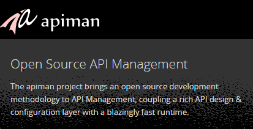

 

 The <a href="" target="_blank">JBoss apiman</a> project hit its first public milestone release (1.0.0.Final) recently, making it the perfect time to go out and have a look at it! Now that the first public release is out the door, we’re planning on iterating quickly on new features and bug fixes. &nbsp;You should expect to see apiman community releases at least monthly.
 
 <b>Getting Started with apiman</b>
 
 So how can you get started with apiman? &nbsp;I’m thrilled you asked! &nbsp;There are already a number of articles and videos discussing apiman functionality and concepts. &nbsp;So let’s start with some links:
 
<ul>
 <li><a href="" target="_blank">All things apiman</a></li>
 <li><a href="http://www.apiman.io/latest/installation-guide.html" target="_blank">Installation</a>, <a href="http://www.apiman.io/latest/user-guide.html" target="_blank">User</a>, and <a href="http://www.apiman.io/latest/developer-guide.html" target="_blank">Developer </a>guides</li>
 <li><a href="http://www.apiman.io/latest/tutorials.html" target="_blank">Tutorials and walkthroughs</a> (short videos - good place to learn about apiman)</li>
 <li>“<a href="http://java.dzone.com/articles/impatient-new-users" target="_blank">An Impatient New User’s Intro to apiman</a>”</li>
 <li><a href="http://blog.eisele.net/2014/09/rest-api-management-in-wildfly-81-with-overlord.html" target="_blank">API Management On WildFly 8.1</a> with apiman</li>
</ul> The 1.0 release of apiman can be easily run as a standalone server, running on WildFly 8 out of the box. &nbsp;However, the runtime component (policy engine) can also be embedded into other projects. This is useful if you want to add API Management functionality to your existing API platform. 
 
 <b>There’s Already a 1.0.1?</b>
 
 We didn't waste any time resting on our 1.0.0.Final laurels! &nbsp;We got right back to work after the first release and added a bunch of new stuff (and fixed a few bugs, for good measure). &nbsp;Early in January we came with 1.0.1.Final, which adds a bunch of stuff, including:
 
<ul>
 <li>Public Services (services that can be invoked without a Service Contract)</li>
 <li>Support for multiple API Gateways (although a single gateway usually makes the most sense)</li>
 <li>Retiring of Services and Applications (removed from the API Gateway)</li>
 <li>New Policy: &nbsp;Ignore Resources (use regular expressions to prevent access to specific parts of your API)</li>
 <li>Version cloning (no longer a need to re-create all your configuration when making a new version of a Service, App, or Plan)</li>
 <li>First stab at a highly scalable vert.x based API Gateway</li>
</ul> (<a href="http://www.apiman.io/latest/roadmap.html" target="_blank">read more</a>)
 
 <b>What are Public Services?</b>
 
 One of the new features that some users will find really helpful is the concept of a “Public” Service. &nbsp;A public service is one that can be invoked without a Service Contract. &nbsp;In fact, if you only use public services in apiman then there isn’t any reason to create Applications! &nbsp;This can be very useful if you are only looking to add policies to your services, but not interested in tracking which applications are invoking it.
 
 (<a href="http://www.apiman.io/latest/user-guide.html#_services" target="_blank">read more</a>)
 
 <b>Why is Version Cloning Important?</b>
 
 An important feature of apiman is the ability to have multiple versions of Plans, Services, and Apps. &nbsp;But whenever a new version of one of these entities is created, it is often necessary to tweak only a small part of the configuration. &nbsp;For example, if a new version of a Service is released into production, then a new version of it may need to be created in apiman. &nbsp;But all of the policies and plan probably still apply to the new version - only the Service Implementation endpoint details may have changed. &nbsp;Now you can clone all of this information whenever you create a new version, saving you the hassle of re-entering all of that config. &nbsp;Just clone what you had and change what you need.
 
 (<a href="http://www.apiman.io/latest/user-guide.html#_versioning" target="_blank">read more</a>)
 
 <b>Why Have a vert.x Gateway?</b>
 
 For many users, having the API Gateway running in WildFly 8 is no problem. &nbsp;We can handle a lot of load using WildFly, and scaling it up to moderate usage levels isn’t too hard. &nbsp;However, asynchronous systems are designed to scale out to very heavy load, so we designed our runtime Policy Engine to have an asynchronous API to take advantage of these types of systems. &nbsp;The latest version introduces an asynchronous API Gateway based on the very nice vert.x platform.
 
 We’ll be doing a lot more work on this in the future, but for now it’s a great start and very exciting! We’re hoping that this solution will eventually be used in very large deployments (once we work out some of the details).
 

  

