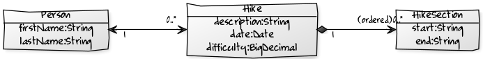
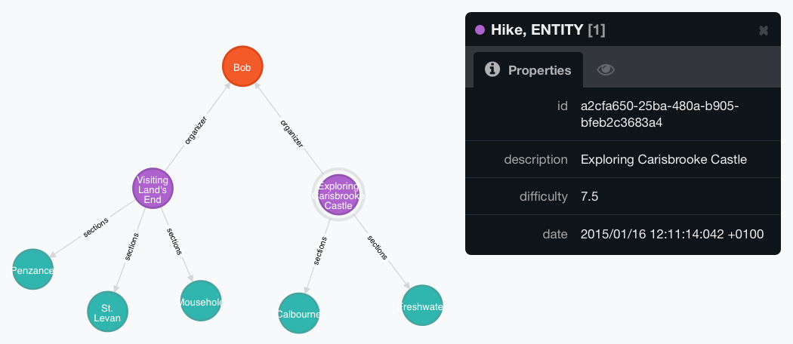

The <a href="" target="_blank">first final version of Hibernate OGM is out</a> and the team recovered a bit from the release frenzy. So they thought about starting a series of tutorial-style blogs which give you the chance to start over easily with Hibernate OGM. Thanks to Gunnar Morling (<a href="https://twitter.com/gunnarmorling" target="_blank">@gunnarmorling</a>) for creating this tutorial.
 
 <b>Introduction</b>
 
 Don't know what Hibernate OGM is? <a href="" target="_blank">Hibernate OGM</a> is the newest project under the Hibernate umbrella and allows you to persist entity models in different NoSQL stores via the well-known <a href="http://en.wikipedia.org/wiki/Java_Persistence_API" target="_blank">JPA</a>.
 
 We'll cover these topics in the following weeks:
 
<ul>
 <li>Persisting your first entities (this instalment)</li>
 <li>Querying for your data</li>
 <li>Running on WildFly</li>
 <li>Running with CDI on Java SE</li>
 <li>Store data into two different stores in the same application</li>
</ul> If you'd like us to discuss any other topics, please let us know. Just add a comment below or <a href="https://twitter.com/Hibernate" target="_blank">tweet your suggestions</a> to us.
 
 In this first part of the series we are going to set up a Java project with the required dependencies, create some simple entities and write/read them to and from the store. We'll start with the <a href="" target="_blank">Neo4j graph database</a> and then we'll switch to the <a href="" target="_blank">MongoDB document store</a> with only a small configuration change.
 
 <b>Project set-up&nbsp;</b>
 
 Let's first create a new Java project with the required dependencies. We're going to use Maven as a build tool in the following, but of course Gradle or others would work equally well.
 
 Add this to the <tt>dependencyManagement</tt> block of your pom.xml:
 
<pre style="background-color: whitesmoke; border-radius: 4px; border: 1px solid rgb(204, 204, 204); box-sizing: border-box; color: #333333; font-family: Menlo, Monaco, Consolas, 'Courier New', monospace; font-size: 13px; line-height: 1.42857143; margin-bottom: 10px; overflow: auto; padding: 9.5px; word-break: break-all; word-wrap: break-word;"><code style="background-color: transparent; border-radius: 0px; box-sizing: border-box; color: inherit; font-family: Menlo, Monaco, Consolas, 'Courier New', monospace; font-size: inherit; padding: 0px; white-space: pre-wrap;"> ... &lt;dependencyManagement&gt; &lt;dependencies&gt; ... &lt;dependency&gt; &lt;groupId&gt;org.hibernate.ogm&lt;/groupId&gt; &lt;artifactId&gt;hibernate-ogm-bom&lt;/artifactId&gt; &lt;type&gt;pom&lt;/type&gt; &lt;version&gt;4.1.1.Final&lt;/version&gt; &lt;scope&gt;import&lt;/scope&gt; &lt;/dependency&gt; ... &lt;/dependencies&gt; &lt;/dependencyManagement&gt; ...</code></pre> This will make sure that you are using matching versions of the Hibernate OGM modules and their dependencies. Then add the following to the <tt>dependencies</tt> block:
 
<pre style="background-color: whitesmoke; border-radius: 4px; border: 1px solid rgb(204, 204, 204); box-sizing: border-box; color: #333333; font-family: Menlo, Monaco, Consolas, 'Courier New', monospace; font-size: 13px; line-height: 1.42857143; margin-bottom: 10px; overflow: auto; padding: 9.5px; word-break: break-all; word-wrap: break-word;"><code style="background-color: transparent; border-radius: 0px; box-sizing: border-box; color: inherit; font-family: Menlo, Monaco, Consolas, 'Courier New', monospace; font-size: inherit; padding: 0px; white-space: pre-wrap;"> ... &lt;dependencies&gt; ... &lt;dependency&gt; &lt;groupId&gt;org.hibernate.ogm&lt;/groupId&gt; &lt;artifactId&gt;hibernate-ogm-neo4j&lt;/artifactId&gt; &lt;/dependency&gt; &lt;dependency&gt; &lt;groupId&gt;org.jboss.jbossts&lt;/groupId&gt; &lt;artifactId&gt;jbossjta&lt;/artifactId&gt; &lt;/dependency&gt; ... &lt;/dependencies&gt; ...</code></pre> The dependencies are:
 
<ul>
 <li>The Hibernate OGM module for working with an embedded Neo4j database; This will pull in all other required modules such as Hibernate OGM core and the Neo4j driver. When using MongoDB, you'd swap that with <i>hibernate-ogm-mongodb</i>.</li>
 <li>JBoss' implementation of the Java Transaction API (JTA), which is needed when not running within a Java EE container such as WildFly</li>
</ul><b>The domain model</b>
 
 Our example domain model is made up of three classes: <tt>Hike</tt>, <tt>HikeSection</tt> and <tt>Person</tt>.
 

 

 
 There is a composition relationship between <tt>Hike</tt> and <tt>HikeSection</tt>, i.e. a hike comprises several sections whose life cycle is fully dependent on the Hike. The list of hike sections is ordered; This order needs to be maintained when persisting a hike and its sections.
 
 The association between <tt>Hike</tt> and <tt>Person</tt> (acting as hike organizer) is a bi-directional many-to-one/one-to-many relationship: One person can organize zero ore more hikes, whereas one hike has exactly one person acting as its organizer.
 
 <b>Mapping the entities</b>
 
 Now let's map the domain model by creating the entity classes and annotating them with the required meta-data. Let's start with the <tt>Person</tt> class:
 
<pre style="background-color: whitesmoke; border-radius: 4px; border: 1px solid rgb(204, 204, 204); box-sizing: border-box; color: #333333; font-family: Menlo, Monaco, Consolas, 'Courier New', monospace; font-size: 13px; line-height: 1.42857143; margin-bottom: 10px; overflow: auto; padding: 9.5px; word-break: break-all; word-wrap: break-word;"><code style="background-color: transparent; border-radius: 0px; box-sizing: border-box; color: inherit; font-family: Menlo, Monaco, Consolas, 'Courier New', monospace; font-size: inherit; padding: 0px; white-space: pre-wrap;"> @Entity public class Person \{ @Id @GeneratedValue(generator = "uuid") @GenericGenerator(name = "uuid", strategy = "uuid2") private long id; private String firstName; private String lastName; @OneToMany(mappedBy = "organizer", cascade = CascadeType.PERSIST) private Set&lt;Hike&gt; organizedHikes = new HashSet&lt;&gt;(); // constructors, getters and setters... \}</code></pre> The entity type is marked as such using the <tt>@Entity</tt> annotation, while the property representing the identifier is annotated with <tt>@Id</tt>.
 
 Instead of assigning ids manually, Hibernate OGM can take care of this, offering several id generation strategies such as (emulated) sequences, UUIDs and more. Using a UUID generator is usually a good choice as it ensures portability across different NoSQL datastores and makes id generation fast and scalable. But depending on the store you work with, you also could use specific id types such as object ids in the case of MongoDB (see the <a href="http://docs.jboss.org/hibernate/ogm/4.1/reference/en-US/html_single/#_entities_3" target="_blank">reference guide</a> for the details).
 
 Finally, <tt>@OneToMany</tt> marks the <tt>organizedHikes</tt> property as an association between entities. As it is a bi-directional entity, the <tt>mappedBy</tt> attribute is required for specifying the side of the association which is in charge of managing it. Specifying the cascade type <tt>PERSIST</tt> ensures that persisting a person will automatically cause its associated hikes to be persisted, too.
 
 Next is the <tt>Hike</tt> class:
 
<pre style="background-color: whitesmoke; border-radius: 4px; border: 1px solid rgb(204, 204, 204); box-sizing: border-box; color: #333333; font-family: Menlo, Monaco, Consolas, 'Courier New', monospace; font-size: 13px; line-height: 1.42857143; margin-bottom: 10px; overflow: auto; padding: 9.5px; word-break: break-all; word-wrap: break-word;"><code style="background-color: transparent; border-radius: 0px; box-sizing: border-box; color: inherit; font-family: Menlo, Monaco, Consolas, 'Courier New', monospace; font-size: inherit; padding: 0px; white-space: pre-wrap;"> @Entity public class Hike \{ @Id @GeneratedValue(generator = "uuid") @GenericGenerator(name = "uuid", strategy = "uuid2") private String id; private String description; private Date date; private BigDecimal difficulty; @ManyToOne private Person organizer; @ElementCollection @OrderColumn(name = "sectionNo") private List&lt;HikeSection&gt; sections; // constructors, getters and setters... \}</code></pre> Here the <tt>@ManyToOne</tt> annotation marks the other side of the bi-directional association between <tt>Hike</tt> and <tt>Organizer</tt>. As <tt>HikeSection</tt> is supposed to be dependent on Hike, the sections list is mapped via <tt>@ElementCollection</tt>. To ensure the order of sections is maintained in the datastore, <tt>@OrderColumn</tt> is used. This will add one extra "column" to the persisted records which holds the order number of each section.
 
 Finally, the <tt>HikeSection</tt> class:
 
<pre style="background-color: whitesmoke; border-radius: 4px; border: 1px solid rgb(204, 204, 204); box-sizing: border-box; color: #333333; font-family: Menlo, Monaco, Consolas, 'Courier New', monospace; font-size: 13px; line-height: 1.42857143; margin-bottom: 10px; overflow: auto; padding: 9.5px; word-break: break-all; word-wrap: break-word;"><code style="background-color: transparent; border-radius: 0px; box-sizing: border-box; color: inherit; font-family: Menlo, Monaco, Consolas, 'Courier New', monospace; font-size: inherit; padding: 0px; white-space: pre-wrap;"> @Embeddable public class HikeSection \{ private String start; private String end; // constructors, getters and setters... \}</code></pre> Unlike <tt>Person</tt> and <tt>Hike</tt>, it is not mapped via <tt>@Entity</tt> but using <tt>@Embeddable</tt>. This means it is always part of another entity (<tt>Hike</tt> in this case) and as such also has no identity on its own. Therefore it doesn't declare any <tt>@Id</tt> property.
 
 Note that these mappings looked exactly the same, had you been using Hibernate ORM with a relational datastore. And indeed that's one of the promises of Hibernate OGM: Make the migration between the relational and the NoSQL paradigms as easy as possible!
 
 <b>Creating the persistence.xml</b>
 
 With the entity classes in place, one more thing is missing, JPA's persistence.xml descriptor. Create it under <i>src/main/resources/META-INF/persistence.xml</i>:
 
<pre style="background-color: whitesmoke; border-radius: 4px; border: 1px solid rgb(204, 204, 204); box-sizing: border-box; color: #333333; font-family: Menlo, Monaco, Consolas, 'Courier New', monospace; font-size: 13px; line-height: 1.42857143; margin-bottom: 10px; overflow: auto; padding: 9.5px; word-break: break-all; word-wrap: break-word;"><code style="background-color: transparent; border-radius: 0px; box-sizing: border-box; color: inherit; font-family: Menlo, Monaco, Consolas, 'Courier New', monospace; font-size: inherit; padding: 0px; white-space: pre-wrap;"> &lt;?xml version="1.0" encoding="utf-8"?&gt; &lt;persistence xmlns="http://java.sun.com/xml/ns/persistence" xmlns:xsi="http://www.w3.org/2001/XMLSchema-instance" xsi:schemaLocation="http://java.sun.com/xml/ns/persistence http://java.sun.com/xml/ns/persistence/persistence_2_0.xsd" version="2.0"&gt; &lt;persistence-unit name="hikePu" transaction-type="RESOURCE_LOCAL"&gt; &lt;provider&gt;org.hibernate.ogm.jpa.HibernateOgmPersistence&lt;/provider&gt; &lt;properties&gt; &lt;property name="hibernate.ogm.datastore.provider" value="neo4j_embedded" /&gt; &lt;property name="hibernate.ogm.datastore.database" value="HikeDB" /&gt; &lt;property name="hibernate.ogm.neo4j.database_path" value="target/test_data_dir" /&gt; &lt;/properties&gt; &lt;/persistence-unit&gt; &lt;/persistence&gt;</code></pre> If you have worked with JPA before, this persistence unit definition should look very familiar to you. The main difference to using the classic Hibernate ORM on top of a relational database is the specific provider class we need to specify for Hibernate OGM: <tt>org.hibernate.ogm.jpa.HibernateOgmPersistence</tt>.
 
 In addition, some properties specific to Hibernate OGM and the chosen back end are defined to set:
 
<ul>
 <li>the back end to use (an embedded Neo4j graph database in this case)</li>
 <li>the name of the Neo4j database</li>
 <li>the directory for storing the Neo4j database files</li>
</ul> Depending on your usage and the back end, other properties might be required, e.g. for setting a host, user name, password etc. You can find all available properties in a class named <tt>&lt;BACK END&gt;Properties</tt>, e.g. <a href="https://docs.jboss.org/hibernate/ogm/4.1/api/index.html?org/hibernate/ogm/datastore/neo4j/Neo4jProperties.html" target="_blank">Neo4jProperties</a>, <a href="https://docs.jboss.org/hibernate/ogm/4.1/api/index.html?org/hibernate/ogm/datastore/mongodb/MongoDBProperties.html" target="_blank">MongoDBProperties</a> and so on.
 
 <b>Saving and loading an entity</b>
 
 With all these bits in place its time to persist (and load) some entities. Create a simple JUnit test shell for doing so:
 
<pre style="background-color: whitesmoke; border-radius: 4px; border: 1px solid rgb(204, 204, 204); box-sizing: border-box; color: #333333; font-family: Menlo, Monaco, Consolas, 'Courier New', monospace; font-size: 13px; line-height: 1.42857143; margin-bottom: 10px; overflow: auto; padding: 9.5px; word-break: break-all; word-wrap: break-word;"><code style="background-color: transparent; border-radius: 0px; box-sizing: border-box; color: inherit; font-family: Menlo, Monaco, Consolas, 'Courier New', monospace; font-size: inherit; padding: 0px; white-space: pre-wrap;"> public class HikeTest \{ private static EntityManagerFactory entityManagerFactory; @BeforeClass public static void setUpEntityManagerFactory() \{ entityManagerFactory = Persistence.createEntityManagerFactory( "hikePu" ); \} @AfterClass public static void closeEntityManagerFactory() \{ entityManagerFactory.close(); \} \}</code></pre> The two methods manage an entity manager factory for the persistence unit defined in persistence.xml. It is kept in a field so it can be used for several test methods (remember, entity manager factories are rather expensive to create, so they should be initialized once and be kept around for re-use).
 
 Then create a test method persisting and loading some data:
 
<pre style="background-color: whitesmoke; border-radius: 4px; border: 1px solid rgb(204, 204, 204); box-sizing: border-box; color: #333333; font-family: Menlo, Monaco, Consolas, 'Courier New', monospace; font-size: 13px; line-height: 1.42857143; margin-bottom: 10px; overflow: auto; padding: 9.5px; word-break: break-all; word-wrap: break-word;"><code style="background-color: transparent; border-radius: 0px; box-sizing: border-box; color: inherit; font-family: Menlo, Monaco, Consolas, 'Courier New', monospace; font-size: inherit; padding: 0px; white-space: pre-wrap;"> @Test public void canPersistAndLoadPersonAndHikes() \{ EntityManager entityManager = entityManagerFactory.createEntityManager(); entityManager.getTransaction().begin(); // create a Person Person bob = new Person( "Bob", "McRobb" ); // and two hikes Hike cornwall = new Hike( "Visiting Land's End", new Date(), new BigDecimal( "5.5" ), new HikeSection( "Penzance", "Mousehole" ), new HikeSection( "Mousehole", "St. Levan" ), new HikeSection( "St. Levan", "Land's End" ) ); Hike isleOfWight = new Hike( "Exploring Carisbrooke Castle", new Date(), new BigDecimal( "7.5" ), new HikeSection( "Freshwater", "Calbourne" ), new HikeSection( "Calbourne", "Carisbrooke Castle" ) ); // let Bob organize the two hikes cornwall.setOrganizer( bob ); bob.getOrganizedHikes().add( cornwall ); isleOfWight.setOrganizer( bob ); bob.getOrganizedHikes().add( isleOfWight ); // persist organizer (will be cascaded to hikes) entityManager.persist( bob ); entityManager.getTransaction().commit(); // get a new EM to make sure data is actually retrieved from the store and not Hibernate's internal cache entityManager.close(); entityManager = entityManagerFactory.createEntityManager(); // load it back entityManager.getTransaction().begin(); Person loadedPerson = entityManager.find( Person.class, bob.getId() ); assertThat( loadedPerson ).isNotNull(); assertThat( loadedPerson.getFirstName() ).isEqualTo( "Bob" ); assertThat( loadedPerson.getOrganizedHikes() ).onProperty( "description" ).containsOnly( "Visiting Land's End", "Exploring Carisbrooke Castle" ); entityManager.getTransaction().commit(); entityManager.close(); \}</code></pre> Note how both actions happen within a transaction. Neo4j is a fully transactional datastore which can be controlled nicely via JPA's transaction API. Within an actual application one would probably work with a less verbose approach for transaction control. Depending on the chosen back end and the kind of environment your application runs in (e.g. a Java EE container such as <a href="" target="_blank">WildFly</a>), you could take advantage of declarative transaction management via CDI or EJB. But let's save that for another time.
 
 Having persisted some data, you can examine it, using the nice <a href="http://neo4j.com/docs/stable/tools-webadmin.html" target="_blank">web console</a> coming with Neo4j. The following shows the entities persisted by the test:
 
 

 

 
 
 Hibernate OGM aims for the most natural mapping possible for the datastore you are targeting. In the case of Neo4j as a graph datastore this means that any entity will be mapped to a corresponding node.
 
 The entity properties are mapped as node properties (see the black box describing one of the Hike nodes). Any not natively supported property types will be converted as required. E.g. that's the case for the <tt>date</tt> property which is persisted as an ISO-formatted String. Additionally, each entity node has the <a href="http://neo4j.com/docs/stable/graphdb-neo4j-labels.html" target="_blank">label</a> ENTITY (to distinguish it from nodes of other types) and a label specifying its entity type (Hike in this case).
 
 Associations are mapped as relationships between nodes, with the association role being mapped to the <a href="http://neo4j.com/docs/stable/graphdb-neo4j-relationships.html" target="_blank">relationship type</a>.
 
 Note that Neo4j does not have the notion of embedded objects. Therefore, the <tt>HikeSection</tt> objects are mapped as nodes with the label EMBEDDED, linked with the owning Hike nodes. The order of sections is persisted via a property on the relationship.
 
 <b>Switching to MongoDB</b>
 
 One of Hibernate OGM's promises is to allow using the same API - namely, JPA - to work with different NoSQL stores. So let's see how that holds and make use of MongoDB which, unlike Neo4j, is a document datastore and persists data in a JSON-like representation. To do so, first replace the Neo4j back end with the following one:
 
<pre style="background-color: whitesmoke; border-radius: 4px; border: 1px solid rgb(204, 204, 204); box-sizing: border-box; color: #333333; font-family: Menlo, Monaco, Consolas, 'Courier New', monospace; font-size: 13px; line-height: 1.42857143; margin-bottom: 10px; overflow: auto; padding: 9.5px; word-break: break-all; word-wrap: break-word;"><code style="background-color: transparent; border-radius: 0px; box-sizing: border-box; color: inherit; font-family: Menlo, Monaco, Consolas, 'Courier New', monospace; font-size: inherit; padding: 0px; white-space: pre-wrap;"> ... &lt;dependency&gt; &lt;groupId&gt;org.hibernate.ogm&lt;/groupId&gt; &lt;artifactId&gt;hibernate-ogm-mongodb&lt;/artifactId&gt; &lt;/dependency&gt; ...</code></pre> Then update the configuration in persistence.xml to work with MongoDB as the back end, using the properties accessible through <tt>MongoDBProperties</tt> to give host name and credentials matching your environment (if you don't have MongoDB installed yet, you can download it <a href="https://www.mongodb.org/downloads" target="_blank">here</a>):
 
<pre style="background-color: whitesmoke; border-radius: 4px; border: 1px solid rgb(204, 204, 204); box-sizing: border-box; color: #333333; font-family: Menlo, Monaco, Consolas, 'Courier New', monospace; font-size: 13px; line-height: 1.42857143; margin-bottom: 10px; overflow: auto; padding: 9.5px; word-break: break-all; word-wrap: break-word;"><code style="background-color: transparent; border-radius: 0px; box-sizing: border-box; color: inherit; font-family: Menlo, Monaco, Consolas, 'Courier New', monospace; font-size: inherit; padding: 0px; white-space: pre-wrap;"> ... &lt;properties&gt; &lt;property name="hibernate.ogm.datastore.provider" value="mongodb" /&gt; &lt;property name="hibernate.ogm.datastore.database" value="HikeDB" /&gt; &lt;property name="hibernate.ogm.datastore.host" value="mongodb.mycompany.com" /&gt; &lt;property name="hibernate.ogm.datastore.username" value="db_user" /&gt; &lt;property name="hibernate.ogm.datastore.password" value="top_secret!" /&gt; &lt;/properties&gt; ...</code></pre> And that's all you need to do to persist your entities in MongoDB rather than Neo4j. If you now run the test again, you'll find the following BSON documents in your datastore:
 
<pre style="background-color: whitesmoke; border-radius: 4px; border: 1px solid rgb(204, 204, 204); box-sizing: border-box; color: #333333; font-family: Menlo, Monaco, Consolas, 'Courier New', monospace; font-size: 13px; line-height: 1.42857143; margin-bottom: 10px; overflow: auto; padding: 9.5px; word-break: break-all; word-wrap: break-word;"><code style="background-color: transparent; border-radius: 0px; box-sizing: border-box; color: inherit; font-family: Menlo, Monaco, Consolas, 'Courier New', monospace; font-size: inherit; padding: 0px; white-space: pre-wrap;"> # Collection "Person" \{ "_id" : "50b62f9b-874f-4513-85aa-c2f59015a9d0", "firstName" : "Bob", "lastName" : "McRobb", "organizedHikes" : [ "a78d731f-eff0-41f5-88d6-951f0206ee67", "32384eb4-717a-43dc-8c58-9aa4c4e505d1" ] \}</code></pre>
<pre style="background-color: whitesmoke; border-radius: 4px; border: 1px solid rgb(204, 204, 204); box-sizing: border-box; color: #333333; font-family: Menlo, Monaco, Consolas, 'Courier New', monospace; font-size: 13px; line-height: 1.42857143; margin-bottom: 10px; overflow: auto; padding: 9.5px; word-break: break-all; word-wrap: break-word;"><code style="background-color: transparent; border-radius: 0px; box-sizing: border-box; color: inherit; font-family: Menlo, Monaco, Consolas, 'Courier New', monospace; font-size: inherit; padding: 0px; white-space: pre-wrap;"> # Collection Hike \{ "_id" : "a78d731f-eff0-41f5-88d6-951f0206ee67", "date" : ISODate("2015-01-16T11:59:48.928Z"), "description" : "Visiting Land's End", "difficulty" : "5.5", "organizer_id" : "50b62f9b-874f-4513-85aa-c2f59015a9d0", "sections" : [ \{ "sectionNo" : 0, "start" : "Penzance", "end" : "Mousehole" \}, \{ "sectionNo" : 1, "start" : "Mousehole", "end" : "St. Levan" \}, \{ "sectionNo" : 2, "start" : "St. Levan", "end" : "Land's End" \} ] \} \{ "_id" : "32384eb4-717a-43dc-8c58-9aa4c4e505d1", "date" : ISODate("2015-01-16T11:59:48.928Z"), "description" : "Exploring Carisbrooke Castle", "difficulty" : "7.5", "organizer_id" : "50b62f9b-874f-4513-85aa-c2f59015a9d0", "sections" : [ \{ "sectionNo" : 1, "start" : "Calbourne", "end" : "Carisbrooke Castle" \}, \{ "sectionNo" : 0, "start" : "Freshwater", "end" : "Calbourne" \} ] \}</code></pre> Again, the mapping is very natural and just as you'd expect it when working with a document store like MongoDB. The bi-directional one-to-many/many-to-one association between <tt>Person</tt> and <tt>Hike</tt> is mapped by storing the referenced id(s) on either side. When loading back the data, Hibernate OGM will resolve the ids and allow to navigate the association from one object to the other.
 
 Element collections are mapped using MongoDB's capabilities for storing hierarchical structures. Here the sections of a hike are mapped to an array within the document of the owning hike, with an additional field <tt>sectionNo</tt> to maintain the collection order. This allows to load an entity and its embedded elements very efficiently via a single round-trip to the datastore.
 
 <b>Wrap-up</b>
 
 In this first instalment of <i>NoSQL with Hibernate OGM 101</i> you've learned how to set up a project with the required dependencies, map some entities and associations and persist them in Neo4j and MongoDB. All this happens via the well-known JPA API. So if you have worked with Hibernate ORM and JPA in the past on top of relational databases, it never was easier to dive into the world of NoSQL.
 
 At the same time, each store is geared towards certain use cases and thus provides specific features and configuration options. Naturally, those cannot be exposed through a generic API such as JPA. Therefore Hibernate OGM lets you make usage of native NoSQL queries and allows to configure store-specific settings via its flexible option system.
 
 You can find the <a href="https://github.com/hibernate/hibernate-demos/tree/master/hibernate-ogm/nosql-with-hibernate-ogm-101/hibernate-ogm-demo-nosql-with-hibernate-ogm-101-part-1" target="_blank">complete example code</a> of this blog post on GitHub. Just fork it and play with it as you like.
 
 Of course storing entities and getting them back via their id is only the beginning. In any real application you'd want to run queries against your data and you'd likely also want to take advantage of some specific features and settings of your chosen NoSQL store. We'll come to that in the next parts of this series, so stay tuned!