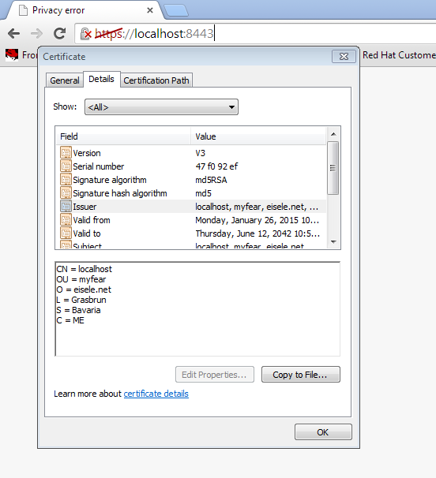

 

 I've been working my way through some security topics along WildFly 8 and stumbled upon some configuration options, that are not very well documented. One of them is the TLS/SSL configuration for the new web-subsystem <a href="" target="_blank">Undertow</a>. There's plenty of documentation for the older web-subsystem and it is indeed still available to use, but here is the short how-to configure it the new way.
 
 <b>Generate a keystore and self-signed certificate&nbsp;</b>
 
 First step is to generate a certificate. In this case, it's going to be a self signed one, which is enough to show how to configure everything. I'm going to use the plain Java way of doing it, so all you need is the JRE keytool.&nbsp;Java <a href="http://docs.oracle.com/javase/8/docs/technotes/tools/unix/keytool.html" target="_blank">Keytool </a>is a key and certificate management utility. It allows users to manage their own public/private key pairs and certificates. It also allows users to cache certificates. Java Keytool stores the keys and certificates in what is called a keystore. By default the Java keystore is implemented as a file. It protects private keys with a password. A Keytool keystore contains the private key and any certificates necessary to complete a chain of trust and establish the trustworthiness of the primary certificate.
 
 
 Please keep in mind, that an SSL certificate serves two essential purposes: distributing the public key and verifying the identity of the server so users know they aren't sending their information to the wrong server. It can only properly verify the identity of the server when it is signed by a trusted third party. A self signed certificate is a certificate that is signed by itself rather than a trusted authority.
 
 Switch to a command-line and execute the following command which has some defaults set, and also prompts you to enter some more information.
 
<pre style="background-color: whitesmoke; border-radius: 4px; border: 1px solid rgb(204, 204, 204); box-sizing: border-box; color: #333333; font-family: Menlo, Monaco, Consolas, 'Courier New', monospace; font-size: 13px; line-height: 1.42857143; margin-bottom: 10px; overflow: auto; padding: 9.5px; word-break: break-all; word-wrap: break-word;"><code style="background-color: transparent; border-radius: 0px; box-sizing: border-box; color: inherit; font-family: Menlo, Monaco, Consolas, 'Courier New', monospace; font-size: inherit; padding: 0px; white-space: pre-wrap;">$&gt;keytool -genkey -alias mycert -keyalg RSA -sigalg MD5withRSA -keystore my.jks -storepass secret &nbsp;-keypass secret -validity 9999 What is your first and last name? &nbsp; [Unknown]: &nbsp;localhost What is the name of your organizational unit? &nbsp; [Unknown]: &nbsp;myfear What is the name of your organization? &nbsp; [Unknown]: &nbsp;eisele.net What is the name of your City or Locality? &nbsp; [Unknown]: &nbsp;Grasbrun What is the name of your State or Province? &nbsp; [Unknown]: &nbsp;Bavaria What is the two-letter country code for this unit? &nbsp; [Unknown]: &nbsp;ME Is CN=localhost, OU=myfear, O=eisele.net, L=Grasbrun, ST=Bavaria, C=ME correct? &nbsp; [no]: &nbsp;yes</code></pre>
 
 Make sure to put your desired "hostname" into the "first and last name" field, otherwise you might run into issues while permanently accepting this certificate as an exception in some browsers. Chrome doesn't have an issue with that though.
 
 The command generates a my.jks file in the folder it is executed. Copy this to your WildFly config directory (%JBOSS_HOME%/standalone/config).
 
 <b>Configure The Additional WildFly Security Realm</b>
 
 The next step is to configure the new keystore as a server identity for ssl in the WildFly security-realms section of the standalone.xml (if you're using -ha or other versions, edit those).
 
<pre style="background-color: whitesmoke; border-radius: 4px; border: 1px solid rgb(204, 204, 204); box-sizing: border-box; color: #333333; font-family: Menlo, Monaco, Consolas, 'Courier New', monospace; font-size: 13px; line-height: 1.42857143; margin-bottom: 10px; overflow: auto; padding: 9.5px; word-break: break-all; word-wrap: break-word;"><code style="background-color: transparent; border-radius: 0px; box-sizing: border-box; color: inherit; font-family: Menlo, Monaco, Consolas, 'Courier New', monospace; font-size: inherit; padding: 0px; white-space: pre-wrap;">&nbsp;&lt;management&gt; &nbsp; &nbsp; &nbsp; &nbsp; &lt;security-realms&gt; &lt;!-- ... --&gt; &nbsp;&lt;security-realm name="UndertowRealm"&gt; &nbsp; &nbsp; &nbsp; &nbsp; &nbsp; &nbsp; &nbsp; &nbsp; &lt;server-identities&gt; &nbsp; &nbsp; &nbsp; &nbsp; &nbsp; &nbsp; &nbsp; &nbsp; &nbsp; &nbsp; &lt;ssl&gt; &nbsp; &nbsp; &nbsp; &nbsp; &nbsp; &nbsp; &nbsp; &nbsp; &nbsp; &nbsp; &nbsp; &nbsp; &lt;keystore path="my.keystore" relative-to="jboss.server.config.dir" keystore-password="secret" alias="mycert" key-password="secret"/&gt; &nbsp; &nbsp; &nbsp; &nbsp; &nbsp; &nbsp; &nbsp; &nbsp; &nbsp; &nbsp; &lt;/ssl&gt; &nbsp; &nbsp; &nbsp; &nbsp; &nbsp; &nbsp; &nbsp; &nbsp; &lt;/server-identities&gt; &nbsp; &nbsp; &nbsp; &nbsp; &nbsp; &nbsp; &lt;/security-realm&gt; &lt;!-- ... --&gt;</code></pre>
 
 And you're ready for the next step.
 
 <b>Configure Undertow Subsystem for SSL</b>
 
 If you're running with the default-server, add the https-listener to the undertow subsystem:
 
<pre style="background-color: whitesmoke; border-radius: 4px; border: 1px solid rgb(204, 204, 204); box-sizing: border-box; color: #333333; font-family: Menlo, Monaco, Consolas, 'Courier New', monospace; font-size: 13px; line-height: 1.42857143; margin-bottom: 10px; overflow: auto; padding: 9.5px; word-break: break-all; word-wrap: break-word;"><code style="background-color: transparent; border-radius: 0px; box-sizing: border-box; color: inherit; font-family: Menlo, Monaco, Consolas, 'Courier New', monospace; font-size: inherit; padding: 0px; white-space: pre-wrap;">&nbsp;&nbsp;&lt;subsystem xmlns="urn:jboss:domain:undertow:1.2"&gt; &nbsp; &nbsp; &nbsp; &nbsp; &nbsp;&lt;!-- ... --&gt; &nbsp; &nbsp; &nbsp; &nbsp; &nbsp; &nbsp; &lt;server name="default-server"&gt; &nbsp; &nbsp; &nbsp; &nbsp; &nbsp; &nbsp; &lt;!-- ... --&gt; &nbsp; &nbsp; &nbsp; &nbsp; &nbsp; &nbsp; &nbsp; &nbsp; &lt;https-listener name="https" socket-binding="https" security-realm="UndertowRealm"/&gt; &lt;! -- ... --&gt; </code></pre>
 
 That's it, now you're ready to connect to the ssl port of your instance&nbsp;<a href="" target="_blank">https://localhost:8443/</a>. Note, that you get the privacy error (compare screenshot). If you need to use a fully signed certificate you mostly get a PEM file from the cert authority. In this case, you need to import this into the keystore. This <a href="http://stackoverflow.com/questions/2138940/import-pem-into-java-key-store" target="_blank">stackoverflow thread may</a> help you with that.