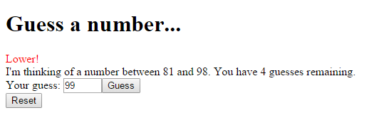
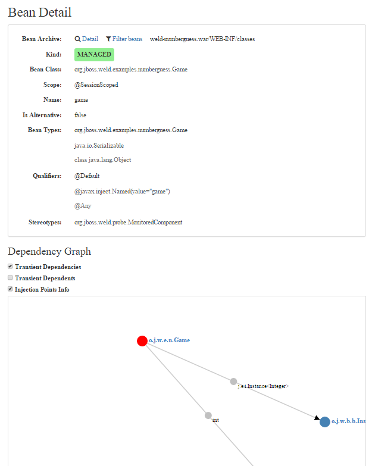

 

<a href="" target="_blank">Weld&nbsp;3.0.0.Alpha4 was released</a>, while I've been sitting in a conference room at DevConf.CZ. More or less next to&nbsp;Jozef Hartinger (<a href="http://twitter.com/@jozefhartinger" target="_blank">@jozefhartinger</a>) who told me about the new awesome features of this latest release a few minutes before in a shared break. There is one particular feature, that really caught my attention which is the new&nbsp;Weld Probe mechanism.
 
 <b>What Is Weld?</b>
 
 Weld is the reference implementation of <a href="" target="_blank">CDI: Contexts and Dependency Injection for the Java EE Platform</a> which is the Java standard for dependency injection and contextual lifecycle management and one of the most important and popular parts of the Java EE platform.
 
 Weld is integrated into many Java EE application servers such as WildFly, JBoss Enterprise Application Platform, GlassFish, Oracle WebLogic and others. Weld can also be used in a Servlet-only environment (Tomcat, Jetty) or plain Java SE environment.
 
 Weld 3.x marks the versions in first experimental stages for the next CDI 2.0 version which will be included in Java EE 8. As you already might have guessed, there is no server pre-configured and ready to run any of the upcoming Java EE 8 RIs no matter stage they are in. Particular Weld is way ahead of the crowd and starts to experiment with not even specified features these days. To not disrupt the WildFly 9 team with their improvements, the latest versions are NOT part of it yet.
 
 <b>Test-driving CDI 2.0 with Weld 3.0.0.Alpha4</b>
 
 In order to test Weld today, you need the stable version of WildFly 8.2 and patch it accordingly. If you want to go with latest <a href="http://sourceforge.net/projects/jboss/files/Weld/3.0.0.Alpha4/wildfly-9.0.0.Alpha1-weld-3.0.0.Alpha4-patch.zip/download" target="_blank">WildFly 9, there's a patch for that</a>, too. Let's go and <a href="" target="_blank">download latest WildFly 8.2.0.Final</a> and unzip it to a location of your choice. Next download we need is the&nbsp;<a href="http://sourceforge.net/projects/jboss/files/Weld/3.0.0.Alpha4/wildfly-8.2.0.Final-weld-3.0.0.Alpha4-patch.zip/download" target="_blank">Weld 3 Alpha4 Patch for WildFly 8.2</a>. The patch can be applied via the WildFly build in patching mechanism:
 
<pre class="code"><code>$&gt;/WildFly/bin/jboss-cli.bat|sh --command="patch apply /path/to/wildfly-8.2.0.Final-weld-3.0.0.Alph4-patch.zip" </code></pre> The successful outcome should look like this:
 
<pre class="code"><code>\{ &nbsp; &nbsp; "outcome" : "success", &nbsp; &nbsp; "result" : \{\} \}</code></pre> Now you're ready to start WildFly. Please keep in mind, that this isn't an official patch! So, for now consider this an easy way to update your Weld version. Nothing more. If you want to learn more about patching WildFly take a look at <a href="" target="_blank">Arun's blog post about patching</a>.
 
<pre class="code"><code>$&gt;/WildFly/bin/standalone.bat|sh</code></pre> Now it's time to play around with it a bit. A good place to keep an eye on is the new features is the<a href="https://github.com/javaee-samples/javaee8-samples" target="_blank"> Java EE 8 examples project on GitHub</a>. Still in the very early beginnings, it has at least one new CDI 2.0 example which can be run out of the box. But I am looking at showing you one other new feature of Weld, which is the new Weld-Probe mechanism. So, we need a little web-application first. There are a couple of examples in the <a href="https://github.com/weld/core/tree/master/examples" target="_blank">weld/core/master</a> branch on Github. One of them is the famous <a href="https://github.com/weld/core/tree/master/examples/jsf/numberguess" target="_blank">number-guess example</a>.
 
 <b>Weld-Probe Answers All Your CDI Questions&nbsp;</b>
 
 Why isn’t my field injected? Why isn’t my interceptor triggered? What extensions do third-party libraries register? Have you ever found yourself asking a similar question? Making Weld developer-friendly and helpful in troubleshooting is one of the main goals of the new 3.x version.&nbsp;Today, I am introducing to you a new tool called Weld Probe. Probe is a built-in tool that provides a detailed view into internals of a CDI application. Weld Probe has a web UI and is provided out-of-the-box.
 
 
 Probe makes it easy to inspect the following CDI aspects. Even more are planned for the future. 
 
<ul>
 <li>beans, their properties such as qualifiers, stereotypes and name</li>
 <li>a graph of bean dependencies</li>
 <li>observers and producers declared by beans</li>
 <li>interceptors and decorators bound to a bean</li>
 <li>extensions</li>
 <li>information about current contextual instances</li>
 <li>tracking of invocations and invocation trees</li>
</ul>

 

 Probe is not meant to replace tools such as a debugger or profiler. It's more about understanding the application and giving a high level view about the inner workings.
 
 Probe consists of a REST API and a default (single-page application) client. Therefore it's only available in a web application. You need to explicitly enable it for development proposes only by adding a servlet initialization parameter org.jboss.weld.development and setting it to true:
 
<pre class="code"><code>&nbsp;&lt;context-param&gt; &nbsp; &nbsp; &nbsp; &nbsp; &lt;param-name&gt;org.jboss.weld.development&lt;/param-name&gt; &nbsp; &nbsp; &nbsp; &nbsp; &lt;param-value&gt;true&lt;/param-value&gt; &nbsp; &nbsp; &lt;/context-param&gt; </code></pre>
 
 Go, build the example and deploy it. Now you can see the number-guess example working. But there's more to it. Just change the application url a bit and add "/weld-probe" to the end of the context:&nbsp;http://localhost:8080/weld-numberguess/weld-probe and you will see this:
 
 

 

 Looking over the navigation on top gives you the following areas:
 
 <i>Bean Archives</i>
 
 The initial view shows all the bean archives in your application. You can decide to hide external archives and the accessibility graph gives you a very useful overview for complicated deployments.
 
 <i>Configuration</i>
 
 Weld can be configured per application through the set of properties.&nbsp;Overview of the Weld configuration properties and their final values (complete reference&nbsp;<a href="http://docs.jboss.org/weld/reference/3.0.0.Alpha4/en-US/html/configure.html#_weld_configuration" target="_blank">Weld Configuration</a>).
 
 <i>Beans</i>
 
 This view shows all the beans Weld is aware of. Note that &nbsp;built-in beans and other Java EE specifications that integrate (e.g. for JSR 352: Batch Applications for the Java Platform) are shown as well. There are various filters to find the beans you're interested in. The bean detail shows all important attributes, declared observers and producers, declaring bean for producers, and also dependencies and dependents.
 

 

 
 <i>Observer Methods</i>
 
 Discover all the registered observer methods, even those declared on extensions or the ones from other Java EE specifications.
 
 <i>Contexts</i>
 
 This view lets you inspect the bean instances in application and session contexts.
 
 <i>Invocation Trees</i>
 
 Finally, the invocation tree shows all invocations within the given entry point. Where the entry point is the first business method invocation captured by the monitor in a certain thread.
 
 
 That was it. If you are missing something or would love to leave comments on existing features, feel free to contribute by filing an issue in the <a href="https://issues.jboss.org/browse/WELD/component/12321103/?selectedTab=com.atlassian.jira.jira-projects-plugin:component-summary-panel" target="_blank">Weld JIRA</a>. Keep in mind, this is still pretty much work in progress and will change and enhance with every new version.
 
 <b>CDI 2.0 Wants You!</b>
 
 But that is not all! CDI 2.0 needs your help and input. There are multiple ways for you to contribute and the specification lead Antoine did a great <a href="" target="_blank">blog post about what you can do and how to participate</a>. Also feel free to reach out to the <a href="" target="_blank">Weld community</a> and provide your feedback.
 
 