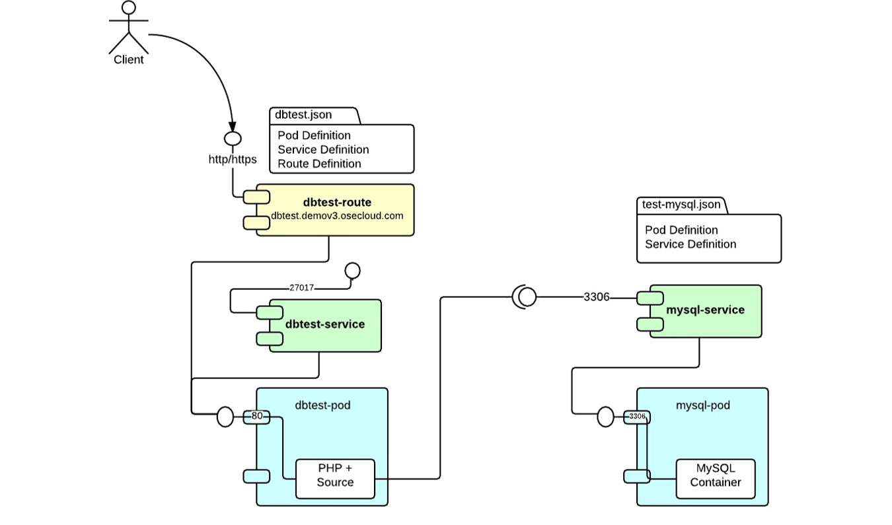

TGIF! And time for a new episode in my developer interview series. With everybody going crazy about containers, <a href="" target="_blank">Docker</a> and such I decided to talk to someone who once was a middleware/Java EE guy and let him introduce all the latest news and stuff around OpenShift Enterprise v3.
 
 
 Veer Muchandi is a Senior Middleware Specialist/Architect at RedHat, an open source enthusiast specifically in OpenShift PaaS and <a href="" target="_blank">Java EE</a>. Veer is also an Enterprise Architect with broad experience with multiple technologies ranging from legacy mainframes to bleeding edge cloud technologies.
 
 
 Sit back, relax and get a #Coffee+++! Thanks, Veer for taking the time!
 
 

 <iframe allowfullscreen frameborder="0" height="315" src="https://www.youtube.com/embed/D_Rv3MQhOZo" width="560"></iframe>

 <b>Some Background:</b>
 <a href="https://github.com/openshift/openshift-pep/blob/master/openshift-pep-013-openshift-3.md" target="_blank">OpenShift 3.x</a> will incorporate a number of significant model changes to better align the PaaS with the evolving development and operational ecosystems - leveraging the Docker container runtime and image model, the Google container management model, and the Mesos scheduling and execution framework. The upstream project, <a href="https://github.com/openshift/origin" target="_blank">OpenShift Origin</a> is in master and everybody is waiting for the first beta builds. Please NOTE: OpenShift is in alpha and is not yet intended for production use. However they welcome feedback, suggestions, and testing as we approach our first beta. So, if you get a chance to test-drive it: Go for it!
 
 <b>Architecture Overview:</b>
 

 

 
 