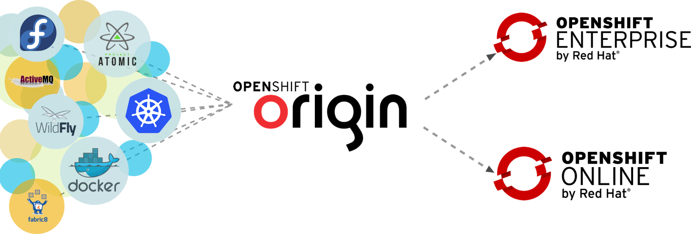

Organizations need a way to make application delivery fast, predictable and secure and the agility provided by containers, such as docker, help developers realize this goal. For Java EE applications, this enables packaging of applications, the application server, and other dependencies in a container that can be replicated in build, test, and production environments. This takes you one step closer to achieving continuous delivery. At least this was the abstract on the <a href="http://red.ht/1HSapUN" target="_blank">Webinar Thomas and I have been giving a couple of days ago</a>. This is the supporting blog-post with a little more details about the setup including all the links to the source code and the demo. Find a more detailed technical walkthrough in the developer interview also embedded below. A big thank you to my <a href="" target="_blank">co-author Thomas</a> who helped me doing this blog-post.
 
 <b>What Did we Cover?</b>
 

 

 First we’re going to talk a bit about why everybody is keen on optimizing application delivery these days. &nbsp;Increasingly complicated applications are putting even more pressure on infrastructures, Teams and processes. Containers promise to bring a solution by keeping applications and their runtime components together.
 
 But let’s not stop there and look beyond, what seems to be a perfect topic for operations. It leaks more and more into the developer space. And as a developer it is easy to ignore latest hypes by just concentrating on what we can do best: Delivering functioning applications. But honestly, there is more to it. Especially Java EE requires more than just code. So, containers promise to make our lives easier.
 
 Just talking about containers isn't the whole story. They have to be usable and out there in production for developers to finally use them. This is where we’re going to briefly sneak into what is upcoming with OpenShift v3 and how this fits into the bigger picture.
 
 After this brief introduction, Thomas is going to walk you through the details, starting with Docker Containers and how they allow for a complete Continuous delivery Chain which fully supports DevOps.
 
 <b>But why do we need containers? And why now?</b>
 
 Most importantly, the new architecture approaches like micro-services drive us away from large-VMs and physical servers running monolithic applications. Individually bootstrapped services are a natural fit for container based deployment, because everything needed to run them is completely encapsulated. Plus, the urge for optimized operations is driving more and more infrastructures into the cloud model. We will see containers as a service offers, which will be faster to deploy, cheaper to run, and be easier to manage than VMs. &nbsp;Enterprises will run PaaS products that focus on enterprise-class operations using Containers as a target. Distributing software in containerised-packages instead of virtual machines is far more complete and more standardized with Containers. Easier to adapt to different suppliers and vendors. No matter what language or runtime the product is built for. Enterprises don’t necessarily have to focus on a single platform anymore to achieve optimized operations and costs. The container infrastructure allows a more heterogeneous technology base by holding up standardized operational models and having the potential for future optimizations and add-ons for example around security.Containers and their management systems are the glue between developers and operators and are a technological layer to support the DevOps movement.&nbsp; To make it short: Containers are ready.&nbsp; 
 
 <b>What do I as a Java EE developer gain from all of that?</b>
 
 Containers are about what’s inside of them, not outside of them. It’s easy to compare this with PaaS offerings. Developers don’t want to care about configuration or hosting. They just want a reliable runtime for their applications. There’s not a lot beside Containers what you need. Standard formats, standard images and even the option to use a company wide hub for them, will make development teams a lot more efficient. And this does also relate to how we will setup local environments and roll them out into our teams. Differently configured instances can be spun up and teared down in seconds. No need to maintain different versions of middleware or databases and messing around with paths or configurations. Preconfigured Containers will reduce team setup times significantly and allow for testing with different configurations more easily. Images can be centrally developed, configured and maintained. According to corporate standards and including specific frameworks or integration libraries. Responsibility and education are the key parts in terms of motivation. Today’s full stack developer want to be responsible for their work of art – End to End. Programming stopped being a tedious job using the same lame APIs day in and day out. As a matter of fact, Containers allow for a complete round-trip from building to packaging and shipping your applications through the different environments into production. And because everything can be versioned and centrally maintained and relies on the same operating system and configuration in any environment the complete software delivery chain is a lot more predictable with Containers. 
 
 <b>How OpenShift fits into all of that?</b>
 
 The perfect example how the market is shifting towards containers is OpenShift. It comes in different editions:
 
<ul>
 <li><a href="https://github.com/openshift/origin" target="_blank">OpenShift Origin</a> is the Open Source Project for Red Hat’s cloud offering</li>
 <li><a href="https://www.openshift.com/app/account/new" target="_blank">OpenShift Online</a> is Red Hat's public cloud application development and hosting platform that automates the provisioning, management and scaling of applications so that you can focus on writing the code for your business, startup, or next big idea. Try out yourself by signing up on openshift.com</li>
 <li><a href="https://www.openshift.com/products/enterprise" target="_blank">OpenShift Enterprise</a> is the an on-premise, private Platform as a Service (PaaS) solution offering that allows you to deliver apps faster and meet your enterprise's growing application demands.</li>
</ul>

 

 
 Depending on your needs you’re free to pick the solution that best fits your needs. From building your own PaaS with Origin to running a fully supported on-premise PaaS yourself.
 
 And we’re going big with the next version of OpenShift! With each milestone of Origin comes a new version of OpenShift. And now that the Origin source code repository for OpenShift 3 is available. It is progressing towards a whole new architecture entirely re-engineered from the ground up. This new architecture integrates Docker and the Kubernetes container orchestration and management system, available on an Atomic host optimized for running containerized applications. &nbsp;On top of all that, OpenShift will incorporate effective and efficient DevOps workflows that play a critical role in platform-as-a-service to accelerate application delivery.
 
 <b>What will OpenShift v3 Look Like?</b>
 
 OpenShift adds developer and operational centric tools on top of Kubernetes to enable rapid application development, easy deployment and scaling, and long-term lifecycle maintenance for small and large teams and applications.
 
 Starting at the bottom of everything, Red Hat has been working with the Docker community to evolve our existing containers technology and drive a new standard for containerization through the libcontainer project. This work lead to announcing Docker support in RHEL 7 and the launch of Project Atomic to develop a new container-optimized Linux host. This new container architecture is at the core of OpenShift v3.
 
 The OpenShift v3 Cartridge format will adopt the Docker packaging model and enable users to leverage any application component packaged as a Docker image. This will enable developers to tap into the Docker Hub community to both access and share container images to use in OpenShift
 
 In OpenShift v3, we will be integrating Kubernetes in the OpenShift Broker to drive container orchestration.
 
 OpenShift v3 will bring new capabilities for provisioning, patching and managing application containers, routing and networking enhancements, and provisioning and managing the OpenShift platform itself. &nbsp;The goal is to deliver a best of breed user experience for OpenShift developers.
 <a href="http://www.openshift.org/#v3" target="_blank">Be excited for the upcoming release!</a>
 
 <b>The Complete Demo</b>
 
 Of you're done with the webcast replay, it's time to <a href="https://github.com/tqvarnst/continuous-delivery-javaee-container-src" target="_blank">get hands on the source-code</a> and grab a #coffee+++ and sit back to relax the demo in 30 instead of just 10 minutes. Thomas is going to cover all the details and I was nice enough to ask some nasty questions in between.
 
 Don't forget, you can always <a href="http://red.ht/1HSapUN" target="_blank">re-watch the original webinar</a>.
 
 

 <iframe allowfullscreen frameborder="0" height="315" src="https://www.youtube.com/embed/AQ0i91AkSZM" width="560"></iframe>

 
 And here is an architectural overview as a prezi presentation, which Thomas showed in the webcast.
 

 <iframe allowfullscreen frameborder="0" height="400" id="iframe_container" mozallowfullscreen="" src="https://prezi.com/embed/kfordqarr_cz/?bgcolor=ffffff&amp;lock_to_path=1&amp;autoplay=0&amp;autohide_ctrls=0#" webkitallowfullscreen="" width="550"></iframe>

 <b>Links and Further Readings</b>
 
 Some food for thought and homework. The link collection form the webinar plus some more resources for you to dig through. 
 
<ul>
 <li>“<a href="http://red.ht/1HSapUN" target="_blank">Continuous delivery with docker containers and Java EE</a>” (Webinar Replay, 28th or April&nbsp;)</li>
 <li><a href="https://github.com/jbossdemocentral/continuous-delivery-demo-app" target="_blank">TicketMonster - a JBoss example</a>&nbsp;(The sample Java EE application used in the demo)</li>
 <li><a href="https://github.com/tqvarnst/continuous-delivery-javaee-container-src" target="_blank">The complete source-code for the example</a></li>
 <li><a href="http://blog.thomasqvarnstrom.com/2015/03/compose-your-docker-containers.html" target="_blank">Compose your Docker Containers</a>&nbsp;</li>
 <li><a href="" target="_blank">Thomas’ Blog</a>&nbsp;&nbsp;</li>
 <li><a href="" target="_blank">Arun Gupta’s Blogs about Docker</a>&nbsp;&nbsp;</li>
 <li><a href="http://www.openshift.org/#v3" target="_blank">What's cooking in OpenShift v3</a>&nbsp;&nbsp;</li>
 <li><a href="" target="_blank">Project Atomic</a>&nbsp;</li>
</ul>