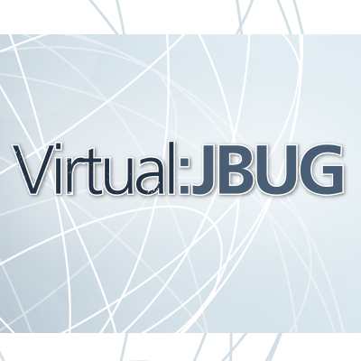
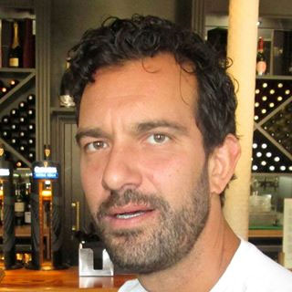

 

 Paul and I are running the Virtual JBoss User Group and we aim for delivering interesting and high profile talks around all kinds of JBoss projects and technologies. I normally don't blog about every upcoming meeting, but let me highlight some, which I find very interesting and I am very happy to have them on our channel.
 
 <b>How to contribute to JBoss WildFly? Hacking on the next Java EE Version -&nbsp;Tuesday, April 21, 2015, 5 PM UTC</b>
 
 Speaker Kabir Khan (<a href="https://twitter.com/kabirkhan" target="_blank">@kabirkhan</a>, <a href="https://github.com/kabir" target="_blank">GitHub</a>) will explain how you can contribute to the WildFly project at many different levels, from properly reporting bugs in the forums and issue tracker, to actually being able to submit a pull request.
 
 

 

 Kabir Khan&nbsp;joined JBoss in 2004 and lead the JBoss AOP project. During this time he helped write the first EJB 3 implementation, and helped on integrating JBoss AOP with other projects such as JBoss Messaging, and the JBoss Microcontainer. He joined the JBoss Microcontainer team in 2009, and spent a lot of time optimising its performance for JBoss AS 6. In 2010 he joined the WildFly team very early in the JBoss AS 7 cycle, and has been a member of the core WildFly team since. He is based in London.
 
 
 During this interactive event you will have a chance to play with WildFly 9 and try some of the following: 
 
<ul>
 <li>Find a JIRA you want to work on.</li>
 <li>See how to check-out the code and setup your IDE.</li>
 <li>Build WildFly</li>
 <li>Code walkthrough - code organisation, jboss-modules etc.</li>
 <li>Debug something from a stack trace in a JIRA issue to nail down the problem.</li>
 <li>Try the testsuite</li>
 <li>And more!</li>
</ul>

 There are&nbsp;Lots of new features in <a href="https://twitter.com/WildFlyAS" target="_blank">@WildFlyAS</a> v9.0 Beta1! <a href="" target="_blank">Get it now!</a>. Make sure to check out <a href="https://developer.jboss.org/wiki/WildFly900Beta1ReleaseNotes" target="_blank">the release notes</a>. If you want to learn more about the Red Hat JBoss offerings around <a href="" target="_blank">Enterprise Java</a> and how to get started, checkout the <a href="" target="_blank">convenient one-stop-page</a>.

  

 <b>Make sure to <a href="" target="_blank">join the vJBUG on Meetup</a> and register for <a href="" target="_blank">Hacking on WildFly 9</a>.</b>

