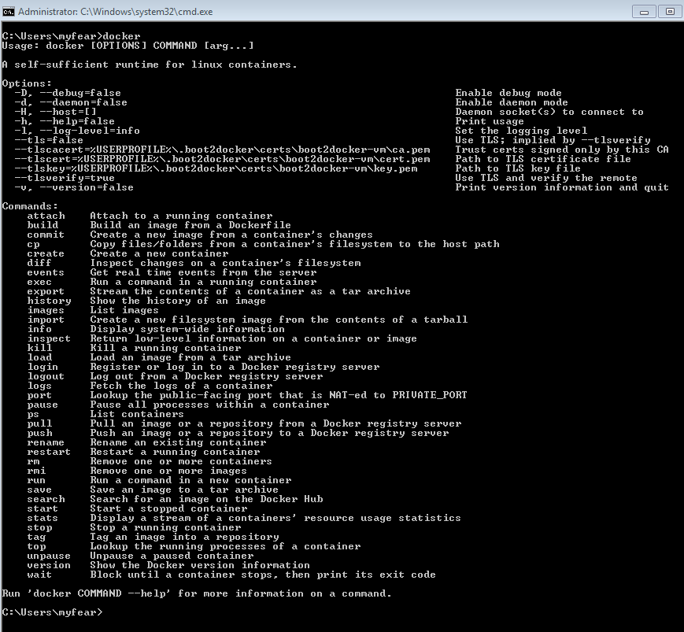

Newest <a href="" target="_blank">Docker 1.6 release was pushed</a> yesterday. Normally, no reason to go crazy, but this time I think, it's worth a blog. Because, it finally contains the first Docker Client for Windows. If you hated having to ssh into your instance and having to do everything via boot2docker: This is over now.
 
 You can download official distribution of Docker Client for Windows by either installing it from the <a href="http://chocolatey.org/packages/docker" target="_blank">Chocolatey</a> package manager (which I never tried before) or installing <a href="" target="_blank">Boot2Docker</a>, which provides a Docker-ready development environment inside a local virtual machine (VirtualBox). You can also simply <a href="http://docs.docker.com/installation/windows/#upgrading" target="_blank">upgrade your Docker VM</a> with boot2docker (stop || download || start).
 
 <b>Installing Boot2Docker And The Windows Client</b>
 
 I went down the <a href="http://blog.eisele.net/2014/12/docker-for-java-ee-developers-on-windows-with-maven.html" target="_blank">road I did before and re-installed boot2docker</a> completely. A very simple and clear experience. Please refer to the <a href="" target="_blank">complete Windows installation instructions</a>, if you run into any errors.
 
 The Boot2Docker start shortcut initializes and starts your docker VM. Although you will be using Windows Docker client, the docker engine hosting the containers will still be running on Linux. Until the Docker engine for Windows is developed, you can launch only Linux containers from your Windows machine. If the VM is up and running, just open another command prompt and try the new Docker Windows client. Make sure you have initialized some environment variables first:
 
<pre class="code"><code> set DOCKER_HOST=tcp://&lt;IP_ADDRESS&gt;:2376 set DOCKER_CERT_PATH='C:\Users\%USERPROFILE%\.boot2docker\certs\boot2docker-vm' set DOCKER_TLS_VERIFY=1 </code></pre> Now just enter "docker" and you have successfully launched the client.
 

 

 
 This is it. If you want to make sure, everything is working, just try to run the hello-world example:
 
<pre class="code"><code> docker run hello-world </code></pre> And it's done. So, now you have the full user experience of the windows command prompt without having to go through boot2docker ever again. Just start your docker VM via VirtualBox and use the new windows client tooling. All this was mainly done with help from Microsoft.&nbsp;Ahmet Alp Balkan (<a href="https://twitter.com/ahmetalpbalkan" target="_blank">@ahmetalpbalkan</a>) was the main committer and he also <a href="http://azure.microsoft.com/blog/2015/04/16/docker-client-for-windows-is-now-available" target="_blank">blogged about the client </a>yesterday.