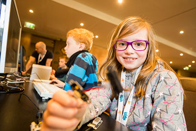

 

 All of my readers should know, that I am part of the organizing team behind <a href="http://www.javaland.eu/1/javaland-2015" target="_blank">JavaLand</a>. We celebrated JavaLand just a short week ago and it was amazing to catch up with all of my peers from around the world and bring such an amazing event to Germany.
 
 One part, which I am very proud about is the JavaLand4Kids initiative that was launched this year. Modeled and inspired by Devoxx4Kids this was one of the many exciting new parts that we decided to introduce after last years inaugural version.
 
 
 14 boys and girls of the 3rd and 4th grade of elementary school were able to convince themselves that programming is easy at the first JavaLand4Kids. In three exciting workshops, the children learned with great enthusiasm and fascination about creative ways to handle a computer and were given playful insights into current technologies.
 
 

 

 In the workshop, the girls and boys learned the programming language "Scratch", which is based on graphic elements. Instead of a traditional programming language, this language uses colored blocks that can be moved by drag &amp; drop and so determines the use of sounds, images and movements. This allowed the young talents after a short time to learn the basics of programming and to take the first steps in game programming.
 
 
 The "QuadroCopter" workshop was exciting, too: Here, the children had the opportunity to control a drone that was programmed specifically for this event. After they learned the basic commands, the newly minted pilots were able to complete many maneuvers. The girls and boys also showed great interest in the electronics kit "TinkerForge". The electronic components can be combined like Lego blocks. This way, the students learned how to handle sensors and their programming.
 
 
 The accompanying teacher, Jörn Diercks, was thrilled by the concept of JavaLand4Kids as well: "For the children it was really a great experience and it was great to see how much fun they had exploring." He will be happy to attend again next year and to intensify the cooperation.
 
 
 From now on, JavaLand4Kids is going to be an integral part of the JavaLand Conference. So, this is a call to arms for my friends and speakers. If you want to contribute for next years edition, if you have ideas and want to help shape the next edition, ping me!
 
 I'm personally most interested in adding some more intercultural and speech competencies into all this. But with this new initiative, we will have a great chance to help shape the future of our industry.
 
 
 Next years edition will take place&nbsp;March 8–10, 2016 and you can already <a href="" target="_blank">signup to our notification system</a> to be the first to know when registration opens.
 
 Most of the slides are already available for download. <a href="http://www.javaland.eu/programm/vortragsunterlagen-zum-download.html" target="_blank">Go, checkout the website</a>.
 
 If you had a chance to attend JavaLand, please make sure to <a href="http://www.doag.org/index.php?id=1844" target="_blank">send in your feedback</a>. We want to improve and this is your chance to make your voice heard.