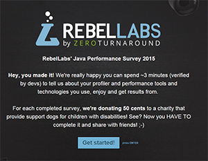

 

 You already know, that the <a href="" target="_blank">RebelLabs</a> team generates awesome content and you might have come across one of their surveys in the past. I occasionally tweet about them, but just recently they launched something which directly went down to my heart.
 
 <b>What do Assistant Dogs And Java Have in Common?</b>
 
 Actually, RebelLabs started to donate money to charities for each completed survey. And this time the survey is all about Java performance, profilers and tooling. It takes three minutes to complete and you can be sure to get an awesome looking, kick-ass report in return. Just compare the 2014 <a href="" target="_blank">"Java Tools And Technologies Landscape"</a>.
 
 And where do the dogs come in? This time its all about "<a href="" target="_blank">dogs for the disabled</a>". Dogs for the Disabled is working to provide solutions to help people with a wide variety of different disabilities and conditions; from assistance dogs helping children and adults with physical disabilities and families affected by autism, to pet dog autism workshops, and innovative new projects working in schools and residential care settings.
 
 
 Stop reading right here and <a href="https://rebellabs.typeform.com/to/yhPzjG" target="_blank">go directly to the surve</a>y.&nbsp;Help Disabled Children by Contributing to the RebelLabs' Java Performance Survey!