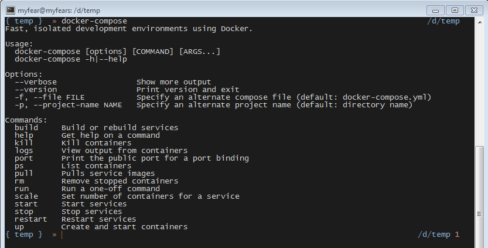

Compose is a tool for defining and running complex applications with Docker. With Compose, you define a multi-container application in a single file, then spin your application up in a single command which does everything that needs to be done to get it running. It is the only tool in the Docker tool-chain, which doesn't have a native binary for Windows in place right now and to get it up and running on Windows requires quite some work.
 
 <b>Using Babon and Python</b>
 

 

 The <a href="" target="_blank">official compose documentation</a> implies, that there is a python only way on not supported platforms. As a matter of fact, this is not totally true. Even the Python package relies on POSIX based commands which aren't available on Windows. If you try to go down this road you will get surprisingly far, but will not finish. The only way to make it work is to use&nbsp;CygWin. For those of you, who don't like it (like I don't), there is a decent alternative called <a href="" target="_blank">Babun</a>.&nbsp;Babun is a turn-key CygWin distribution for developers and is very easy to install and maintain.
 
<ul>
 <li>Download the <a href="http://projects.reficio.org/babun/download" target="_blank">installer ZIP</a> archive from the <a href="" target="_blank">Babun</a> homepage. (~280MB)</li>
 <li>Unzip the archive to a temporary folder.</li>
 <li>Change to the unzipped folder and start the install.bat (this might take a while) When you're finished, you can safely delete the temp folder.</li>
 <li>The babun shell is now open, run the command: "babun update"</li>
 <li>Change the default shell from zsh to bash if you prefer that by running the command: "babun shell /bin/bash".</li>
 <li>Edit ~/.bashrc to activate loading of ~/.bash_aliases. (scroll down a bit until you find the line: "#Aliases" and un-comment the if statement.</li>
 <li>Install additional Python essentials: 
  <pre class="code"><code>pact install python-setuptools pact install libxml2-devel libxslt-devel libyaml-devel curl -skS https://bootstrap.pypa.io/get-pip.py | python pip install virtualenv curl -skS https://raw.githubusercontent.com/mitsuhiko/pipsi/master/get-pipsi.py | python </code></pre></li>
</ul> This installed a bunch of python packages and the pipsi package manager to your Babun installation. Now you're ready to actually install the docker compose python package: 
 
<pre class="code"><code>pip install -U docker-compose </code></pre> After everything got downloaded and installed, you can now use compose from Babun: 
 
<pre class="code"><code>\{ ~ \} » docker-compose --version docker-compose 1.2.0 </code></pre> With the mapped directories it is easy to change to a temp folder on your windows drive (e.g. /d/temp/) and use compose. Make sure you have everything you need in your PATH variable (Hint: that is different now, e.g. just use:&nbsp; PATH=$PATH\:/d/path/to/docker/exe ; export PATH ) and make sure to set your environment properly:
 
<pre class="code"><code>eval "$(docker-machine env)"</code></pre> Now, you can go ahead and just use a very simple docker-compose.yml file, like the one <a href="" target="_blank">Arun blogged about</a> and you have a bunch of instances up and running without any further configuration or command line hacks.
 
 Find the complete reference to the <a href="" target="_blank">compose file format on the official Docker Website</a>.
 
 <b>Using the Docker Image Workaround</b>
 
 If you want to, you can try to use the (unofficial)&nbsp;<a href="" target="_blank">Docker Compose</a> image and run it as a container locally. While this seems to be a solution, I couldn't get this to work on plain Windows. Any pointer and ideas appreciated.
 
 <b>A Two Minute Babun Screencast</b>
 
 Have a look at a 2 minutes long screencast about Babon by <a href="http://www.twitter.com/tombujok" target="_blank">@tombujok</a>.
 
 

 <iframe allowfullscreen frameborder="0" height="236" mozallowfullscreen="" src="https://player.vimeo.com/video/95045348" webkitallowfullscreen="" width="420"></iframe>

