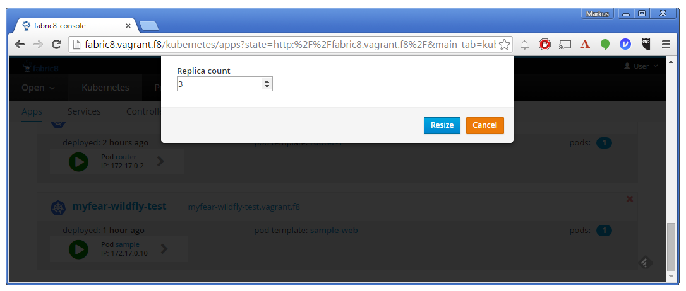
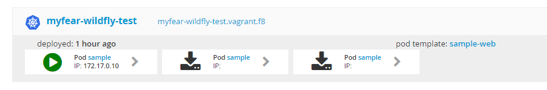
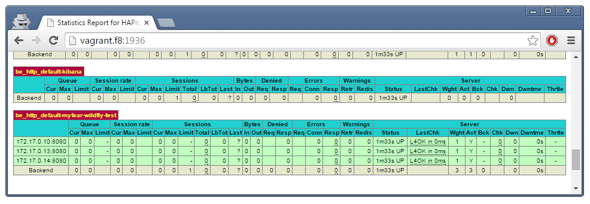

Did you enjoy the first ride with Fabric8 and OpenShift v3? There's more a lot more to come. After we got the first WildFly container up and running on Kubernetes, without having to deal with all it's inherent complexity, I think it is about time to start to scale and load balance WildFly.
 
 <b>Prerequisites</b>
 
 Make sure, you have the complete Vagrant, Fabric8, OpenShift v3, Kubernetes environment running. I walked you <a href="http://blog.eisele.net/2015/07/running-wildfly-on-openshift-3-with-kubernetes-fabric8-on-windows.html" target="_blank">through the installation on Windows in my earlier blog post</a>, but you can also give it a try on&nbsp;<a href="http://fabric8.io/guide/getStarted/gke.html" target="_blank">Google Container Engine</a>&nbsp;or on <a href="http://fabric8.io/guide/getStarted/openshift.html" target="_blank">OpenShift v3</a>.
 
 <b>The Basics</b>
 
 What we did yesterday was to take our local Java EE 7 application and dockerize it based on latest jboss/wildfly:9.0.1.Final image. After that was done, we build the new myfear/wildfly-test:latest custom image and pushed it to the docker registry running on the vagrant image. The Fabric8 Maven plugin created the Kubernetes JSON for us and pushed it out to OpenShift for us. All this with the help of a nice and easy to use web-console. This post is going to re-use the same <a href="https://github.com/myfear/sample-wildfly-fabric8" target="_blank">Java EE 7 example</a> which you can grep from my github account.
 
 <b>Scaling Your Java EE Application on OpenShift With Fabric</b>
 
 One of the biggest features of Java EE application servers is scaling. Running high load on Kubernetes doesn't exactly match to how this was typically done in the past. With Kubernetes, you can scale Nodes and Minions, Replication Controllers and Pods according to your needs. Instead of launching new JVMs, you launch new container instances. And, we have learned, that Fabric8 is a very handy administration tool for Kubernetes, so we're going to scale our application a bit.
 
 So, build the docker image of your Java EE 7 application and deploy it to Fabric8 with the following maven commands:
 
<pre class="code"><code> mvn clean install docker:build mvn fabric8:json fabric8:apply </code></pre> If that succeeded, you can access your application via http://myfear-wildfly-test.vagrant.f8/. The <a href="http://myfear-wildfly-test.vagrant.f8/HelloWorld" target="_blank">HelloWorld Servlet</a> shows the hostname and the POD ID
 
 

 

 No matter how often you hit refresh at this point, there is never going to be another pod id in this response. Of course not, we're only running one instance until now. Let's switch to the Fabric 8 console and scale up the pods. Switch to the "Apps" tab and click on the little green icon on the lower right to your application. In the overlay change the number of pods from one to three.
 
 

 

 
 After a while, the change is reflected in your console and the pods go from downloading to green in a couple of seconds
 

 

 
 Let's go back to our web-interface and hit refresh a couple of times. Nothing changes? What happened? What is wrong? Let me walk you through the architecture a little:
 
 <b>Overall Architecture</b>
 
 Did yesterdays blog post left your wondering? How did all the parts work together? Here's a little better overview for you. Spoiler alert: This is overly simplifying the <a href="https://docs.openshift.org/latest/architecture/overview.html" target="_blank">OpenShift architecture</a>. Please dig into the details on your own. I just want to give you a very focused view on scaling and load balancing with Fabric8 and OpenShift.
 

 

 
 Everything relies on the OpenShift routing and management of the individual pods. Ports are exposed by containers and mapped through services. And this goes back to back from client to the running instance. And the central component, which does the routing is the HAProxy obviously. Which is a normal pod with one little exception: It has a public IP address. Let's see, what this thing does on OpenShift and how it is configured.
 
 <b>HAProxy As Standard Router On OpenShift</b>
 
 The default router implementation on OpenShift is HAProxy. It uses sticky sessions based on http-keep-alive. In addition, the router plug-in provides the service name and namespace to the underlying implementation. This can be used for <a href="https://docs.openshift.org/latest/architecture/core_concepts/routes.html" target="_blank">more advanced configuration</a> such as implementing stick-tables that synchronize between a set of peers.
 
 The HAProxy router exposes a web listener for the HAProxy statistics. You can view the statistics in our example, by accessing http://vagrant.f8:1936/. It's a little tricky to find out the administrator password. This password and port are configured during the router installation, but they can be found by viewing the haproxy.conf file on the container. All you need find out is the pod, log-in to it, find the configuration file and read the password. In my case it was "6AtZV43YUk".
 
<pre class="code"><code> oc get pods oc exec -it -p &lt;POD_ID&gt; bash less haproxy.config </code></pre> Now, that we found out about this, things got clearer. Once, we have an open connection to one of our instances, this is not going to be released again in the standard configuration. But we can check that the routes are in place by looking at the statistics.
 
 

 

 
 And if you really want to see, that it actually does work, you need to trick out the stickiness with a little curl magic. If you have <a href="" target="_blank">Mysysgit</a> installed on Windows, you can run the <a href="https://github.com/myfear/sample-wildfly-fabric8/blob/master/src/main/bin/check_cluster.bat" target="_blank">little batch script</a> in my repository. It curl's a REST endpoint which puts out the POD ID which is serving the request:
 
<pre class="code"><code> \{"name":"myfear","environment":"sample-web-jruh5"\} \{"name":"myfear","environment":"sample-web-jruh5"\} \{"name":"myfear","environment":"sample-web-jruh5"\} \{"name":"myfear","environment":"sample-web-jruh5"\} \{"name":"myfear","environment":"sample-web-jruh5"\} \{"name":"myfear","environment":"sample-web-4oxjj"\} \{"name":"myfear","environment":"sample-web-jruh5"\} \{"name":"myfear","environment":"sample-web-pku0c"\} \{"name":"myfear","environment":"sample-web-4oxjj"\} \{"name":"myfear","environment":"sample-web-jruh5"\} \{"name":"myfear","environment":"sample-web-pku0c"\} </code></pre> The first five requests always return the same POD ID until the new PODs come up and the HAProxy starts to dispatch the requests round-robin. If you want to influence this behavior, you can do this. Just read more about administration of the router in the <a href="https://github.com/openshift/openshift-docs/blob/master/admin_guide/router.adoc" target="_blank">OpenShift Administration documentation</a>. And here is a <a href="https://docs.openshift.org/latest/cli_reference/basic_cli_operations.html" target="_blank">complete reference about the "oc" command line interface</a>. If you need some ideas how to use the oc client to find out about different objects and types, there is a complete set of <a href="https://github.com/fabric8io/fabric8/tree/master/bin" target="_blank">batch scripts in the fabric8/bin folder</a> on github.
 
 
 It's about time to diver deeper into the developer tooling of Fabric8. Stay curious for more details in the next blog posts.