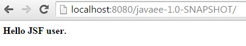
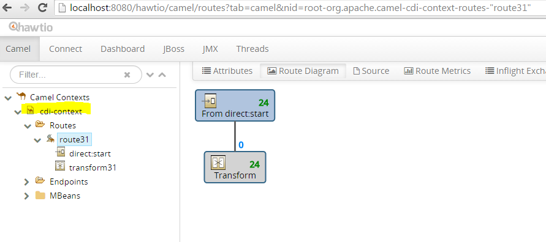

I've been working with Camel since a while now and I really like it's simplicity. Using it on top of Java EE always was a little bit of a challenge and one of the recent talks I gave about how to do this and the different methods of bootstrapping Camel in Java EE actually proposes to use the <a href="" target="_blank">WildFly-Camel Subsystem</a>. In an ongoing series I am going to explore the different ways of doing this and provide a bunch of examples which are still missing from the talk. I'm happy to receive your feedback and requests in the comments or via <a href="http://www.twitter.com/myfear" target="_blank">@myfear</a> on twitter.
 
 <b>Getting Started With Camel On WildFly 8.2&nbsp;</b>
 
 The Wildfly-Camel Subsystem provides Apache Camel integration with the WildFly Application Server. It allows you to add Camel Routes as part of the WildFly configuration. Routes can be deployed as part of Java EE applications. Java EE components can access the Camel Core API and various Camel Component APIs. Your Enterprise Integration Solution can be architected as a combination of Java EE and Camel functionality.
 
 Remark: Latest WildFly 9 is expected to be supported by the 3.x release of WildFly-Camel.
 
 <b>Getting Ready&nbsp;</b>
 
 Download and unzip W<a href="" target="_blank">ildFly 8.2.0.Final</a> to a folder of your choice. Download and unzip the <a href="https://github.com/wildfly-extras/wildfly-camel/releases" target="_blank">wildfly-camel patch</a> (2.3.0) to the wildfly folder. &nbsp;Start WildFly with
 
<pre class="code"><code>bin/standalone[.bat|.sh] -c standalone-camel.xml</code></pre> One of the fastest ways to get up and running is with Docker and the <a href="" target="_blank">WildFly Camel image</a>. This image comes bundled with WildFly 8.1 and the Camel subsystem already installed. 
 <b>Defining And Using A Camel Context</b>
 
 The CamelContext represents a single Camel routing rulebase. You use the CamelContext in a similar way to the Spring ApplicationContext. It contains all the routes for your application. You can have as many CamelContexts as necessary, as long as they have different names. WildFly-Camel let's you define them as a) in the <a href="http://wildflyext.gitbooks.io/wildfly-camel/content/features/context-definitions.html" target="_blank">standalone-camel.xml and domain.xml</a> as part of the subsystem definition itself and b) or deploy them in a <a href="http://wildflyext.gitbooks.io/wildfly-camel/content/features/context-deployments.html" target="_blank">supported deployment artifact which contains a -camel-context.xml</a> suffixed file and c) it can be provided as together with it's routes via a <a href="http://wildflyext.gitbooks.io/wildfly-camel/content/javaee/cdi.html" target="_blank">RouteBilder and the CDI integration</a>.
 
 A defined CamelContext can be consumed in two different ways: a) <a href="http://wildflyext.gitbooks.io/wildfly-camel/content/javaee/cdi.html" target="_blank">@Injected via Camel-CDI</a> or b) accessed from the<a href="http://wildflyext.gitbooks.io/wildfly-camel/content/javaee/jndi.html" target="_blank"> JNDI tree</a>. 
 
 <b>The Example Context And Route</b>
 
 For the following examples I use a context with an associated route which is provided via CDI and a RouteBuilder. It is an application scoped bean which is automatically started with the application start. The @ContextName annotation gives a specific name to the CamelContext.
 
<pre class="code"><code>@ApplicationScoped @Startup @ContextName("cdi-context") public class HelloRouteBuilder extends RouteBuilder \{ @Inject HelloBean helloBean; @Override public void configure() throws Exception \{ from("direct:start").transform(body().prepend(helloBean.sayHello()).append(" user.")); \} \} </code></pre> The route itself isn't exactly challenging. It takes an empty message body from direct:start and prepends the output from a CDI bean-method "sayHello" and appends the string " user." to it. For reference, the complete code can be found on <a href="https://github.com/myfear/camel-javaee" target="_blank">my GitHub account</a>. So, all we need to find out next is, how to use this route in the various Java EE component specifications.
 
 <b>Using Camel From CDI</b>
 
 Camel supports CDI since version 2.10. Before and outside the subsystem, it needed to be bootstrapped. This is no longer necessary and you can just use a deployed or defined CamelContext in a @Named CDI bean by simply @Injecting it by name:
 
<pre class="code"><code>@Inject @ContextName("cdi-context") private CamelContext context; </code></pre>
 <b>Using Camel From JSF, JAX-RS and EJBs</b>
 

 

 With the knowledge about how to use a CamelContext in CDI, you would assume, that it is easy to just do the same from JSF and alike. This is not true. You actually can't inject it into either ManagedBeans or even CDI Beans which are bound to a JSF component. Plus it's not working in EJBs. I haven't looked into it detailed, but assume it has something to do with scopes. A reasonable workaround and in fact, a better application design is to put the complete Camel logic into a separate CDI bean and just inject this.
 
<pre class="code"><code>@Named public class HelloCamel \{ @Inject @ContextName("cdi-context") private CamelContext context; private final static Logger LOGGER = Logger.getLogger(HelloCamel.class.getName()); public String doSomeWorkFor(String name) \{ ProducerTemplate producer = context.createProducerTemplate(); String result = producer.requestBody("direct:start", name, String.class); LOGGER.log(Level.INFO, result); return result; \} \}</code></pre> The <a href="http://camel.apache.org/producertemplate.html" target="_blank">ProducerTemplate</a> interface allows you to send message exchanges to endpoints in a variety of different ways to make it easy to work with Camel Endpoint instances from Java code. In this particular case, it just starts the route and puts a String into the body which represents the name of the component I'm using it from.
 
 The CDI Bean, which acts as a backing-bean for the component just uses it:
 
<pre class="code"><code>@Inject HelloCamel helloCamel; public String getName() \{ return helloCamel.doSomeWorkFor("JSF"); \}</code></pre> The return String is "Hello JSF user." Which also is written to the WildFly server log. The same approach is the best for all the other Java EE components.
 
 <b>Using Camel From EJBs</b>
 
 If you're using EJBs as your man application component model, it is also very reasonable to just use the JNDI approach: 
 
<pre class="code"><code> CamelContext camelctx =&nbsp; (CamelContext) inicxt.lookup("java:jboss/camel/context/cdi-context");</code></pre>
 <b>Hawtio - A Camel Console</b>
 
 Another hidden gem in the subsystem is the bundling of the <a href="" target="_blank">Hawtio</a> console. It is a modular web console for managing your Java stuff and has an Apache Camel plugin which visualizes your contexts and routes. Remember, that it is automatically configured for security and you need to add a management user before you're able to access it.
 
 

 

 <b>Further Reading &amp; Help</b>
 <a href="https://webchat.freenode.net/?channels=wildfly-camel" target="_blank">Talk to the Developers on Freenode</a>
 <a href="http://wildflyext.gitbooks.io/wildfly-camel/content/index.html" target="_blank">WildFly-Camel Subystem Documentation</a>
 <a href="" target="_blank">WildFly Camel On GitHub</a>
 <a href="" target="_blank">Apache Camel Website</a>