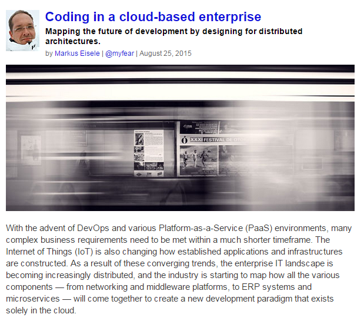

 

 One of my recent writings got posted on O'Reilly's Radar. It explores the future of development projects and teams while using all the new xPaaS services offered by today's clouds. While the article is more a thought leadership piece based on a vision Mark Little sketched earlier, it also has some aspects in it, which you can find in projects as of today already.
 
 <b>xPaaS - All The PaaS Offerings</b>
 <a href="http://www.gartner.com/id=2515316" target="_blank">Gartner</a> uses the term xPaaS to describe the whole spectrum of specialized middleware services that can be offered as PaaS.&nbsp;Red Hat decided to also use xPaaS as a description for their offerings, because it is meant to encompass much more than what PaaS has typically come to be associated with (aPaaS, or Application PaaS, is a component of xPaaS). In many ways we've been talking about xPaaS for a couple of years and particularly how technologies and methodologies such as SOA or integration must play within the Cloud and between users of the Cloud.
 
 <b>How Will This Change Development?</b>
 
 This is the real question, the article answers.&nbsp;With the advent of DevOps and various Platform-as-a-Service (PaaS) environments, many complex business requirements need to be met within a much shorter timeframe. The Internet of Things (IoT) is also changing how established applications and infrastructures are constructed. As a result of these converging trends, the enterprise IT landscape is becoming increasingly distributed, and the industry is starting to map how all the various components — from networking and middleware platforms, to ERP systems and microservices — will come together to create a new development paradigm that exists solely in the cloud.
 
 <a href="http://radar.oreilly.com/2015/08/coding-in-a-cloud-based-enterprise.html" target="_blank">Read it online for free</a> and I am happy to hear about your thoughts and comments about what you think, that development will look like in the Future.