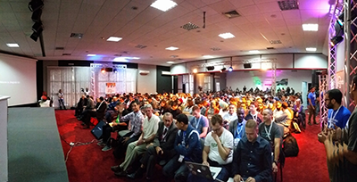
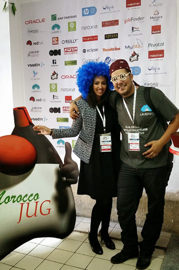

Last year was my first year at <a href="" target="_blank">Devoxx Morocco</a>. Oh, I forgot. Back in the days, it was still called JMaghreb. And I was really curious to go there, because of a couple of reasons. First of all, I never visited Morocco before. But second of all, my dear friend <a href="https://twitter.com/badrelhouari" target="_blank">Badr</a> said, that it is an amazing conference and I just had to come. It din't work out before and I felt guilty to not have gone. So, I decided to do my best to make up for it. And first of all had the pleasure to attend JMaghreb 2014. It has been a very warm welcome to me and I really enjoyed all the new impressions this country had waiting for me. Everybody was friendly and I got to see a little of Casablanca, which was the city where the conference was held.
 
 

 

 
 <b>Content, Content Content for a Hungry Audience</b>
 

 

 The content was amazing. A lot of well known speakers and topics which were spot on. And even I had packed one of my most relevant presentations about Developer Security Awareness. Every session was packed. A little different to from what I was used to, the strong presence of comparably young people, which have been very hungry for information and latest updates. As a speaker you usually get to answer a couple of questions and maybe find the time to have a coffee or water with another three attendees afterwards which have some more detailed questions. And believe it or not, I felt like a rockstar in Morocco: 10+ people wanted to talk about all aspects of my session afterwards and we've been hanging out and talking for at least an hour longer than usual. And this was more a general feedback from all the speakers; the audience was very interested and ready to fire their questions.
 
 <b>Casablanca - A Beautiful City</b>
 
 The venue was a little away from the center and cabs are a rare thing to get hands on. At least the ones I trust (not judging, just telling you that I am German). But we managed to get back and forth to the venue and beside that, there is some great history in Casablanca. I had to see <a href="" target="_blank">Rick's Cafe</a> and the <a href="https://en.wikipedia.org/wiki/Hassan_II_Mosque" target="_blank">Hassan II Mosque</a>. And the local markets and .. and ... and.
 
 <b>A Trip To Marrakesh</b>
 
 We've not been done after the conference. Badr invited his speakers on an extended weekend trip over to Marrakesh. Which is another just wonderful piece of history. The hospitality in the country is still a big part for me to remember and I can only briefly tell you about all the historic sites in between the pulsing life, that is waiting for you there. A trip, I'll never forget.
 
 <b>JMaghreb turned Devoxx Morocco</b>
 
 But coming back and adopting to the really cold weather in Germany in November wasn't the only surprise waiting for me. Very soon it turned out, that this amazing conference is joining the Devoox family and after I was asked to join the program committee, I was just left with a simple: yes, I want to! And that is, what I spend a reasonable amount of time on: Selecting the best talks for the upcoming inaugural edition of the most southern Devoxx conference ever.
 
 And here are <a href="http://cfp.devoxx.ma/2015/speakers.html" target="_blank">some of the already selected speakers</a>. I can only highly recommend on going if you have a chance to attend. There is still <a href="" target="_blank">plenty of time to register</a>!