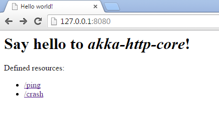

From time to time it is necessary to just take the little effort to think outside the box. This is a good habit for every developer and even if you just spend 10% of your time, with new and noteworthy technology, you will gain experience and broaden your knowledge. I wanted to look into Scala and Akka since a while. Both well known old acquaintances on many conference agendas. But honestly, I've never felt the need to take a second look. This changed quite a bit when I started to look deeper into microservices and relevant concepts around it. Let's get started and see what's in there.
 
 <b>What Is Akka? And why Scala?</b>
 
 But first some sentences about what <a href="" target="_blank">Akka </a>is.&nbsp;The name AKKA is the a palindrome of letters A and K as in Actor Kernel.
 
 
<blockquote class="tr_bq">
 "Akka is a toolkit and runtime for building highly concurrent, distributed, and resilient message-driven applications on the JVM."
</blockquote>
 
 It was built with the idea in mind to make writing&nbsp;concurrent, fault-tolerant and scalable applications easier. With the help of the so called "<a href="https://en.wikipedia.org/wiki/Actor_model" target="_blank">Actor</a>" model the abstraction level for those applications has been re-defined and by adopting the&nbsp;"let it crash" concept you can build&nbsp;applications that self-heal and systems that stand very high workloads. &nbsp;Akka is Open Source, available under the Apache 2 License and can be downloaded from&nbsp;<a href="http://akka.io/downloads" target="_blank">http://akka.io/downloads</a>. Learn more about it in the official <a href="http://doc.akka.io/docs/akka/2.4.0/intro/what-is-akka.html" target="_blank">Akka documentation</a>. Akka comes in two flavors: With a Java and a Scala API. So, you're basically free to choose which version you want to use in your projects. I went for Scala in this blog post &nbsp;because I couldn't find enough Akka Java examples out there. 
 
 <b>Why Should A Java Developer Care?</b>
 
 I don't know a lot about you, but I was just curious about it and started to browse the documentation a bit. The "<a href="http://doc.akka.io/docs/akka/2.4.0/java/hello-world.html" target="_blank">Obligatory Hello World</a>" didn't lead me anywhere. Maybe because I was (am) still thinking too much in Maven and Java but we're here to open our minds a bit so it was about time to change that. Resilient and message driven systems seem to be the most promising way of designing microservices based applications. And even if there are things like Vert.x which are a lot more accessible for Java developers it never is bad to look into something new.&nbsp; Because I didn't get anywhere close to where I wanted to be with the documentation, I gave Konrad `<a href="http://twitter.com/ktosopl" target="_blank">@ktosopl</a>` Malawsk&nbsp;a ping and asked for help. He came up with a nice little <a href="https://github.com/ktoso/example-akka-http" target="_blank">Akka-HTTP</a> example for me to take apart and learn. Thanks for your help!
 
 <b>Akka, Scala and now Akka-HTTP?</b>
 
 Another new name.&nbsp;<a href="http://doc.akka.io/docs/akka-stream-and-http-experimental/1.0/scala/http/introduction.html" target="_blank">The Akka HTTP</a> modules implement a full server- and client-side HTTP stack on top of akka-actor and akka-stream. It's not a web-framework but rather a more general toolkit for providing and consuming HTTP-based services. And this is what I wanted to take a look at. Sick of reading? Let's get started:
 
 <b>Clone And Compile - A Smoke-Test</b>
 

 

 Git clone Konrad's example to a folder of choice and start to compile and run it: 
 
<pre class="code"><code>git clone&nbsp;https://github.com/ktoso/example-akka-http.git mvn exec:java </code></pre> After downloading the internet point your browser to http://127.0.0.1:8080/ and try the "ping" link. You get a nice "PONG!" answer.
 
 Congratulations. Now let's look at the code. 
 
 <b>The Example Code</b>
 
 Looking at the pom.xml and the <a href="https://github.com/ktoso/example-akka-http/blob/master/pom.xml#L141" target="_blank">exec-maven-plugin configuration</a> points us to the com.example.<a href="https://github.com/ktoso/example-akka-http/blob/master/src/main/scala/com/example/ExampleServer.scala" target="_blank">ExampleServer.scala</a> class. It extends the <a href="https://github.com/ktoso/example-akka-http/blob/master/src/main/scala/com/example/ExampleRoutes.scala" target="_blank">ExampleRoutes.scala</a> and obviously has some routes defined. Not surprisingly those map to the links you can use from the index page. It kinds of makes sense, even if you don't understand Scala. For the Java developers among us, Konrad was kind enough to add a Java Akka example (<a href="https://github.com/ktoso/example-akka-http/blob/master/src/main/java/com/example/JavaExampleServer.java" target="_blank">JavaExampleServer.java</a>). If I compare both of them, I still like the Java example a lot better, but it is also probably also a little longer. Just choose what you like best.
 
 There's <a href="https://github.com/ktoso/example-akka-http/blob/master/src/main/scala/com/example/ExampleRoutes.scala#L38" target="_blank">one very cool thing</a> in the example that you might want to check out.&nbsp;The line is emitting an Reactive Streams source of data which is pushed exactly as fast as the client can consume it, and it is only generated "on demand". Compare&nbsp;<a href="" target="_blank">http://www.reactive-streams.org/</a> for more details.
 
 The main advantage of the example is obviously that it provides a complete Maven based build for both languages and can be easily used to learn a lot more about Akka. A good jumping off point. And because there is not a lot more in this example from a feature perspective let's see if we can get this to run in the cloud.
 
 <b>Deploying Akka - In A Container</b>
 
 According to the documentation there are three different ways of deploying Akka applications: 
 
<ul>
 <li>As a library: used as a regular JAR on the classpath and/or in a web app, to be put into WEB-INF/lib</li>
 <li>Package with sbt-native-packager which is able to build *.deb, *.rpm or docker images which are prepared to run your app.</li>
 <li>Package and deploy using Typesafe ConductR.</li>
</ul> I don't know anything about sbt and ConductR &nbsp;so, I thought I just go with what I was playing around lately anyway: In a container. If it runs from a Maven build, I can easily package it as an image. Let's go. The first step is to add the Maven Shade Plugin to the pom.xml: 
 
<pre class="code"><code>&lt;plugin&gt; &nbsp; &nbsp;&lt;groupId&gt;org.apache.maven.plugins&lt;/groupId&gt; &nbsp; &nbsp;&lt;artifactId&gt;maven-shade-plugin&lt;/artifactId&gt; &nbsp; &nbsp;&lt;version&gt;2.4.1&lt;/version&gt; &nbsp; &nbsp;&lt;executions&gt; &nbsp; &nbsp; &nbsp; &lt;execution&gt; &nbsp; &nbsp; &nbsp; &nbsp; &nbsp;&lt;phase&gt;package&lt;/phase&gt; &nbsp; &nbsp; &nbsp; &nbsp; &nbsp;&lt;goals&gt; &nbsp; &nbsp; &nbsp; &nbsp; &nbsp; &nbsp; &lt;goal&gt;shade&lt;/goal&gt; &nbsp; &nbsp; &nbsp; &nbsp; &nbsp;&lt;/goals&gt; &nbsp; &nbsp; &nbsp; &nbsp; &nbsp;&lt;configuration&gt; &nbsp; &nbsp; &nbsp; &nbsp; &nbsp; &nbsp; &lt;shadedArtifactAttached&gt;true&lt;/shadedArtifactAttached&gt; &nbsp; &nbsp; &nbsp; &nbsp; &nbsp; &nbsp; &lt;shadedClassifierName&gt;allinone&lt;/shadedClassifierName&gt; &nbsp; &nbsp; &nbsp; &nbsp; &nbsp; &nbsp; &lt;artifactSet&gt; &nbsp; &nbsp; &nbsp; &nbsp; &nbsp; &nbsp; &nbsp; &nbsp;&lt;includes&gt; &nbsp; &nbsp; &nbsp; &nbsp; &nbsp; &nbsp; &nbsp; &nbsp; &nbsp; &lt;include&gt;*:*&lt;/include&gt; &nbsp; &nbsp; &nbsp; &nbsp; &nbsp; &nbsp; &nbsp; &nbsp;&lt;/includes&gt; &nbsp; &nbsp; &nbsp; &nbsp; &nbsp; &nbsp; &lt;/artifactSet&gt; &nbsp; &nbsp; &nbsp; &nbsp; &nbsp; &nbsp; &lt;transformers&gt; &nbsp; &nbsp; &nbsp; &nbsp; &nbsp; &nbsp; &nbsp; &nbsp;&lt;transformer implementation="org.apache.maven.plugins.shade.resource.AppendingTransformer"&gt; &nbsp; &nbsp; &nbsp; &nbsp; &nbsp; &nbsp; &nbsp; &nbsp; &nbsp; &lt;resource&gt;reference.conf&lt;/resource&gt; &nbsp; &nbsp; &nbsp; &nbsp; &nbsp; &nbsp; &nbsp; &nbsp;&lt;/transformer&gt; &nbsp; &nbsp; &nbsp; &nbsp; &nbsp; &nbsp; &nbsp; &nbsp;&lt;transformer implementation="org.apache.maven.plugins.shade.resource.ManifestResourceTransformer"&gt; &nbsp; &nbsp; &nbsp; &nbsp; &nbsp; &nbsp; &nbsp; &nbsp; &nbsp; &lt;main-Class&gt;com.example.ExampleServer&lt;/main-Class&gt; &nbsp; &nbsp; &nbsp; &nbsp; &nbsp; &nbsp; &nbsp; &nbsp;&lt;/transformer&gt; &nbsp; &nbsp; &nbsp; &nbsp; &nbsp; &nbsp; &lt;/transformers&gt; &nbsp; &nbsp; &nbsp; &nbsp; &nbsp;&lt;/configuration&gt; &nbsp; &nbsp; &nbsp; &lt;/execution&gt; &nbsp; &nbsp;&lt;/executions&gt; &lt;/plugin&gt; </code></pre> The shade plugin creates an Uber jar, which is exactly, what I want to have in this case. There are three little special cases in the configuration. We need to:
 
<ol>
 <li>attach the shaded artifact to access it from the Docker Maven Plugin</li>
 <li>use the AppendingTransformer, because the configuration file is <a href="http://doc.akka.io/docs/akka/snapshot/general/configuration.html" target="_blank">concatenated and not a "pick one" thing</a> during the build process.</li>
 <li>define the main class, that we want to run.</li>
</ol> When this is done, it is about time to configure our Docker Maven Plugin accordingly:
 
<pre class="code"><code>&lt;plugin&gt; &nbsp; &nbsp;&lt;groupId&gt;org.jolokia&lt;/groupId&gt; &nbsp; &nbsp;&lt;artifactId&gt;docker-maven-plugin&lt;/artifactId&gt; &nbsp; &nbsp;&lt;version&gt;0.13.5&lt;/version&gt; &nbsp; &nbsp;&lt;configuration&gt; &nbsp; &nbsp; &nbsp; &lt;images&gt; &nbsp; &nbsp; &nbsp; &nbsp; &nbsp;&lt;image&gt; &nbsp; &nbsp; &nbsp; &nbsp; &nbsp; &nbsp; &lt;name&gt;myfear/akka-sample:latest&lt;/name&gt; &nbsp; &nbsp; &nbsp; &nbsp; &nbsp; &nbsp; &lt;build&gt; &nbsp; &nbsp; &nbsp; &nbsp; &nbsp; &nbsp; &nbsp; &nbsp;&lt;from&gt;jboss/base-jdk:8&lt;/from&gt; &nbsp; &nbsp; &nbsp; &nbsp; &nbsp; &nbsp; &nbsp; &nbsp;&lt;maintainer&gt;markus@jboss.org&lt;/maintainer&gt; &nbsp; &nbsp; &nbsp; &nbsp; &nbsp; &nbsp; &nbsp; &nbsp;&lt;ports&gt; &nbsp; &nbsp; &nbsp; &nbsp; &nbsp; &nbsp; &nbsp; &nbsp; &nbsp; &lt;port&gt;8080&lt;/port&gt; &nbsp; &nbsp; &nbsp; &nbsp; &nbsp; &nbsp; &nbsp; &nbsp;&lt;/ports&gt; &nbsp; &nbsp; &nbsp; &nbsp; &nbsp; &nbsp; &nbsp; &nbsp;&lt;entryPoint&gt; &nbsp; &nbsp; &nbsp; &nbsp; &nbsp; &nbsp; &nbsp; &nbsp; &nbsp; &lt;exec&gt; &nbsp; &nbsp; &nbsp; &nbsp; &nbsp; &nbsp; &nbsp; &nbsp; &nbsp; &nbsp; &nbsp;&lt;arg&gt;java&lt;/arg&gt; &nbsp; &nbsp; &nbsp; &nbsp; &nbsp; &nbsp; &nbsp; &nbsp; &nbsp; &nbsp; &nbsp;&lt;arg&gt;-jar&lt;/arg&gt; &nbsp; &nbsp; &nbsp; &nbsp; &nbsp; &nbsp; &nbsp; &nbsp; &nbsp; &nbsp; &nbsp;&lt;arg&gt;/opt/akka-http/akka-http-service.jar&lt;/arg&gt; &nbsp; &nbsp; &nbsp; &nbsp; &nbsp; &nbsp; &nbsp; &nbsp; &nbsp; &lt;/exec&gt; &nbsp; &nbsp; &nbsp; &nbsp; &nbsp; &nbsp; &nbsp; &nbsp;&lt;/entryPoint&gt; &nbsp; &nbsp; &nbsp; &nbsp; &nbsp; &nbsp; &nbsp; &nbsp;&lt;assembly&gt; &nbsp; &nbsp; &nbsp; &nbsp; &nbsp; &nbsp; &nbsp; &nbsp; &nbsp; &lt;inline&gt; &nbsp; &nbsp; &nbsp; &nbsp; &nbsp; &nbsp; &nbsp; &nbsp; &nbsp; &nbsp; &nbsp;&lt;dependencySets&gt; &nbsp; &nbsp; &nbsp; &nbsp; &nbsp; &nbsp; &nbsp; &nbsp; &nbsp; &nbsp; &nbsp; &nbsp; &lt;dependencySet&gt; &nbsp; &nbsp; &nbsp; &nbsp; &nbsp; &nbsp; &nbsp; &nbsp; &nbsp; &nbsp; &nbsp; &nbsp; &nbsp; &nbsp;&lt;useProjectAttachments&gt;true&lt;/useProjectAttachments&gt; &nbsp; &nbsp; &nbsp; &nbsp; &nbsp; &nbsp; &nbsp; &nbsp; &nbsp; &nbsp; &nbsp; &nbsp; &nbsp; &nbsp;&lt;includes&gt; &nbsp; &nbsp; &nbsp; &nbsp; &nbsp; &nbsp; &nbsp; &nbsp; &nbsp; &nbsp; &nbsp; &nbsp; &nbsp; &nbsp; &nbsp; &lt;include&gt;com.example:akka-http-example:jar:allinone&lt;/include&gt; &nbsp; &nbsp; &nbsp; &nbsp; &nbsp; &nbsp; &nbsp; &nbsp; &nbsp; &nbsp; &nbsp; &nbsp; &nbsp; &nbsp;&lt;/includes&gt; &nbsp; &nbsp; &nbsp; &nbsp; &nbsp; &nbsp; &nbsp; &nbsp; &nbsp; &nbsp; &nbsp; &nbsp; &nbsp; &nbsp;&lt;outputFileNameMapping&gt;akka-http-service.jar&lt;/outputFileNameMapping&gt; &nbsp; &nbsp; &nbsp; &nbsp; &nbsp; &nbsp; &nbsp; &nbsp; &nbsp; &nbsp; &nbsp; &nbsp; &lt;/dependencySet&gt; &nbsp; &nbsp; &nbsp; &nbsp; &nbsp; &nbsp; &nbsp; &nbsp; &nbsp; &nbsp; &nbsp;&lt;/dependencySets&gt; &nbsp; &nbsp; &nbsp; &nbsp; &nbsp; &nbsp; &nbsp; &nbsp; &nbsp; &lt;/inline&gt; &nbsp; &nbsp; &nbsp; &nbsp; &nbsp; &nbsp; &nbsp; &nbsp; &nbsp; &lt;user&gt;jboss:jboss:jboss&lt;/user&gt; &nbsp; &nbsp; &nbsp; &nbsp; &nbsp; &nbsp; &nbsp; &nbsp; &nbsp; &lt;basedir&gt;/opt/akka-http&lt;/basedir&gt; &nbsp; &nbsp; &nbsp; &nbsp; &nbsp; &nbsp; &nbsp; &nbsp;&lt;/assembly&gt; &nbsp; &nbsp; &nbsp; &nbsp; &nbsp; &nbsp; &lt;/build&gt; &nbsp; &nbsp; &nbsp; &nbsp; &nbsp; &nbsp; &lt;run&gt; &nbsp; &nbsp; &nbsp; &nbsp; &nbsp; &nbsp; &nbsp; &nbsp;&lt;ports&gt; &nbsp; &nbsp; &nbsp; &nbsp; &nbsp; &nbsp; &nbsp; &nbsp; &nbsp; &lt;port&gt;$\{swarm.port\}:8080&lt;/port&gt; &nbsp; &nbsp; &nbsp; &nbsp; &nbsp; &nbsp; &nbsp; &nbsp;&lt;/ports&gt; &nbsp; &nbsp; &nbsp; &nbsp; &nbsp; &nbsp; &nbsp; &nbsp;&lt;wait&gt; &nbsp; &nbsp; &nbsp; &nbsp; &nbsp; &nbsp; &nbsp; &nbsp; &nbsp; &lt;http&gt; &nbsp; &nbsp; &nbsp; &nbsp; &nbsp; &nbsp; &nbsp; &nbsp; &nbsp; &nbsp; &nbsp;&lt;url&gt;http://$\{docker.host.address\}:$\{swarm.port\}&lt;/url&gt; &nbsp; &nbsp; &nbsp; &nbsp; &nbsp; &nbsp; &nbsp; &nbsp; &nbsp; &nbsp; &nbsp;&lt;status&gt;200&lt;/status&gt; &nbsp; &nbsp; &nbsp; &nbsp; &nbsp; &nbsp; &nbsp; &nbsp; &nbsp; &lt;/http&gt; &nbsp; &nbsp; &nbsp; &nbsp; &nbsp; &nbsp; &nbsp; &nbsp; &nbsp; &lt;time&gt;30000&lt;/time&gt; &nbsp; &nbsp; &nbsp; &nbsp; &nbsp; &nbsp; &nbsp; &nbsp;&lt;/wait&gt; &nbsp; &nbsp; &nbsp; &nbsp; &nbsp; &nbsp; &nbsp; &nbsp;&lt;log&gt; &nbsp; &nbsp; &nbsp; &nbsp; &nbsp; &nbsp; &nbsp; &nbsp; &nbsp; &lt;color&gt;yellow&lt;/color&gt; &nbsp; &nbsp; &nbsp; &nbsp; &nbsp; &nbsp; &nbsp; &nbsp; &nbsp; &lt;prefix&gt;AKKA&lt;/prefix&gt; &nbsp; &nbsp; &nbsp; &nbsp; &nbsp; &nbsp; &nbsp; &nbsp;&lt;/log&gt; &nbsp; &nbsp; &nbsp; &nbsp; &nbsp; &nbsp; &lt;/run&gt; &nbsp; &nbsp; &nbsp; &nbsp; &nbsp;&lt;/image&gt; &nbsp; &nbsp; &nbsp; &lt;/images&gt; &nbsp; &nbsp;&lt;/configuration&gt; &lt;/plugin&gt; </code></pre> Couple of things to notice: 
 
<ul>
 <li>the output file mapping, which needs to be the same in the entrypoint argument.&nbsp;</li>
 <li>the project attachment include "allinone" which we defined in the Maven shade plugin.</li>
 <li>the user in the image assembly (needs to be one that has been defined in the base image. In this case jboss/base-jdk which only knows the user jboss.)</li>
</ul> And while we're on it, we need to tweak the example a bit. The binding to localhost for the Akka-Http server is not really helpful on a containerized environment. So, we use the java.net library to find out about the actual IP of the container. And while we're at it: Comment out the post startup procedure. The new ExampleServer looks like this:
 
<pre class="code"><code>package com.example import akka.actor.ActorSystem import akka.http.scaladsl.Http import akka.stream.ActorMaterializer import java.net._ object ExampleServer extends ExampleRoutes \{ &nbsp; implicit val system = ActorSystem("ExampleServer") &nbsp; import system.dispatcher &nbsp; implicit val materializer = ActorMaterializer() &nbsp; // settings about bind host/port &nbsp; // could be read from application.conf (via system.settings): &nbsp; val localhost = InetAddress.getLocalHost &nbsp; val interface = localhost.getHostAddress &nbsp; val port = 8080 &nbsp; def main(args: Array[String]): Unit = \{ &nbsp; &nbsp; // Start the Akka HTTP server! &nbsp; // Using the mixed-in testRoutes (we could mix in more routes here) &nbsp; &nbsp; val bindingFuture = Http().bindAndHandle(testRoutes, interface, port) &nbsp; &nbsp; println(s"Server online at http://$interface:$port/\nON Docker...") &nbsp; \} \}&nbsp; </code></pre> Let's build the Akka Application and the Dockerfile by executing:
 
<pre class="code"><code>mvn package docker:build</code></pre> and give it a test-run:
 
<pre class="code"><code>docker run myfear/akka-sample</code></pre> Redirecting your browser to http://192.168.99.100:32773/ (Note: IP and port will be different in your environment. Make sure to list the container port mapping with docker ps and get the ip of your boot2docker or docker-machine instance) will show your the working example again.
 
 <b>Some Final Thoughts</b>
 
 The next step in taking this little Akka example to the cloud would be to deploy it on a PaaS. Take OpenShift for example (compare this post on <a href="http://blog.eisele.net/2015/10/scaling-java-ee-microservices-on-openshift.html" target="_blank">how to do it</a>). As a fat-jar application, it can be easily packaged into an immutable container. I'm not going to compare Akka with anything else in the Java space but wanted to give you a starting point for your own first steps and encourage you always stay curious and educate yourself about some of the technologies out there.
 
 
 Further Readings and Information:
 
<ul>
 <li><a href="" target="_blank">Akka Website</a></li>
 <li><a href="https://twitter.com/akkateam" target="_blank">@AkkaTeam</a> on Twitter</li>
 <li><a href="https://github.com/akka/akka" target="_blank">Source Code</a> on GitHub</li>
 <li><a href="http://groups.google.com/group/akka-user" target="_blank">User Mailinglist</a></li>
</ul>