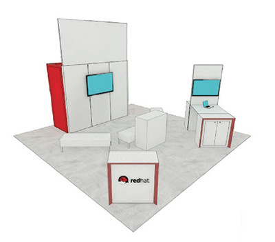

 

 A little under a week before I jump on a plane and make my way to San Francisco again. As you might have guessed it is not only because of the beautiful city but because: It's JavaOne time! And we're pretty excited to be there again as Red Hat. We planned a lot of exciting activities for the attendees and hope to make a real difference with content and our presence in the exhibition hall. This &nbsp;post should be your guide to all the Red Hat content and activieties for the JavaOne week and I can't wait to see you getting excited about it. As usual for an overview, I might be missing things. Please feel free to reach out and I'll get the information added. If you haven't registered so far there is still plenty of time to consider a visit. Find more information on the <a href="" target="_blank">offical JavaOne website</a> and on the <a href="" target="_blank">JavaOne blog</a>.
 
 <b>Come To Our Booth</b>
 

 

 First and foremost: Come to our booth! Located in the exhibition hall (Hilton San Francisco, Grand Ballroom) next to the Java Hub. Number 5101! We're dressed in all red and white and there's swag and a mini-theater with some cool sessions from our engineers attending JavaOne. There will be plenty of people from the community around to talk to and answer all your questions. If you just want to come bye and say hello, you're more than welcome. You can register to become a Red Hat Developer and I'm not unveiling a lot if I tell you that we will have a very cool t-shirt to give a way. It is a special 20-years-of-java edition! You can't afford to let this go. And there will be another great thing to grab. You probably have heard of me writing a little book: A book about Java EE and Modern Design pattern. It is distributed as a e-book from the 10/25 and I will let you know the download link: But if you happen to be there, please stop by and get your personal hard-copy of it!
 
 <b>Register For Talks, Hands-On-Labs, BOFs and Tutorials By Red Hat Engineers</b>
 
 As usual, there are a lot of our engineers at JavaOne. Please feel free to reach out to them, give feedback, ask questions and network as this is a perfect opportunity to make yourself heard. I wouldn't be too surprised to see many if not all of them dropping by our booth regularly. That's your goto!
 

 

 To make it easier for your, here is the complete list of sessions and speakers: (Add them via the <a href="https://events.rainfocus.com/oow15/catalog/oracle.jsp?event=javaone&amp;search=%22Red%20Hat%22" target="_blank">schedule builder</a>!)
 
 
<table>
 <tbody>
  <tr>
   <td><b>CON,BOF,TUT,HOL</b></td>
   <td><b>Speaker</b></td>
   <td><b>Co-Speaker</b></td>
  </tr>
  <tr>
   <td>Apache DeltaSpike, the CDI Toolbox [CON2380]</td>
   <td>Rafael Benevides,&nbsp;Senior Software Engineer,&nbsp;Red Hat</td>
   <td>Antoine Sabot-Durand,&nbsp;Senior Software Engineer,&nbsp;Red Hat</td>
  </tr>
  <tr>
   <td>You’ve Got Microservices: Now Secure Them [CON7320]</td>
   <td>Steven Pousty,&nbsp;Developer Advocate,&nbsp;Red Hat</td>
   <td>Stian Thorgersen,&nbsp;Principal Software Engineer,&nbsp;Red Hat</td>
  </tr>
  <tr>
   <td>&nbsp;Apache Lucene for Java EE Developers [CON3538]</td>
   <td>Sanne Grinovero,&nbsp;Principal Software Engineer,&nbsp;Red Hat</td>
   <td></td>
  </tr>
  <tr>
   <td>Java EE 7 Applications as a Microservice with WildFly Swarm [CON7090]</td>
   <td>Kenneth Finnigan,&nbsp;Principal Software Engineer,&nbsp;Red Hat</td>
   <td>Mark Little,&nbsp;Vice President,&nbsp;Red Hat, Inc.</td>
  </tr>
  <tr>
   <td>&nbsp;CDI 2.0: What’s in the Works? [CON2391]</td>
   <td>José Paumard,&nbsp;CTO,&nbsp;JPEFI</td>
   <td>Antoine Sabot-Durand,&nbsp;Senior Software Engineer,&nbsp;Red Hat</td>
  </tr>
  <tr>
   <td>&nbsp;Shenandoah: An Ultralow-Pause-Time Garbage Collector for OpenJDK [CON1868]</td>
   <td>Christine Flood,&nbsp;Software Engineer,&nbsp;Red Hat, Inc.</td>
   <td></td>
  </tr>
  <tr>
   <td>What Would ESBs Look Like If They Were Done Today? [CON1716]</td>
   <td>Markus Eisele,&nbsp;Developer Advocate,&nbsp;Red Hat GmbH</td>
   <td></td>
  </tr>
  <tr>
   <td>Building Applications with JRuby 9000 [CON7272]</td>
   <td>Thomas Enebo,&nbsp;Senior Principal Software Engineer,&nbsp;Red Hat</td>
   <td>Charles Nutter,&nbsp;Principal Software Engineer,&nbsp;Red Hat</td>
  </tr>
  <tr>
   <td>Developing Java EE Applications with Security in Mind [CON1971]</td>
   <td>Mauricio Leal,&nbsp;LATAM Cloud/Mobile Subject Matter Expert (SME),&nbsp;Red Hat</td>
   <td></td>
  </tr>
  <tr>
   <td>Java EE to Microservices Automagically [CON7641]</td>
   <td>Alexandre Porcelli,&nbsp;Principal Software Engineer,&nbsp;Red Hat</td>
   <td></td>
  </tr>
  <tr>
   <td>Taming Microservices Testing with Docker and Arquillian Cube [CON7101]</td>
   <td>Aslak Knutsen,&nbsp;Senior Software Engineer,&nbsp;Red Hat Inc</td>
   <td>Bartosz Majsak,&nbsp;Software Engineer,&nbsp;Cambridge Technology Partners</td>
  </tr>
  <tr>
   <td>Riding a Camel Through the JEEhara [CON1715]</td>
   <td>Markus Eisele,&nbsp;Developer Advocate,&nbsp;Red Hat GmbH</td>
   <td></td>
  </tr>
  <tr>
   <td>Standardized Extension-Building in Java EE with CDI and JCA [CON2385]</td>
   <td>Jason Porter,&nbsp;Senior Software Engineer,&nbsp;Red Hat Inc</td>
   <td></td>
  </tr>
  <tr>
   <td>What's the Best IDE for Java EE? [CON6699]</td>
   <td>Max Andersen,&nbsp;Consulting Engineer,&nbsp;Red Hat</td>
   <td></td>
  </tr>
  <tr>
   <td>Script Bowl 2015: The Emerging Languages Take Over [CON6946]</td>
   <td>Charles Nutter,&nbsp;Principal Software Engineer,&nbsp;Red Hat</td>
   <td></td>
  </tr>
  <tr>
   <td></td>
   <td></td>
   <td></td>
  </tr>
  <tr>
   <td>Securing Web Applications: A Practical Guide [TUT5977]</td>
   <td>Sébastien Blanc,&nbsp;Senior Software Engineer,&nbsp;Red Hat</td>
   <td>Bruno Oliveira,&nbsp;Security Software Engineer,&nbsp;Red Hat, Inc.</td>
  </tr>
  <tr>
   <td>Advanced CDI in Live Coding [TUT2376]</td>
   <td>Antoine Sabot-Durand,&nbsp;Senior Software Engineer,&nbsp;Red Hat</td>
   <td>Antonin Stefanutti,&nbsp;Senior Software Engineer,&nbsp;Red Hat</td>
  </tr>
  <tr>
   <td>Java Cryptography Deep Dive: Taming the Beast [TUT4468]</td>
   <td>Bruno Oliveira,&nbsp;Security Software Engineer,&nbsp;Red Hat, Inc.</td>
   <td></td>
  </tr>
  <tr>
   <td>Docker for Java EE Developers [HOL7249]</td>
   <td>Rafael Benevides,&nbsp;Senior Software Engineer,&nbsp;Red Hat</td>
   <td>Markus Eisele,&nbsp;Developer advocate,&nbsp;Red Hat GmbH</td>
  </tr>
  <tr>
   <td>OpenJDK Adoption Group BOF [BOF3377]</td>
   <td>Dalibor Topic,&nbsp;Principal Product Manager,&nbsp;Oracle</td>
   <td>Mario Torre,&nbsp;Principal Software Engineer,&nbsp;Red Hat</td>
  </tr>
 </tbody>
</table>
 <b>An Even More</b>
 

 

 Not much longer and you will find an events page up on <a href="" target="_blank">developers.redhat.com</a> with even more information about the talks and speakers. I heard, there will be something like a party :-)
 
 And while you're there make sure to join the Red Hat Developers Network. Share more. Learn more. Code more. Red Hat Developers delivers the resources and ecosystem of experts to help professional programmers to be more productive and get ahead of the curve as they build great applications.
 
 
 And maybe even more. Follow <a href="http://www.twitter.com/myfear" target="_blank">@myfear</a> and <a href="http://www.twitter.com/jbossdeveloper" target="_blank">@jbossdeveloper</a> on Twitter for latest news and happenings. 
 
 