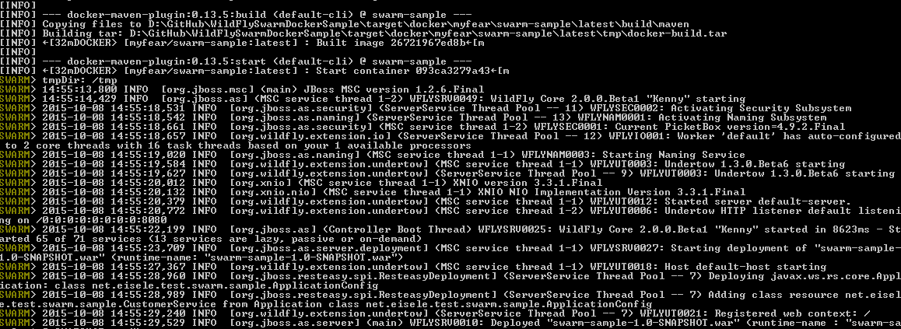

Everybody is talking about microservices these days. And there are plenty of opinions and ideas and very few examples about how to apply those principles on an enterprise level. One thing is for sure, even at conferences just a couple of days ago, I rarely found anyone who was running a Docker container in production. At least a reasonable amount of hands went up when I asked about first experiences and if someone had played around with it. And looking at all the operational level knowledge (OS, Networking, etc.) that is required to run a containerized infrastructure, I can understand all this. A lot has to be done to make this easier for Enterprise Java developers. There are indeed some ways we can work with day to day tools and combine them with latest technologies to educate ourselves. One of them is WildFly Swarm as a lightweight and easy way to build fully contained Java EE applications. And this blog post is going to show you how to run this locally on Docker.
 
 <b>What is WildFly Swarm?</b>
 <a href="" target="_blank">WildFly</a> is a light weight, flexible, feature rich, Java EE 7 compliant application server. WildFly 9 even introduced a <a href="http://download.jboss.org/wildfly/10.0.0.CR2/servlet/wildfly-servlet-10.0.0.CR2.zip" target="_blank">27MB Servlet-only distribution</a>. Both are solid foundations for your Java Enterprise projects. The most recent version WildFly 10.CR2 will be the foundation for Red Hat's next supported Java EE server offering, the Enterprise Application Platform 7.
 <a href="" target="_blank">WildFly Swarm</a> moves away from the static bundling of various profiles and allows you to build your own, custom feature Java EE runtime. But WildFly Swarm isn't just about a customized application server; it is about bundling your application including the relevant application server components together in a single executiable. This is also called a "fat-jar" which can simply be run using java -jar. And while we're talking about it: Microservices usually bring the complete application plus their stack into it, so you can think of every WildFly Swarm application as an independent and fully contained &nbsp;microservice.
 
 <b>Turning A Java EE Application into A Fat-Jar</b>
 
 A Java EE application can be packaged as WildFly Swarm fat jar by adding a Maven dependency and a plugin. The complete source code for this simple JAX-RS sample is available at <a href="">https://github.com/myfear/WildFlySwarmDockerSample/</a>. The application itself exposes an endpoint /rs/customer which just outputs some text. The real magic is put into the pom.xml file. We're walking now through it.
 
 First of all, the <a href="https://github.com/myfear/WildFlySwarmDockerSample/blob/master/pom.xml#L27" target="_blank">dependency for the Java EE 7 API</a> and after that it's
 
 
 &lt;dependency&gt;
 
 &nbsp; &nbsp; &nbsp; &nbsp; &nbsp; &nbsp; &lt;groupId&gt;org.wildfly.swarm&lt;/groupId&gt;
 
 &nbsp; &nbsp; &nbsp; &nbsp; &nbsp; &nbsp; &lt;artifactId&gt;wildfly-swarm-jaxrs&lt;/artifactId&gt;
 
 &nbsp; &nbsp; &nbsp; &nbsp; &nbsp; &nbsp; &lt;version&gt;$\{version.wildfly-swarm\}&lt;/version&gt;
 
 &nbsp; &nbsp;&lt;/dependency&gt;
 
 
 A <a href="https://github.com/myfear/WildFlySwarmDockerSample/blob/master/pom.xml#L59" target="_blank">WildFly Swarm plugin</a> takes care for the packaging of the application:
 
 
 &lt;plugin&gt;
 
 &nbsp; &nbsp; &nbsp; &nbsp; &nbsp; &nbsp; &nbsp; &nbsp; &lt;groupId&gt;org.wildfly.swarm&lt;/groupId&gt;
 
 &nbsp; &nbsp; &nbsp; &nbsp; &nbsp; &nbsp; &nbsp; &nbsp; &lt;artifactId&gt;wildfly-swarm-plugin&lt;/artifactId&gt;
 
 &nbsp; &nbsp; &nbsp; &nbsp; &nbsp; &nbsp; &nbsp; &nbsp; &lt;version&gt;$\{version.wildfly-swarm\}&lt;/version&gt;
 
 &nbsp; &nbsp; &nbsp; &nbsp; &nbsp; &nbsp; &nbsp; &nbsp; &lt;executions&gt;
 
 &nbsp; &nbsp; &nbsp; &nbsp; &nbsp; &nbsp; &nbsp; &nbsp; &nbsp; &nbsp; &lt;execution&gt;
 
 &nbsp; &nbsp; &nbsp; &nbsp; &nbsp; &nbsp; &nbsp; &nbsp; &nbsp; &nbsp; &nbsp; &nbsp; &lt;goals&gt;
 
 &nbsp; &nbsp; &nbsp; &nbsp; &nbsp; &nbsp; &nbsp; &nbsp; &nbsp; &nbsp; &nbsp; &nbsp; &nbsp; &nbsp; &lt;goal&gt;package&lt;/goal&gt;
 
 &nbsp; &nbsp; &nbsp; &nbsp; &nbsp; &nbsp; &nbsp; &nbsp; &nbsp; &nbsp; &nbsp; &nbsp; &lt;/goals&gt;
 
 &nbsp; &nbsp; &nbsp; &nbsp; &nbsp; &nbsp; &nbsp; &nbsp; &nbsp; &nbsp; &lt;/execution&gt;
 
 &nbsp; &nbsp; &nbsp; &nbsp; &nbsp; &nbsp; &nbsp; &nbsp; &lt;/executions&gt;
 
 &nbsp; &nbsp; &lt;/plugin&gt;
 
 
 That's about all the magic. You can build the application with "mvn package". You will find the war file itself and an additional attachment "swarm-sample-1.0-SNAPSHOT-swarm.jar" in the target folder. If you open that, you can find a m2repo folder with all the dependent libraries and your app itself bundled in the&nbsp;_bootstrap\ folder. You can directly run it from the command line in your maven project (Windows users might run into <a href="https://github.com/wildfly-swarm/wildfly-swarm/issues/134" target="_blank">this issue</a>):
 
<pre class="code"><code>java -jar target/swarm-1.0-SNAPSHOT-swarm.jar </code></pre> Redirecting the browser to http://localhost:8080/rs/customer will show you some json
 
<pre class="code"><code>\{"text":"WildFly Swarm Docker Application on OpenShift at http://192.168.99.100:32773/rs/ - Hostname: 093ca3279a43"\} </code></pre>
 <b>Dockerizing WildFly Swarm</b>
 
 The WildFly Swarm project has some Docker examples up on github. Mostly bash scripts and some wrappers to dockerize your project. But there is something even better: The <a href="https://github.com/rhuss/docker-maven-plugin" target="_blank">Docker Maven Plugin</a> by Roland Huss. I used it a couple of times before already, and it is also used in this example. All you have to do is to add the <a href="https://github.com/myfear/WildFlySwarmDockerSample/blob/master/pom.xml#L71" target="_blank">plugin to your pom.xml</a>.
 
<pre class="code"><code>&nbsp;&lt;plugin&gt; &nbsp; &nbsp; &nbsp; &nbsp; &nbsp; &nbsp; &nbsp; &nbsp; &lt;groupId&gt;org.jolokia&lt;/groupId&gt; &nbsp; &nbsp; &nbsp; &nbsp; &nbsp; &nbsp; &nbsp; &nbsp; &lt;artifactId&gt;docker-maven-plugin&lt;/artifactId&gt; &nbsp; &nbsp; &nbsp; &nbsp; &nbsp; &nbsp; &nbsp; &nbsp; &lt;version&gt;$\{docker.maven.plugin.version\}&lt;/version&gt; &lt;/plugin&gt; </code></pre> The configuration is a bit more tricky. (Thanks to Roland for all the email support he gave me over the last couple of days!). First of all, the basics are easy. Add an image to the plugin configuration and name it accordingly. I inherit from jboss/jdk-base:8 and the image gets the name and tag myfear/swarm-sample:latest (<a href="https://github.com/myfear/WildFlySwarmDockerSample/blob/master/pom.xml#L77" target="_blank">Lines 77ff</a>). The build configuration exposes the <a href="https://github.com/myfear/WildFlySwarmDockerSample/blob/master/pom.xml#L82" target="_blank">port 8080</a> and defines the relevant <a href="https://github.com/myfear/WildFlySwarmDockerSample/blob/master/pom.xml#L85" target="_blank">entry point</a> (the command to start java with the -jar parameter). The assembly of the image needs to include <a href="https://github.com/myfear/WildFlySwarmDockerSample/blob/master/pom.xml#L96" target="_blank">project attachments</a> and include the <a href="https://github.com/myfear/WildFlySwarmDockerSample/blob/master/pom.xml#L98" target="_blank">attachment as dependency</a>. Make sure, that the <a href="https://github.com/myfear/WildFlySwarmDockerSample/blob/master/pom.xml#L100" target="_blank">output service mapping</a> and the <a href="https://github.com/myfear/WildFlySwarmDockerSample/blob/master/pom.xml#L105" target="_blank">basedir</a> match the <a href="https://github.com/myfear/WildFlySwarmDockerSample/blob/master/pom.xml#L89" target="_blank">entry point argument</a>.
 
 <b>Let's give it a Test-Run</b>
 
 Make sure you have docker-machine setup on your host. Create a dev machine and configure your environment variables accordingly. Now you can run:
 
<pre class="code"><code>mvn clean install docker:build docker:start -Ddocker.follow </code></pre> (NOTE: A bug in the 10.3.5 Docker Maven Plugin actually can't pull the base image right now. You need to manually execute a 'docker pull jboss/jdk-base:8' before doing the maven run.)
 
 The project is build and a container is started from the image.
 
 

 

 
 Congratulations, now you have a running Java EE microservice in your local Docker instance. The next blog will actually look into how to take this image and run it on OpenShift Origin and scale it to your needs.