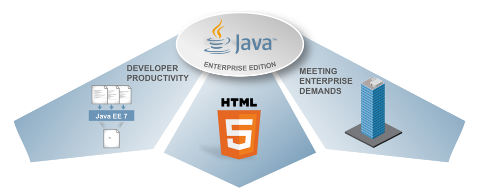

As the Red Hat JBoss Enterprise Application Platform 7 (EAP 7) is looming on the horizon and even the WebLogic server just recently got Java EE 7 certified, I thought it might be about time to give you a little refresher about the Java Enterprise Edition 7 features and point you towards further resources.
 
 <b>Java EE 7 - Developer Productivity, HTML 5 and Enterprise Demands</b>
 
 The Java Enterprise Edition 7 offers new features for enhanced HTML5 support,
 
 helps developers being more productive and further helps meeting enterprise demands. As a developer you will write a lot less boilerplate code and have better support for the latest Web applications and frameworks.
 
 

 

 
 
 There are a couple of new features in Java EE 7 and Arun compiled a list of the top ten most prominent ones a while ago already and you can see the complete <a href="" target="_blank">slide-deck as part of the Java EE 7</a> samples project on GitHub. This is a quick recap of them:
 
 <b>Java API for WebSocket 1.0 (JSR 356)</b>
 
 There is first class support for creating and deploying WebSocket endpoints. There is a standard W3C JavaScript API that can be used from browsers but this API also introduces a client endpoint.
 
 The reference implementation is <a href="" target="_blank">Tyrus</a>.
 

 <iframe allowfullscreen frameborder="0" height="315" src="https://www.youtube.com/embed/jkchA2WeZwA" width="560"></iframe>

 <b>Batch Applications for the Java Platform (JSR 352)</b>
 
 In-built support for Batch applications allows to remove dependency on third-party frameworks. Also see the <a href="http://www.mastertheboss.com/javaee/batch-api/batch-applications-tutorial-on-wildfly" target="_blank">Batch Applications tutorial on WildFly</a> for further information.
 

 <iframe allowfullscreen frameborder="0" height="315" src="https://www.youtube.com/embed/Bs3ZD00CcSs" width="560"></iframe>

 <b>JSON Processing (JSR 353)</b>
 
 Native support for JSON processing allows to make the application light-weight and getting rid of third party libraries.
 

 <iframe allowfullscreen frameborder="0" height="315" src="https://www.youtube.com/embed/1lkS7ppnqAc" width="560"></iframe>

 <b>Concurrency Utilities for Java EE (JSR 236)</b>
 
 Concurrency Utilities extends JSR standard Java SE Concurrency Utilities and add asynchronous capabilities to Java EE application components.
 

 <iframe allowfullscreen frameborder="0" height="315" src="https://www.youtube.com/embed/JeE_L9VJ4E8" width="560"></iframe>

 <b>Simplified JMS API (JSR 368)</b>
 
 JMS API has been extremely simplified by leveraging CDI, Autocloseable, and other features of the language.
 

 <iframe allowfullscreen frameborder="0" height="315" src="https://www.youtube.com/embed/itx4xjqI7yY" width="560"></iframe>

 <b>@Transactional and @TransactionScoped (JSR 907)</b>
 
 Deliver transactional applications with choice and flexibility, use @Transactional to enable transactions on any POJO.
 

 <iframe allowfullscreen frameborder="0" height="315" src="https://www.youtube.com/embed/rChkWy2NFyQ" width="560"></iframe>

 <b>JAX-RS Client API (JSR 339)</b>
 
 JAX-RS added a new Client API to invoke a REST endpoint using a fluent builder API.
 

 <iframe allowfullscreen frameborder="0" height="315" src="https://www.youtube.com/embed/maEtpN-kTyI" width="560"></iframe>

 <b>Default Resources (JSR 342)</b>
 
 Default resources like JDBC DataSource, JMS ConnectionFactory, etc are added to simplify OOTB experience.
 
 <b>More annotated POJOs</b>
 
 More annotations have been added to simplify devops experience such as @JMSDestinationDefinition that automatically creates a JMS destination.
 
 <b>Faces Flow (JSR 344)</b>
 
 JSF added Faces Flow that allows to create reusable modules to capture a flow of pages together.
 

 <iframe allowfullscreen frameborder="0" height="315" src="https://www.youtube.com/embed/gQzTQPVUttI" width="560"></iframe>

 <b>Pruned&nbsp;Technologies</b>
 
 While many new features have been added in Java EE 7, others have been made optional. Those are: Java EE Management (JSR-77); Application Deployment (JSR-88); JAXR, for interfacing with UDDI registries (JSR-93); JAX-RPC, for XML-based RPC (JSR-101); and EJB 2.x Container Managed Persistence, which is effectively replaced by the Java Persistence API (JSR-338). These specifications, while removed from the current release, remain optional for vendors in the event that demand for them persists among customers. They will, however, be removed in Java EE 8.
 
 <b>Further Reading</b>
 <a href="" target="_blank">Java EE 7 API Documentation</a>
 <a href="http://www.oracle.com/technetwork/java/javaee/downloads/index.html" target="_blank">Oracle Java EE SDK</a>
 <a href="" target="_blank">Java EE 7 Tutorial</a>
 <a href="https://github.com/javaee-samples/javaee7-samples" target="_blank">Java EE 7 Samples On Github</a>
 <a href="" target="_blank">Application Server Migration: Java EE 5 to JBoss Wildfly Java EE7</a>
 <a href="http://blog.eisele.net/2015/11/getting-started-with-eap-7-alpha-and.html" target="_blank">Getting Started With EAP 7 Alpha and Java EE 7</a>
 <a href="http://shop.oreilly.com/product/0636920030614.do" target="_blank">Java EE 7 Essentials by Arun Gupta</a>
 <a href="http://www.apress.com/9781430246268" target="_blank">Beginning Java EE 7 by Antonio Goncalves</a>
 <a href="" target="_blank">Java EE Bootstrap Course by JBoss Champion Adam Bien</a>
 <a href="https://javaee7.zeef.com/arjan.tijms" target="_blank">Arjan Tijm's ZEEF Page about Java EE 7</a>