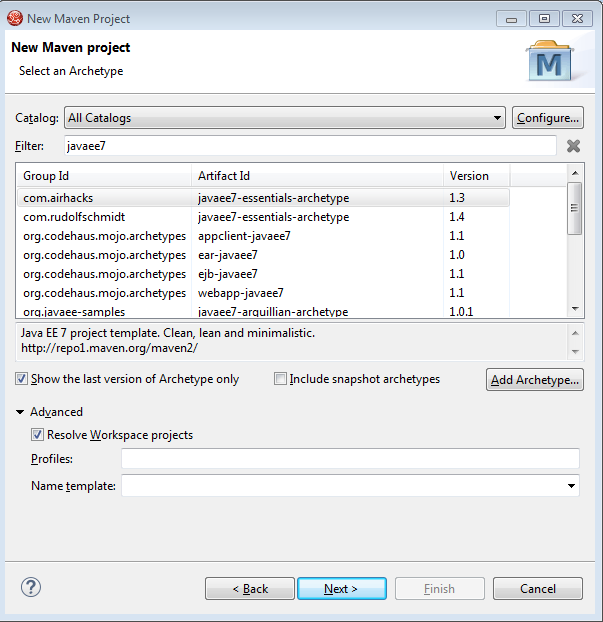

Red Hat JBoss Enterprise Application Platform 7 (JBoss EAP 7) is a middleware platform built on open standards and compliant with the Java Enterprise Edition 7 specification. Built on top of innovative and proven open source technologies like WildFly, it will make Java EE 7 development a lot easier. Here is a quick guide on how to get started with the latest ALPHA release.
 
 <b>Prerequisites and Preface</b>
 
 JBoss EAP 7 provides two operating modes for JBoss EAP 7 instances: standalone server or managed domain. The standalone server operating mode represents running JBoss EAP as a single server instance. The managed domain operating mode allows for the management of multiple JBoss EAP instances from a single control point. The available version as of today is EAP 7 ALPHA.&nbsp;Just like with any Alpha release, please anticipate issues. If you find issues, feel free to file them in the <a href="" target="_blank">corresponding JIRA</a>. You need to have a supported JDK installed. EAP 7 requires Java SE 8.
 
 You can test-drive EAP 7 under the&nbsp;<a href="http://www.jboss.org/developer-program/termsandconditions" target="_blank">Red Hat JBoss Developer Program</a>. All you need to do is to register with jboss.org right after you click download on the <a href="" target="_blank">EAP product page</a>.
 
 <b>Download And Install JBoss EAP 7</b>
 

 Open a web browser and navigate to http://www.jboss.org/products/eap/. Click the green "download" button on the upper right of the page.&nbsp;If you have not yet done so, you will be prompted to review and accept the terms of the Red Hat JBoss Developer Program. Alternatively, just log-in and wait for the download to begin. Attention: This will download the 6.4.0-installer. We just want to download a ZIP file of the ALPHA release! You need to follow the <a href="" target="_blank">link to all downloads</a>&nbsp;and select the <a href="https://www.jboss.org/download-manager/file/jboss-eap-7.0.0.Alpha.zip" target="_blank">7.0.0.Alpha ZIP Download (172mb)</a>. When finished, unzip into a folder of your choice. We call this folder "EAP_HOME" from now on. The installation is finished.
 
 <b>Startup And Basic Administration</b>
 
 Start the&nbsp;server&nbsp;in standalone mode via the following command:
 
<pre class="code" code="">$ EAP_HOME/bin/standalone.bat|.sh</pre> If successful, you will see the following last lines of the output:
 
<pre>09:46:50,789 INFO &nbsp;[org.jboss.as] (Controller Boot Thread) WFLYSRV0025: EAP 7.0.0.Alpha1 (WildFly Core 2.0.0.CR8) started in 15482ms - Started 259 of 489 services (314 services are lazy, passive or on-demand)</pre> You must create a management user in order to access the web-based management console and remote instances of the management CLI. Execute the script:
 
<pre class="code"><code>$ EAP_HOME/bin/add-user.bat|.sh</code></pre> and fill in the required information. Make sure to select the option "a) Management User" when offered. I am using the highly unsecure combination of admin/admin as username/password. If you added the user, you can check in your browser if the server is up and running. Redirect your browser to&nbsp;http://localhost:9990/ and login with the admin-user. You will be presented with the revamped admin-console.
 
 

 

 
 Now it is time to setup your development environment and get you started with a first Java EE 7 application.
 
 

 <b>Setup The Development Environment</b>

 The natural choice for EAP 7 based applications is the JBoss Developer Studio (JBDS). Download the latest version 9.0 from the <a href="https://www.jboss.org/products/devstudio.html" rel="nofollow" target="_blank">jboss.org product pages</a> and install as described there. Start it after installation and go to the "servers tab" to add a new EAP 7 server.
  
  
 

  
 

  
  Expand Red Hat JBoss Middleware and choose JBoss Enterprise Application Platform 7.0 (Experimental). Enter a server name, for example, "JBoss EAP 7.0", then click Next to create the JBoss runtime and define the server. The next time you define a new server, this dialog displays a Server runtime environment selection with the new runtime definition.&nbsp;Create a Server Adapter to manage starting and stopping the server. Keep the defaults and click Next.&nbsp;Enter a name, for example "JBoss EAP 7.0 Runtime". Under Home Directory, click Browse and navigate to your JBoss EAP install location. Then click Next.

  

 <b>Create Your First Java EE 7 Application</b>

 Now all the bits and pieces are in place and you can start to create your first Java EE 7 application. Right click into the project explorer in JBDS and select "new", select "other", scroll down to Maven and select "New Maven Project". Accept the standards in the next dialogue and type "javaee7" into the filter text.box. Select the "com.airhacks.javaee7-essentials-archetype" and click next.
  
  
 

  
 

  
  Enter a group- and artifact-id and click "finish". Maven is downloading the archetype and instantiating a project from that template. Expand the project and navigate to the source package com.airhacks and right click. Select "new", "other", "WebServices" and select "JAX-RS Resource". Enter source folder and package and name the resource "HelloResource". Click "Finish". Open the newly created class and change it to this:
  
 <pre class="code"><code> package net.eisele; import javax.enterprise.context.RequestScoped; import javax.ws.rs.GET; import javax.ws.rs.Path; import javax.ws.rs.Produces; @RequestScoped @Path("") public class HelloService \{  @Produces("application/json")  @GET  public String sayHello()\{  return "\{\"name\" : \"Hello\"\}";  \} \} </code></pre>

  

 Last step is to actually deploy and run the application on EAP 7. Right click the project and select "Run As..." and "Run On Server" and select the existing EAP 7 server. You can see, that our demo project is configured in the next dialogue. Click "Finish" and switch to the "Console" view to see the server starting. And as you can see, the demo.war file is also deployed. When you now visit&nbsp;http://localhost:8080/demo/resources with your browser, you see the json output:

  

 <table>
  <tbody>
   <tr>
    <td class="line-number" value="1"></td>
    <td class="line-content">\{"name" : "Hello"\}  
      Congratulations! That has been your first Java EE 7 example on JBoss EAP 7 ALPHA. Now you might want to check out the quickstarts or the documentation:</td>
   </tr>
  </tbody>
 </table>

<ul>
 <li>QuickStarts for Java EE 7 features (<a href="http://www.jboss.org/download-manager/file/jboss-eap-7.0.0.Alpha-quickstarts.zip" target="_blank">ZIP Download</a>)</li>
 <li><a href="https://access.redhat.com/documentation/en-US/JBoss_Enterprise_Application_Platform/7/html/Getting_Started_Guide/index.html" target="_blank">Product Documentation</a></li>
 <li><a href="https://access.redhat.com/documentation/en-US/JBoss_Enterprise_Application_Platform/7/html/Getting_Started_Guide/index.html" target="_blank">Getting Started Guide</a></li>
</ul>