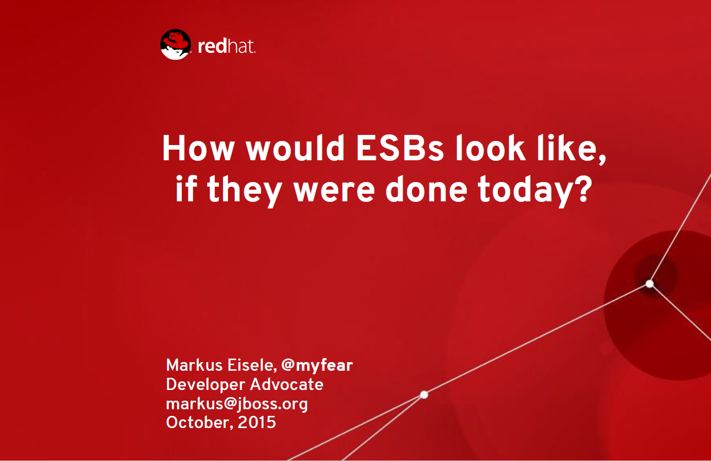

 

 JavaOne 2015 just came to an end and it was a great community event again. I gave two sessions and a <a href="http://blog.eisele.net/2015/10/docker-for-java-ee-developers-javvaone.html" rel="nofollow">HOL with Rafael</a>. One of the sessions actually is my favorite: The talk about how ESBs would look like, if they were done today.
 
 <b>What? ESBs? I thought that is the past?</b>
 
 That is what I usually tend to also say. But, system integration has come a long way, from point-to-point connections between individual systems towards the first integration solutions that helped in standardizing those connections. And in the advent of a much more business-centered design—and the broader shift into more service-oriented organizations—the Enterprise Service Bus (ESB) evolved from a pattern to a variety of products. They all promised to deliver re-usability and ex-changeability by standing up as a centralized and managed infrastructure component. With the next technology evolution—Microservices—the need to manage even more potentially-polyglot and distributed services became overwhelming.
 

  

<b>Everybody Microservice-wash Their Solutions?</b>
 
 Vendors have already started to “microservice-wash” their tools and platforms to get your attention. And the segment architecture approach is still too new to give recommendations. For a while, it will still be your responsibility to understand the capabilities you need by doing your own research. Some promising candidates are evolving out of the open-source think tank at this very moment. First and foremost, projects like <a href="http://www.openshift.org/#v3" target="_blank">OpenShift Origin</a>, <a href="" target="_blank">WildFly Swarm</a>, <a href="" target="_blank">Fabric8</a>, and <a href="" target="_blank">APIMan </a>will help you put together most of the puzzle pieces in your microservices-based architecture.
 

  

<b>And There Are Some More Thoughts Here</b>
 
 My presentation abstract was: Looking past former hype topics such as enterprise application integration, ESBs, and SOA, the fact is that the need for reliable integration solutions that are manageable and scalable is growing. More devices and datasources, combined with new and upcoming use cases and exciting wearables in a cloudified and heterogeneous infrastructure, require more bits and pieces than just a central ESB with some rules and point-to-point connections. What would that look like? And how can we keep the resultant solutions manageable? Looking forward to your feedback!
 
 
 

 <iframe allowfullscreen frameborder="0" height="355" marginheight="0" marginwidth="0" scrolling="no" src="//de.slideshare.net/slideshow/embed_code/key/eMVr5GoOEymJ2p" style="border-width: 1px; border: 1px solid #CCC; margin-bottom: 5px; max-width: 100%;" width="425"> </iframe>

 <b>Modern Java EE Design Patterns&nbsp;</b>
 

 

 And if you're still stuck in Java EE and want to know how to build scalable architectures for sustainable enterprise development, you have to download my latest book. It gives you a complete overview about all the new trends and topics and helps you to check back, if you're still on track.
 
 With the ascent of DevOps, microservices, containers, and cloud-based development platforms, the gap between state-of-the-art solutions and the technology that enterprises typically support has greatly increased. But as Markus Eisele explains in this O’Reilly report, some enterprises are now looking to bridge that gap by building microservice-based architectures on top of Java EE.