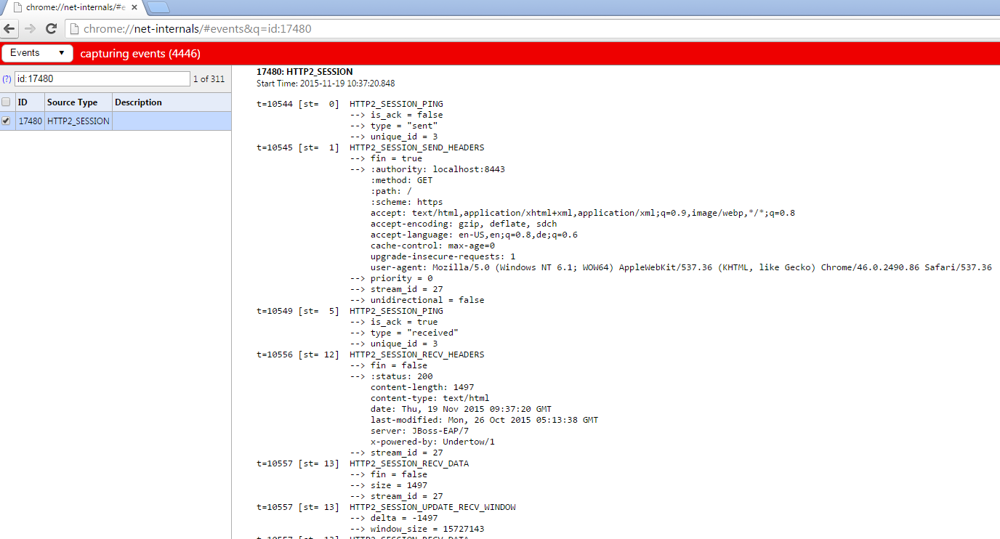

Just a couple of days ago, the new <a href="http://blog.eisele.net/2015/11/red-hat-jboss-enterprise-application-platform-7.0-alpha.html" rel="nofollow" target="_blank">JBoss EAP 7 ALPHA</a> version was released. &nbsp;And I already blogged about how to <a href="http://blog.eisele.net/2015/11/getting-started-with-eap-7-alpha-and.html" rel="nofollow" target="_blank">get started with it</a>. One very interesting part is the HTTP/2 support which has been added as a technical preview. It is provided by the new webserver Untertow.&nbsp;&nbsp;HTTP/2 reduces latency by compressing headers and multiplexing many streams over the same TCP connection. It also supports the ability for a server to push resources to the client before it has requested them, leading to faster page loads.
 
 <b>Tech Preview Components</b>
 
 A short remark about what technology preview actually means. Some features in JBoss EAP are provided as technology preview. This means that while these components have been included in JBoss EAP but they're not considered functionally complete and are not suitable for production use. So they're supported in development &nbsp;but not recommended or supported for production use. But they help us to get wider exposure and feedback. So, if you encourage something that does not work as expected or have ideas about the future direction of this feature, feel free to reach out to us.
 
 Red Hat intends to fully support technology preview features in a future release.
 
 <b>Prepare Your EAP Installation</b>
 
 The <a href="https://tools.ietf.org/html/rfc7301" rel="nofollow" target="_blank">Application Layer Protocol Negotiation (ALPN)</a> is an extension for the SSL protocol that helps to make HTTPS connections faster. It was defined together with HTTP/2 and this uses ALPN to create HTTPS connections. As most browsers implement HTTP/2 only over HTTPS, The OpenJDK implements SSL in the sun.security.ssl package. The current implementations in Java 7 and Java 8 do not support ALPN. With Java 9,there will (hopefully) be native support for ALPN (<a href="http://openjdk.java.net/jeps/244" rel="nofollow" target="_blank">JEP 244</a>). EAP requires you to use Java 8. You can't run the HTTP/2 example on Java 7 at all, because of missing cyphers.
 
 Since HTTP/2 is also a goal for Java EE8, it is also expected to be made available in a future Java SE 8 update, likely after Java 9 is released.
 
 
 To get around this limitation today on Java 8 we need to add a library that provides ALPN support to the JVM’s boot class path. The version of the jar file that you need is tied to the JVM version in use, so you must make sure you are using the correct version for you JVM. Jetty provides a ALPN implementation for java. Go to the <a href="http://www.eclipse.org/jetty/documentation/current/alpn-chapter.html#alpn-versions" target="_blank">jetty website and find the correct version for your JDK</a>. In this example, I'm using JDK 1.8.0u60 which needs ALPN version: "8.1.5.v20150921".
 
 Switch working folder to your JBOSS_HOME and download the alpn library to the /bin folder.
 
<pre class="code"><code>curl http://central.maven.org/maven2/org/mortbay/jetty/alpn/alpn-boot/8.1.5.v20150921/alpn-boot-8.1.5.v20150921.jar &gt;bin/alpn-boot-8.1.5.v20150921.jar</code></pre> The library now needs to be added to the server's bootclasspath. Add the following lines to the standalone configuration files
 
<pre class="code"><code>//standalone.conf on Linux JAVA_OPTS="$JAVA_OPTS &nbsp;-Xbootclasspath/p:$JBOSS_HOME/bin/alpn-boot-8.1.5.v20150921.jar" //standalone.conf.bat on Windows set "JAVA_OPTS=%JAVA_OPTS% -Xbootclasspath/p:%JBOSS_HOME%/bin/alpn-boot-8.1.5.v20150921.jar" </code></pre> The next step is to install certificates for the https connector.&nbsp;For testing purposes you can download the ones from the Undertow test suite. Learn how to <a href="http://blog.eisele.net/2015/01/ssl-with-wildfly-8-and-undertow.html" target="_blank">generate and run your own SSL certificates</a> in an older blog-post of mine.
 
<pre class="code"><code>curl https://raw.githubusercontent.com/undertow-io/undertow/master/core/src/test/resources/server.keystore &gt;standalone/configuration/server.keystore curl https://raw.githubusercontent.com/undertow-io/undertow/master/core/src/test/resources/server.truststore &gt;standalone/configuration/server.truststore </code></pre> When you're done with that, start the server and add a https connector via the command-line tool (connect to your running server and issue the commands highlighted in the following):
 
<pre>$&gt;jboss-cli.bat|sh You are disconnected at the moment. Type 'connect' to connect to the server or 'help' for the list of supported commands. [disconnected /] connect [standalone@localhost:9990 /] <b>/core-service=management/security-realm=https:add()</b> \{"outcome" =&gt; "success"\} [standalone@localhost:9990 /] &nbsp;<b>/core-service=management/security-realm=https/authentication=truststore:add(keystore-path=server.truststore, keystore-password=password, keystore-relative-to=jboss.server.config.dir)</b> \{ &nbsp; &nbsp; "outcome" =&gt; "success", &nbsp; &nbsp; "response-headers" =&gt; \{ &nbsp; &nbsp; &nbsp; &nbsp; "operation-requires-reload" =&gt; true, &nbsp; &nbsp; &nbsp; &nbsp; "process-state" =&gt; "reload-required" &nbsp; &nbsp; \} \} [standalone@localhost:9990 /] <b>/core-service=management/security-realm=https/server-identity=ssl:add(keystore-path=server.keystore, keystore-password=password, keystore-relative-to=jboss.server.config.dir)</b> \{ &nbsp; &nbsp; "outcome" =&gt; "success", &nbsp; &nbsp; "response-headers" =&gt; \{ &nbsp; &nbsp; &nbsp; &nbsp; "operation-requires-reload" =&gt; true, &nbsp; &nbsp; &nbsp; &nbsp; "process-state" =&gt; "reload-required" &nbsp; &nbsp; \} \} [standalone@localhost:9990 /] <b>/subsystem=undertow/server=default-server/https-listener=https:add(socket-binding=https, security-realm=https, enable-http2=true)</b> \{ &nbsp; &nbsp; "outcome" =&gt; "success", &nbsp; &nbsp; "response-headers" =&gt; \{"process-state" =&gt; "reload-required"\} \} [standalone@localhost:9990 /] </pre> Shutdown and re-start your EAP instance.
 
 <b>Testing The Connection</b>
 
 When the server is up again, point your browser to https://localhost:8443. After clicking through the security warning about the self signed certificate you see the normal EAP 7 welcome page.
 
 But how do you find out, that the connection is actually using HTTP/2? You can do this in various ways. If you're using Chrome, you can enter "chrome://net-internals" in the browser bar and select "HTTP/2" in the dropdown. If you re-load the EAP homepage and come back to the network page in chrome, you can see the HTTP/2 session with all headers and information.
 
 

 

 
 
 Another option is to use a little JavaScript and deploy it in your application:
 
 
<pre>&lt;p style="font-size: 125%;"&gt;You are currently connected using the protocol: &lt;b style='color: darkred;' id="transport"&gt;checking...&lt;/b&gt;.&lt;/p&gt; &lt;p id="summary" /&gt; &lt;script&gt; var url = "/"; var xhr = new XMLHttpRequest(); xhr.onreadystatechange = function(e) \{ if (this.readyState === 4) \{ var transport = this.status == 200 ? xhr.getResponseHeader("X-Undertow-Transport") : null; transport = transport == null ? "unknown" : transport; document.getElementById("transport").innerHTML = transport; var summary = "No HTTP/2 Support!"; if (transport.indexOf("h2") == 0) \{ summary = "Congratulations! Your client is using HTTP/2."; \} document.getElementById("summary").innerHTML = summary; \} \} xhr.open('HEAD', url, true); xhr.send(); &lt;/script&gt;</pre> Congratulations! You just upgraded your EAP installation to HTTP/2! Don't forget to give feedback and learn more about JBoss EAP 7: And please keep in mind:&nbsp;&nbsp;just like with any Alpha release, please anticipate issues. If you find any please report them in the <a href="" target="_blank">corresponding JIRA</a>.
 
<ul>
 <li>QuickStarts for Java EE 7 features (<a href="http://www.jboss.org/download-manager/file/jboss-eap-7.0.0.Alpha-quickstarts.zip" target="_blank">ZIP Download</a>)</li>
 <li><a href="https://access.redhat.com/documentation/en-US/JBoss_Enterprise_Application_Platform/7/html/Getting_Started_Guide/index.html" target="_blank">Product Documentation</a></li>
 <li><a href="https://access.redhat.com/documentation/en-US/JBoss_Enterprise_Application_Platform/7/html/Getting_Started_Guide/index.html" target="_blank">Getting Started Guide</a></li>
</ul>