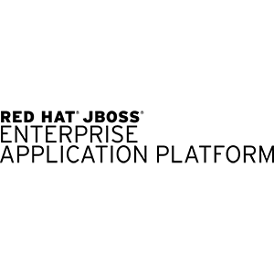

 

 Red Hat JBoss Enterprise Application Platform 7 (JBoss EAP 7) is a middleware platform built on open standards and compliant with the Java Enterprise Edition 7 specification. It integrates WildFly Application Server 10 with high-availability clustering, messaging, distributed caching, and other technologies. The latest JBoss EAP 7.0 Alpha release is now <a href="" target="_blank">available to download</a>!
 
 
 JBoss EAP 7.0 Alpha is the product of years of hard work by <a href="" target="_blank">WildFly 8, 9, 10</a> community and EAP Engineering teams. Congratulations!
 
 <b>Summary of new features in this release</b>
 
 With JBoss EAP 7, everyone gets what they need to become more productive and efficient. &nbsp;Whether you are a newbie developer, a veteran Java EE expert, or a staff member on an operations, testing, or administration team, JBoss EAP 7 gives you that extra edge needed to build, deploy, and maintain robust, web-scale, high-impact applications at DevOps speeds.
 

  

<i>Java EE 7 Support</i>
 
 JBoss EAP 7.0 implements the Java EE 7 Full Platform and Web Profile standards.
 
 Batch 1.0, JSON-P 1.0, Concurrency 1.0, WebSockets 1.1, JMS 2.0, JPA 2.1, JCA 1.7, JAX-RS 2.0, JAX-WS 2.2, Servlet 3.1, JSF 2.2, JSP 2.3, EL 3.0, CDI 1.1, CDI Extensions, JTA 1.2, Interceptors 1.2, Common Annotations 1.1, Managed Beans 1.0, EJB 3.2, Bean Validation 1.1
 
 <i>Java SE 8</i>
 
 JBoss EAP 7.0 requires Java SE 8 and EAP 7.0 Alpha has been tested with Open JDK 8, Oracle JDK 8 so far.
 
 <i>Highly Scalable Web Server (Undertow)</i>
 
 We have switched the web server and servlet implementation from JBoss Web to <a href="" target="_blank">Undertow</a>. Undertow is a modern NIO web server that is designed for maximum throughput and scalability. It supports non-blocking and blocking handlers, traditional and asynchronous servlets, and JSR-356 web socket handlers.
 
 <i>Port Reduction</i>
 
 By utilizing HTTP upgrade, EAP 7 has moved nearly all of its protocols to be multiplexed over two ports: a management port (HTTP/JSON Management, HTTP Upgraded Remoting - Native Management &amp; JMX, Web Administration Console), and an application port (HTTP Servlet, JAX-RS, JAX-WS, Web Sockets, HTTP Upgraded Remoting-EJB Invocation-Remote JNDI)
 
 <i>Messaging Consolidation and Backwards Compatibility with EAP 6</i>
 
 EAP 6’s HornetQ codebase was donated to the Apache ActiveMQ project, and the HornetQ community joined to build a next-generation messaging broker. This was materialized in the first major release of the <a href="" target="_blank">ActiveMQ Artemis</a> project. ActiveMQ Artemis includes many new features, and also retains protocol compatibility with the HornetQ broker. EAP 7 includes this new exciting project as its JMS broker, and due to the protocol compatibility, it fully replaces the HornetQ project.
 
 <i>Offline CLI</i>
 
 In both standalone and domain modes you can now manage the server using CLI commands, without having a running server. This works similar to the admin-only mode, but does not require launching the server, and using a TCP port. Instead the CLI embeds the server and launches it directly in admin-only mode.
 
 <i>IIOP Implementation</i>
 
 We have switched our IIOP implementation from JacORB to a downstream branch of the OpenJDK ORB. This change should lead to better interoperability with the JVM ORB and the Java EE RI
 
 <i>Server Suspend Mode / Graceful Shutdown</i>
 
 The new server suspend mode in EAP 7, once activated rejects new requests but allows old ones to complete. Once the suspension process has completed the server can either be stopped without aborting in-flight transactions, left in suspended state while maintenance is performed, or returned back to running state where new requests are once again allowed. (Excluding JMS and Transactions, Including Web, EJB, EE Concurrency, mod_cluster, Naming)
 
 <i>Built-in Front End Load Balancer (Tech. Preview)</i>
 
 EAP 7 (using Undertow) can now be <a href="http://blog.eisele.net/2015/01/developer-interview-di-11-stuart-douglas-about-wildfly9-undertow.html" target="_blank">configured to function as a multi-platform intelligent load balancer</a>, proxying requests to backend EAP 7 nodes using HTTP and AJP/mod_cluster protocols.
 
 <i>Clustering</i>
 
 New optimized session replication and Single Sign On implementation using Undertow. New/optimized @Stateful EJB caching implementation. HA Singleton Deployments (for failover usecase same as EAP 5 e.g. EJB deployments enabled in one node in cluster) and Singleton MDBs (Technical Preview).
 
 <i>JCA &amp; DataSources</i>
 
 EAP 7 supports a DistributedWorkManager implementation based on the JGroups project, and the JCA connection manager has been enhanced with the lazy connection manager extensions. The data sources and resource adapters subsystems allow setting capacity policies and additional flush strategies as well.
 
 <i>Migration CLI Operations for the discontinued subsystems of EAP 6 Series</i>
 
 To help users migrating from old subsystems in EAP 6 such as jbossweb, jacorb, and hornetq, we have introduced a set of management operations that can convert old configuration over to the new respective subsystem equivalent. Since these operations migrate the underlying management resource model, old CLI scripts or custom provisioning systems can also take advantage of these.
 
 <i>HTTP/2 Server Push (Technical Preview)</i>
 
 Undertow, the web server in <a href="http://undertow.io/blog/2015/03/26/HTTP2-In-Wildfly.html" target="_blank">WildFly, has added support for the new HTTP/2</a> standard. HTTP/2 reduces latency by compressing headers and multiplexing many streams over the same TCP connection. It also supports the ability for a server to push resources to the client before it has requested them, leading to faster page loads. Tech. Preview support is provided via a tested 3rd party alpn.jar for http(S) until JDK 9 is released/supported.
 
 <i>Modern Enterprise Web Applications with Server Side JavaScript on JVM (Technical Preview)</i>
 
 EAP 7 now allows you to <a href="" target="_blank">write server side JavaScripts</a> (using JDK 8 Nashorn capabilities) to quickly develop REST endpoints which can pull in CDI beans, perform JNDI lookups and and invoke JPA Entity Beans. &nbsp;This capability is provided by Undertow project
 
 <i>Pruning</i>
 
 The following technologies that are no longer required in Java EE 7 were removed: 
 
<ul>
 <li>CMP - JPA offers much more performant and flexible API.&nbsp;</li>
 <li>JAX-RPC - JAX-WS offers a much more accurate and complete solution.</li>
 <li>JSR-88 - Very little adoption.&nbsp;</li>
</ul>
 <b>Learn More About EAP 7 With The Following Resources </b>
 
 And please keep in mind:&nbsp;&nbsp;just like with any Alpha release, please anticipate issues. If you find issues, feel free to file them in the <a href="" target="_blank">corresponding JIRA</a>.
 
<ul>
 <li>QuickStarts for Java EE 7 features (<a href="http://www.jboss.org/download-manager/file/jboss-eap-7.0.0.Alpha-quickstarts.zip" target="_blank">ZIP Download</a>)</li>
 <li><a href="https://access.redhat.com/documentation/en-US/JBoss_Enterprise_Application_Platform/7/html/Getting_Started_Guide/index.html" target="_blank">Product Documentation</a></li>
 <li><a href="https://access.redhat.com/documentation/en-US/JBoss_Enterprise_Application_Platform/7/html/Getting_Started_Guide/index.html" target="_blank">Getting Started Guide</a></li>
</ul>