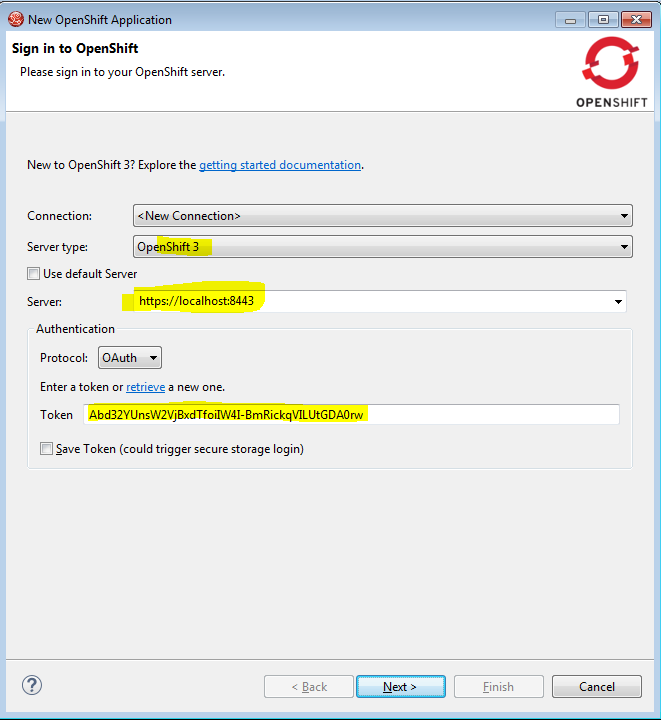
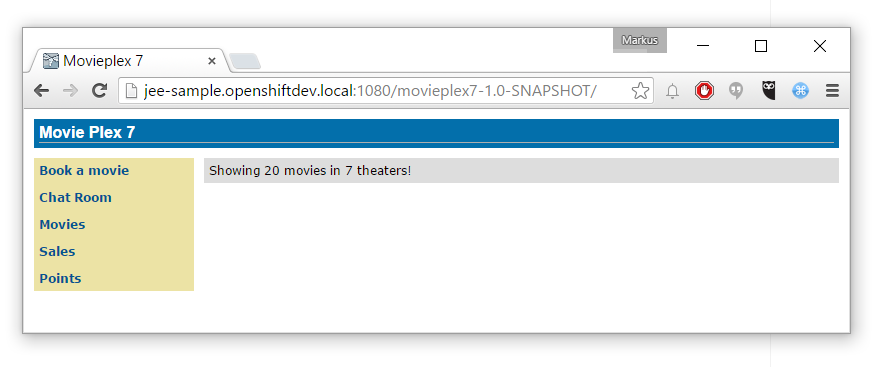
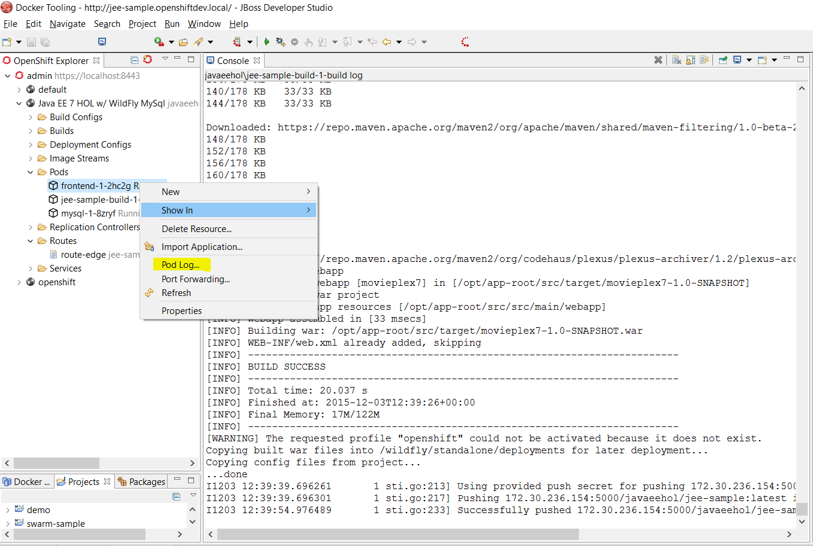

You can create and manage OpenShift applications in Eclipse with the latest version of the OpenShift Plugin for JBoss Tools. They are either pre-bundled with the latest <a href="http://tools.jboss.org/downloads/devstudio/mars/9.0.0.GA.html" target="_blank">JBoss Developer Studio (9.0.0.GA)</a> or you can <a href="http://tools.jboss.org/downloads/jbosstools/mars/4.3.0.Final.html" target="_blank">install them into an existing Eclipse</a> Mars. This post walks you through deploying the Java EE 7 Hands-On-Lab in OpenShift with the JBoss Developer Studio.
 
 <b>OpenShift 3 Tooling Overview</b>
 
 The OpenShift 3 tooling is included as a TechPreview. It will allow you to connect to OpenShift 3 servers using OAuth or Basic authentication, manage your OpenShit 3 Projects, deploy new applications in the Cloud, using pre-defined (or your own) templates, or even Docker images. You will be able to import existing applications in your workspace, monitor them via remote log streaming directly into your local console, or enable Port-Forwarding and access their data as if it was local.
 
 <b>Get Started</b>
 
 Install the <a href="http://openshift.org/vm" target="_blank">OpenShift 3 all-in-one VM</a> and start your local instance with vagrant. Login via the oc command-line tool with admin/admin and get your OAuth token:
 
<pre class="code"><code>oc login https://localhost:8334 oc whoami -t </code></pre> And while we're at the command line, let's create a new OpenShift project for this example.
 
<pre class="code"><code>oc new-project javaeehol --display-name="Java EE 7 HOL w/ WildFly MySql" </code></pre>

 

 <a href="http://www.jboss.org/products/devstudio/get-started/#!project=devstudio" target="_blank">Install and fire up your JBoss Developer Studio</a>. If you want to get started with the JBoss Tools in an existing Eclipse distribution <a href="http://marketplace.eclipse.org/content/jboss-tools-luna" target="_blank">use this package from the Eclipse marketplace</a>.
 
 
 Create a new OpenShift Project. Select OpenShift 3 as server type, change the server to https://localhost:8443 and enter the token you gathered from the cli into the token field. When you click next, the credentials are verified and you need to accept a warning about an unsigned certificate when using the all-in-one vm.
 
 
 Select the project from the first drop down list in the next dialogue. The dialogue also lists all available templates on your server.A complete list can befound on&nbsp;<a href="https://github.com/jboss-openshift/application-templates" target="_blank">github</a>. We want to use our own template in this case. The <a href="https://github.com/javaee-samples/javaee7-hol" target="_blank">Java EE 7 Hands-On-Lab</a> has been converted into a Kubernetes template by Ben Pares. So, we're going to use this. <a href="https://github.com/bparees/javaee7-hol/raw/master/application-template-jeebuild.json" target="_blank">Download it from Ben's Github repository</a>&nbsp;and save it locally.
 
 Open it with a text editor and change the "apiVersion" value from&nbsp;v1beta3 to "v1". And in line 47 is a host entry which says: "www.example.com", change that to "jee-sample.openshiftdev.local". And while you are in a text-editor make sure to add an entry to your hosts file which maps the loopback interface to the changed domain name.
 
<pre class="code"><code>127.0.0.1 jee-sample.openshiftdev.local </code></pre> Now back to JBDS.
 

 

 Select "Use a template from my local file system" and browse to the place you saved it.
 
 After clicking next you see another dialogue which allows you to change the template parameter values for the various passwords. Leave everything as it is and click "next" again.
 
 The following dialogue will let you add additional labels. Just click "Finish" now.
 
 The final dialogue gives you an overview about the executed actions and generated passwords. Make sure to write them down in case you need them later.
 
 
 You can also access the github web-hook secrets and URLs. After clicking "ok" a last wizard clones the application from github into a folder of your choice locally. It get's opened in JBDS and you can browser through the various resources and explore the example a bit. While you're doing that, OpenShift actually triggered a build of the sample application. When you point your browser to the web-console at http://localhost:8443/ and login with admin/admin and select the javaee project, you can see the mysql service running and a build job:
 
 

 

 
 After a couple of minutes, this one finishes and you see the running frontend-service. Let's briefly look into the build logs:
 
<pre class="code"><code>oc get builds #Shows the one successful build oc build-logs &nbsp;jee-sample-build-1 &nbsp;#Shows the log output for the build </code></pre> Everything looks good. You can see, that the maven dependencies are downloaded and looking at the various image streams with:
 
<pre class="code"><code>oc get is </code></pre> you can see, that there are two:
 
<pre>NAME &nbsp; &nbsp; &nbsp; &nbsp; DOCKER REPO &nbsp; &nbsp; &nbsp; &nbsp; &nbsp; &nbsp; &nbsp; &nbsp; &nbsp; &nbsp; &nbsp; &nbsp; &nbsp; &nbsp; &nbsp; &nbsp;TAGS &nbsp; &nbsp; &nbsp;UPDATED jee-sample &nbsp; 172.30.236.154:5000/javaeehol/jee-sample wildfly &nbsp; &nbsp; &nbsp;openshift/wildfly-90-centos7 &nbsp; &nbsp; &nbsp; &nbsp; &nbsp; &nbsp; &nbsp; latest &nbsp; &nbsp;57 seconds ago </pre> OpenShift actually build a new docker image with the javaee-hol in it and deploys the result as a new pod. Time to see everything in action. Point your browser to&nbsp;<a href="" rel="nofollow" target="_blank">http://jee-sample.openshiftdev.local:1080/movieplex7-1.0-SNAPSHOT/</a> and see the Movieplex application in action.
 
 

 

 
 Are you wondering about the weird port? 1080 is actually a specialty of the OpenShift all-in-one-VM. Because, we assume that you already have a service running on port 80 and because of that, the NAT mapping in VirtualBox assigns port 1080 to port 80 on the OpenShift master. Unfortunately this makes some things in the OpenShift Eclipse tooling a little unhandy. But, it's a local installation and has this one drawback. Let's explore the tooling features a little bit more
 
 <b>OpenShift Explorer View - The embedded Web Console.</b>
 
 The OpenShift Explorer View lets you connect to OpenShift 3 instances, create new applications, manage domains or projects, execute action such as Port-Forwarding and Tail Files (Log Streaming). Specific actions are available, depending on the version of the OpenShift instance you’re connected to. For OpenShift 2 connections, you can configure cartridges, for OpenShift 3, you can access Pods, Routes, Services and deploy Docker images. Just expand the tree and right click on the resource you're interested in. For example, like in the following screenshot to access the frontend logs.
 
 

 

 
 
 You can find even more details about the Docker Tooling and other features in the <a href="http://tools.jboss.org/features/openshift.html" target="_blank">detailed feature description</a>.
 
 <b>Learn Even More</b>
 
 Learn more about OpenShift Origin and how to <a href="http://openshift.org/vm" target="_blank">get started with the All-In-One-VM</a>. <a href="https://github.com/javaee-samples/javaee7-hol" target="_blank">Take the Java EE 7 Hands-On-Lab</a> and follow the individual steps to get a refresher in Java EE 7. Follow <a href="https://twitter.com/openshift" target="_blank">@OpenShift on Twitter</a> and stay up to date with latest news. Feel free to reach out to me in the comments or via <a href="https://twitter.com/myfear" target="_blank">Twitter @myfear</a>.