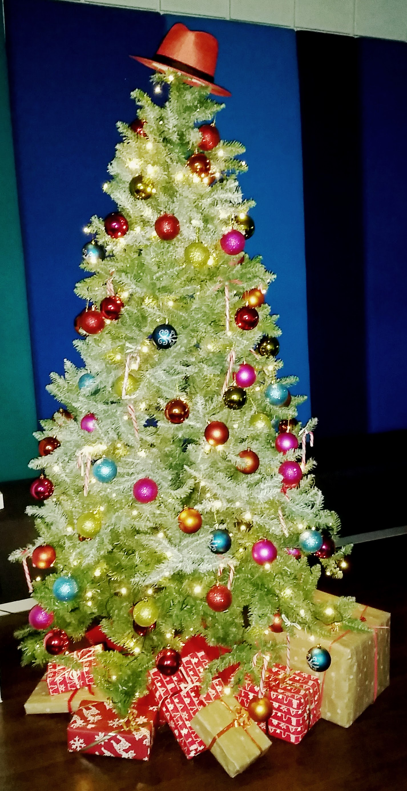

 

 It has been an amazing year for me. With 31 trips to 13 countries and a total of 110k miles traveled, I have seen a lot of places and spoken at many conferences and user groups. I had the pleasure to talk to many many people and learned a lot about technology and community. The main topics in my past year have been the Red Hat JBoss middleware integration technologies. Mixing those with my Java EE knowledge and also look into new topics like microservices made this a very fast paced year.
 
 <b>84 Blog Posts</b>
 
 Here are the top 5 posts on my blog this year. It's always interesting to see, what helps my readers the most. Thank you for all the visits and comments on the overall 84 blog posts (including this one) this year.
 
 
 1)&nbsp;<a href="http://blog.eisele.net/2015/01/nosql-with-hibernate-ogm-part-one.html" target="_blank">NoSQL with Hibernate OGM - Part one: Persisting your first Entities</a>
 
 2)&nbsp;<a href="http://blog.eisele.net/2015/01/jdbc-realm-wildfly820-primefaces51.html" target="_blank">JDBC Realm and Form Based Authentication with WildFly 8.2.0.Final, Primefaces 5.1 and MySQL 5</a>
 
 3)&nbsp;<a href="http://blog.eisele.net/2015/01/ssl-with-wildfly-8-and-undertow.html" target="_blank">SSL with WildFly 8 and Undertow</a>
 
 4) <a href="http://blog.eisele.net/2015/10/my-book-modern-java-ee-design-patterns.html" target="_blank">My Book: Modern Java EE Design Patterns</a>
 
 5)&nbsp;<a href="http://blog.eisele.net/2015/01/java-ee-docker-wildfly-and-microservices-on-docker.html" target="_blank">Java EE, Docker, WildFly and Microservices on Docker</a>
 
 <b>3381 Tweets</b>
 
 Social Media is a significant part of my daily life. Mostly because of the many inspirations and I think that it is a very quick and convenient way to catch up with latest happenings and developments. Beside tweeting from <a href="http://www.twitter.com/myfear" target="_blank">@myfear</a> I also look after the <a href="http://www.twitter.com/jbossdeveloper" target="_blank">@jbossdeveloper</a> handle. And help run the <a href="http://www.twitter.com/vjbug" target="_blank">@vjbug</a>. Feel free to catch up with any of them and stay updated with latest happenings and rumblings in the Java/Java EE ecosystem.
 
 <b>One (mini) Book</b>
 
 I did it. Found some time to write a little more than just a blog post. And the feedback I got was pretty amazing. The <a href="http://blog.eisele.net/2015/10/my-book-modern-java-ee-design-patterns.html" target="_blank">Modern Java EE Design Pattern mini book</a> can be downloaded for free from the <a href="" target="_blank">developers.redhat.com</a> website. Just register, benefit from all the free content available there and get a great overview about how DevOps, Microservices, Containers and PaaS influence the way we design and developer applications tomorrow. If you don't have time for the complete book, register and re-watch the accompanying <a href="http://blog.eisele.net/2015/12/java-ee-microservices-architecture.html" target="_blank">O'Reilly webcast</a>.
 
 <b>And The Best Wishes For The New Year</b>
 
 Beside the already mentioned events and happenings, a lot more was going on over the turn of the year. And I can't wait to start over in 2016. Le't all take some precious offline hours with friends, kids and loved ones and prepare for the new challenges. I am really looking forward to meet a lot of you next year. The first conferences have already been announced and you can <a href="http://blog.eisele.net/p/about-me.html" target="_blank">follow my schedule on my blog page</a>.
 
 
<blockquote class="tr_bq">
 “We spend January 1st walking through our lives, room by room, drawing up a list of work to be done, cracks to be patched. Maybe this year, to balance the list, we ought to walk through the rooms of our lives...not looking for flaws, but for potential.”
  
 ― Ellen Goodman
</blockquote>
 