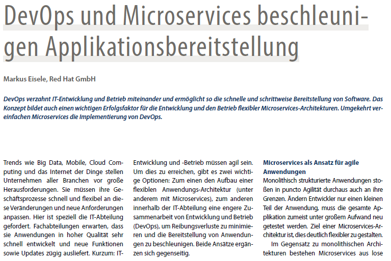

 

 Happy new year everybody! While I'm officially still on vacation, I'd quickly like to point you to a recent DevOps and Microservices article in the German DOAG Business News. You can <a href="https://dl.dropboxusercontent.com/u/5384959/04_2015-Business_News-Markus_Eisele-DevOps_und_Microservices_beschleunigen_Applikationsbereitstellung.pdf" target="_blank">download your copy directly via this link</a> (PDF, ~300 KB).
 
 
 The <a href="http://www.doag.org/en/wissen/publikationen/fachzeitschriften/business-news.html" target="_blank">Business News</a> is a DOAG trade journal publication and is published four times a year. It covers basic business relevant topics from a semi technical perspective. Please be aware, that the linked PDF is in German. If you want to learn more I recommend the following articles:
 
 
 
<ul>
 <li><a href="http://www.infoq.com/news/2015/11/eisele-microservices" target="_blank">Microservices, DevOps and PaaS - The Impact on Modern Java EE Architecture</a></li>
 <li><a href="" target="_blank">Microservices and Java EE</a></li>
 <li><a href="http://blog.eisele.net/2015/12/java-ee-microservices-architecture.html" target="_blank">Java EE Microservices Architecture - O'Reilly Webcast</a></li>
 <li><a href="http://blog.eisele.net/2015/10/my-book-modern-java-ee-design-patterns.html" target="_blank">Modern Java EE Design Patterns - Building Scalable Architecture for Sustainable Enterprise Development</a></li>
 <li><a href="http://radar.oreilly.com/2015/08/coding-in-a-cloud-based-enterprise.html" target="_blank">Coding in a cloud-based enterprise</a></li>
</ul>