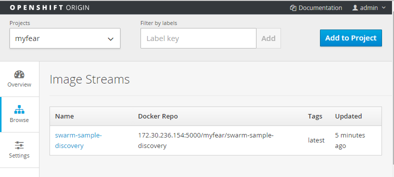

I've been using OpenShift since a while now. For many reasons. First of all, I don't want to build my own Docker and Kubernetes environment on Windows and second of all, because I like the simple installation. After the Christmas holidays I decided to upgrade my machine to Windows 10. While I like the look and feel, it broke quite a bit of networking and container installments including the Docker and OpenShift environments. Now that I have everything up and running again, it is time to follow the microserivces path a little more. The first thing is to actually get OpenShift up and running and get a development environment setup in which we can simply push Docker images to it without having to use any of the Source-2-Image or OpenShift build mechanisms.
 
 <b>Installing the all-in-one-VM</b>
 <a href="" target="_blank">Download the all-in-one-vm</a> image and import it into the vagrant box. This image is based off of OpenShift Origin and is a fully functioning OpenShift instance with an integrated Docker registry. The intent of this project is to allow Web developers and other interested parties to run OpenShift V3 on their own computer. Given the way it is configured, the VM will appear to your local machine as if it was running somewhere off the machine. Which is exactly what I need to show you around in OpenShift and introduce some more features. If you need a little more assistance follow the <a href="http://blog.eisele.net/2015/09/running-openshift-origin-on-windows.html" target="_blank">method 2 in this earlier blog-post</a>.
 
 I also assume, that you have docker-machine running. You can install it via the <a href="" target="_blank">Docker Toolbox</a>.
 
 <b>First steps in OpenShift</b>
 
 Fire up the magazine via vagrant up and redirect you browser to&nbsp;https://localhost:8443/. Accept the certificate warning and enter admin/admin as login. You're now browsing through the admin console. Let's create a new project to play around with:
 
<pre class="code"><code>oc login https://localhost:8443 # enter admin/admin as the credentials oc new-project myfear --description="Testing random Docker Images on OpenShift" --display-name="Myfears test project" # Add admin role to user myfear oc policy add-role-to-user myfear admin -n myfear </code></pre> First thing to do is to actually get a MySql database up and running. I want to use that in subsequent blog-posts and it's a good test to see if everything is working. Get the two json files from the my github repository and execute the following commands:
 
<pre class="code"><code>oc create -f <a href="https://github.com/myfear/WildFlySwarmDiscoverySample/blob/master/mysql-pod.json" target="_blank">mysql-pod.json</a> oc create -f <a href="https://github.com/myfear/WildFlySwarmDiscoverySample/blob/master/mysql-service.json" target="_blank">mysql-service.json</a> </code></pre> Go back to your browser and select the myfear project and see the mysql service up and running with one pod.
 
 <b>Using the OpenShift Registry</b>
 
 You just witnessed how OpenShift pulled the mysql image and started a pod with a container on it. Obviously this image came from the built in registry. But how can one actually upload a docker image to the internal OpenShift registry? Ssh into the vagrant machine and look around a bit:
 
<pre class="code"><code>vagrant ssh docker ps </code></pre> You see a lot of running containers and one of them is running the openshift/openshift-registry-proxy. This little gem actually forwards the port 5000 from the internal docker registry to the vagrant vm. Open Virtualbox and look at the port forwarding rules there. Another rule forwards port 5000 from the guest to the host. This means, the internal OpenShift Docker registry is already exposed by default. But how do we push something there? The docker client requires a docker host to work. The OpenShift Docker Daemon isn't exposed externally and you can't just point your docker client to it.
 
 This means, you need another docker host on your machine which is configured to access the OpenShift docker registry as external registry. I'm using docker-machine here, because it is extremely easy to create new docker hosts with it.
 
<pre class="code"><code>docker-machine create -d virtualbox dev </code></pre> After a couple of seconds your "dev" vm is created and started. Now we need to find out, what the host system's IP address is from the dev box. Ssh into the machine and get the ip of the default gateway:
 
<pre class="code"><code>docker-machine ssh dev $ ip route | grep default &gt; 10.0.0.2 </code></pre> Now we need to stop the machine and add the ip address we found to the insecure registry part of the configuration:
 
<pre class="code"><code>docker-machine stop dev edit &nbsp;~/.docker/machine/machines/default/config.json # Add the found ip address plus the registry port to the HostOptions =&gt; EngineOptions =&gt; &nbsp;InsecureRegistry array </code></pre> Afterwards it should look like this:
 
<pre class="code"><code>&nbsp;"InsecureRegistry": [ &nbsp; &nbsp; &nbsp; &nbsp; &nbsp; &nbsp; &nbsp; &nbsp; "10.0.2.2:5000" &nbsp; &nbsp;] </code></pre> time to re-start the dev vm and get the docker client configured for it:
 
<pre class="code"><code>docker-machine start dev FOR /f "tokens=*" %i IN ('docker-machine env dev --shell cmd') DO %i </code></pre> That's it for now. One important thing is, that the internal registry is secured and we need to login to it. Get the login token for the user "myfear" with the following commands:
 
<pre class="code"><code>oc login -u myfear oc whoami -t </code></pre> This will return something cryptic like:&nbsp;dV2Dep7vP8pJTxNGk5oNJuqXdPbdznHrxy5_7MZ4KFY. Now login to the registry:
 
<pre class="code"><code>docker login -u myfear -p dV2Dep7vP8pJTxNGk5oNJuqXdPbdznHrxy5_7MZ4KFY -e markus@someemail.org 10.0.2.2:5000 </code></pre> Make sure to use the correct username and token. You get a success message with and your login credentials are being saved in the central config.json.
 
 <b>Build and push the custom image</b>
 
 Time to finally build the custom image and push it. I am using Roland's docker maven plugin again.
 
 If you want to learn more about it, there is an <a href="http://blog.eisele.net/2015/10/wildfly-swarm-jax-rs-microservice-on-docker.html" target="_blank">older blog-post about it</a>. Also find the code in this <a href="https://github.com/myfear/WildFlySwarmDiscoverySample" target="_blank">github repository</a>. Compare the <a href="https://github.com/myfear/WildFlySwarmDiscoverySample/blob/master/pom.xml" target="_blank">pom.xml</a> and make sure to update the docker.host and docker.registry properties
 
<pre class="code"><code>&nbsp; &lt;docker.host&gt;tcp://192.168.99.101:2376&lt;/docker.host&gt; &nbsp; &lt;docker.registry&gt;10.0.2.2:5000&lt;/docker.registry&gt; </code></pre> and the &lt;authConfig&gt; section with the correct credentials. Build the image with:
 
<pre class="code"><code>mvn clean install docker:build docker:push </code></pre> If you ran into an issue with the maven plugin not being able to build the image, you may need to pull the jboss/base-jdk:8 image manually first:
 
<pre class="code"><code>docker pull jboss/base-jdk:8 </code></pre> Let's check, if the image is successfully uploaded by using the console and navigating to the overview =&gt; image streams page.
 

 

 And in fact, the image is listed. Now, we need to start a container with it and expose the service to the world:
 
<pre class="code"><code>oc new-app swarm-sample-discovery:latest --name=swarm oc expose service swarm --hostname=swarm-sample-discovery.local </code></pre> Please make sure to add the hostname mapping to your hosts or dns configuration (to 127.0.0.1). As you can see, I am no longer using the docker image tag but the image stream name. OpenShift converted this internally.
 
 Time to access the example via the browser http://swarm-sample-discovery.local:1080/rs/customer.
 
 If you're wondering about the port go back to the Virtualbox configuration and check the nat section. The all on one vm actually assumes, that you have something running on port 80 already and maps the vm ports to the 1080 host port.
 
 The application does very little for now, but I will use this in subsequent blog-posts to dig a little into service discovery options.
 
 The console overview shows the two services with one pod each.
 
 

 

 
 That's it for today. Thanks again to Roland for his help with this. Let me know, if you run into issues and if you want to know something else about OpenShift and custom images.
 
 