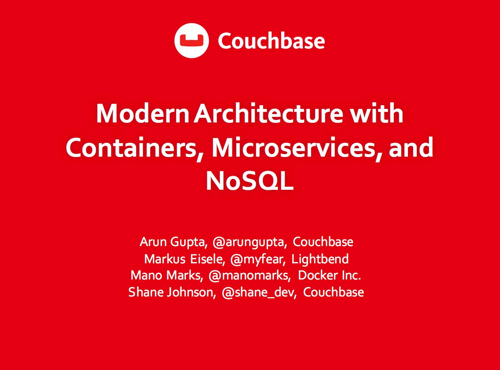
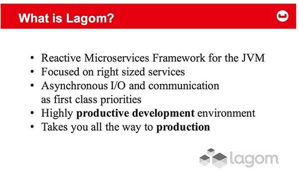

 

 On&nbsp;Tuesday, May 10, 2016 I had the pleasure to join Arun Gupta (Couchbase), Mano Marks (Docker) and Shane Johnson (Couchbase) for a great webinar with ADTMag. You can watch the complete <a href="https://adtmag.com/webcasts/2016/04/couchbase-may10.aspx?partnerref=refer" target="_blank">replay for free after registration</a>. This blog highlights some of the most prominent findings and provides a brief writeup.
 
 
 After a short introduction of the main business drivers behind the new architectures and the panel by Arun Gupta, it was time for Mano Marks (@manomarks) from Docker to give an overview of the container hype. With applications changing from centralised server installations which very rarely got updated to loosely coupled services with a high update frequency running on my small servers, containers provide a standard format which is easily portable between environments. Docker provides a great ecosystem around their products and is a solid foundation for applications following the new principles.
 
 

 

 After Mano, it was my part. I did an overview from where we came from in terms of monolithic applications and why they survived so long including their advantages. With the introduction of microservices or better "right-sized" services we finally start to build systems for flexibility
 
 and resiliency, not just efficiency and robustness. The relevant aspects for a successful microservices architecture are plenty and not easily to be achieved by using a single framework. You also have to respect the architecture, software design, methodology and organisation and also embrace the distributed systems thinking. I introduced the audience to some available decomposition strategies and also gave a very quick rundown about the Lightbend microservice framework <a href="http://www.lightbend.com/lagom" target="_blank">Lagom</a>.
 
 
 Shane finished the presentation part of the webinar with an overview about the capabilities of the Couchbase server and how it supports application modernisation and microservice base architectures. The following FaQ with all the panelists tried to answer some of the most pressuring audience questions.
 
 
 The whole webinar runs for an hour and it is packed with all the latest information around modern architectures. With the additional minutes spend on an hour, this is pretty much the most recent information you can get on the topic by the top speakers in the field. If you have nothing to do on this rainy weekend I highly recommend to watch it!