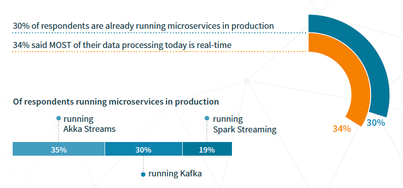

 

 Lightbend recently ran a survey with more than 2000 JVM developers and the results just got published. The survey was launched to discover: &nbsp;correlations between development trends and IT infrastructure trends, how organizations at the forefront of digital transformation are modernizing their applications, and real production usage break-downs of today’s most buzzed about emerging developer technologies. While you can download the <a href="https://info.lightbend.com/COLL-20XX-Enterprise-Development-Trends-2016-Report_RES-LP.html?lst=BL" target="_blank">complete results from the official website</a>, I would love to highlight some particular things that I found very interesting. Especially around containers and microservices.
 
 <b>Lightweight Containers Are Democratising Infrastructure and Challenging the Old Guard Java EE App Servers</b>
 

 

 The momentum around containers has gone much more quickly than many anticipated. People are looking at containers as that great hope for infrastructure portability that they’ve been chasing for a long time. And I was always interested in learning about how containers are actually used by developers in the wild. And bottom line is, that containers are really happening in production right now. What types of applications are people putting in containers is the million dollar question. Today it’s primarily greenfield applications, with far fewer examples of legacy applications being modernized for containers in production. This is the reason, that everybody is looking for more leightweight approaches to run their applications on the JVM without the overhead of Java EE servers. The survey has more details around which kind of containers and orchestration models.
 
 <b>Microservices and Fast Data Are Driving Application Modernization Efforts</b>
 

 

 Microservices-Based Architectures advocate the creation for a system build from a collection of small, isolated services, each of which owns their data, and is independently isolated, scalable and resilient to failure. Services integrate with other services in order to form a cohesive system that’s far more flexible than legacy monolithic applications. But how is this taken into production? Are people already building those systems or is this just a hype? Almost three third of the respondents run a microservice based system in production. And as I've been talking about in my talks before, the driver is mostly the need for real time data handling and streaming requirements.
 
 
 The survey reveals a lot more details and I strongly suggest, that you <a href="https://info.lightbend.com/COLL-20XX-Enterprise-Development-Trends-2016-Report_RES-LP.html?lst=BL" target="_blank">look at the details of it</a>. One thing is for sure, the changing requirements put on today's architectures can't be easily meet by just creating new applications on old platforms. And even Java EE is starting to adopt those new principles as JavaOne will hopefully how in a couple of days. I keep you posted.