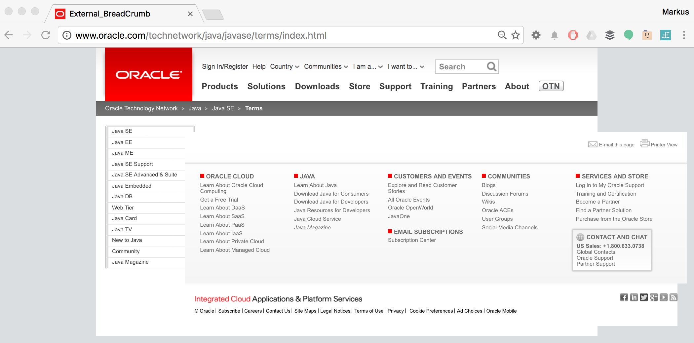

<table cellpadding="0" cellspacing="0" class="tr-caption-container" style="float: right; margin-left: 1em; text-align: right;">
 <tbody>
  <tr>
   <td style="text-align: center;"></td>
  </tr>
  <tr>
   <td class="tr-caption" style="text-align: center;">Screenshot from the Oracle Website (<a href="http://www.oracle.com/technetwork/java/javase/terms/index.html" rel="nofollow" target="_blank">source</a>)</td>
  </tr>
 </tbody>
</table> So. Oracle want's to make money from Java. And The Register published a very <a href="" rel="nofollow" target="_blank">polarising piece with a super catchy</a> title about it. According to their sources, "Oracle is massively ramping up audits of Java customers it claims are in breach of its licences". While the Twitter-verse went ballistic about people criticising Oracle's behaviour, I want to take a minute to recap, why I am against this method and clarify, that the normal developer and user have nothing to fear!
 
 <b>People complaining about Oracle are hurting the community</b>
 
 You know me in and around the Oracle-sphere since many years. And tweeting at the moment is probably the most important part of how you can get the lastest news about me. I rarely post on this blog lately, because there is so much to do and I do a bunch of posts for my employer already.
 
 The tweet I send was basically the title of The Register article and replies and reactions implied that just by spreading a FUD article, I am hurting the community. Let's look into the details.
 
 <b>Are Java developers affected?</b>
 <b><i>NOTE: First of all, I am not a lawyer. This isn't mean to be a legal advice! If you are in doubt over your compliance to the BCL, contact a licensing lawyer, your local Oracle User Group or Oracle.</i></b>
 
 
 NO. We are covered. The Binary Code License (BCL) explicitly mentions:
 
 
 "Oracle grants you a non-exclusive, non-transferable, limited license without fees to reproduce internally and use internally the Software complete and unmodified for the purpose of designing, developing, and testing your Programs."
 
 (<a href="http://www.oracle.com/technetwork/java/javase/terms/license/index.html" rel="nofollow" target="_blank">BCL, April 2013</a>)
 
 
 There are some cases you should be aware of.
 
 
 "You may not use the Commercial Features for running Programs, Java applets or applications in your internal business operations or for any commercial or production purpose, or for any purpose other than as set forth in Sections B, C, D and E of these Supplemental Terms."
 
 (<a href="http://www.oracle.com/technetwork/java/javase/terms/license/index.html" rel="nofollow" target="_blank">BCL, April 2013</a>)
 
 
 - If you use a commercial feature in your local environment and stage it to test, you might not be covered.
 
 - If you are accessing any of the &nbsp;JMX MBeans under oracle.jrockit.management and bea.jrockit.management to enable observation of a running JVM, independently of the monitoring solutions, you are not covered.
 
 - Flight Recorder, Mission Control and everything mentioned in the below linked PDF are commercial and you can only use them on your local machine.
 
 
 A complete list of commercial features is listed in Table 1-1 on page 5 of the <a href="http://www.oracle.com/technetwork/java/javase/documentation/java-se-product-editions-397069.pdf" target="_blank">Java SE product edition description (PDF)</a>. As a general rule of thumb, make sure to NOT use the -XX:+UnlockCommercialFeatures option.
 
 
 This mostly affects companies who are already Oracle customers and have access to the commercial features, that are most interesting (e.g. MSI Enterprise installer). Funny enough, WebLogic for example includes a Java SE license (<a href="https://docs.oracle.com/cd/E23943_01/doc.1111/e14860/products.htm#FMWLC109" target="_blank">random product link</a>).
 
 <b>I'm still afraid, what are the alternatives?</b>
 
 You can go with various alternatives. First of all, there is the <a href="" target="_blank">OpenJDK</a> itself. Windows builds are a little tricky, as they are not available directly from the project. Only latest development releases are available for Windows. But you can also get binaries from Azul (<a href="" target="_blank">Zulu</a>) and <a href="" target="_blank">Red Hat</a>. If you are a Red Hat customer of any JBoss Middleware product, you also get support from them.
 
 <b>Why do I dislike what Oracle does?</b>
 
 I do like, that Oracle is sponsoring the Java development and I acknowledge that they invest significant manpower into the project. But that doesn't get them a carte blanche to get away with everything.
 
 My main point of criticism is, that Oracle makes it easy to accidentally use commercial features. And yes, as people on Twitter pointed out, you should have just read the license and know about it. But as a matter of fact, I believe that separation of concerns is a good design decision. Instead of directing potential customers and users from the OpenJDK site to java.oracle.com with the comment "which are based largely on the same code" and not even distantly mentioning, that these do contain commercial features which you aren't allowed to use, it would be easier to have separate commercial and open source builds.
 
 
 If you click around on the Oracle Java website you have a couple of hints at Licenses. But they don't get you the full picture.
 
<table align="center" cellpadding="0" cellspacing="0" class="tr-caption-container" style="margin-left: auto; margin-right: auto; text-align: center;">
 <tbody>
  <tr>
   <td style="text-align: center;"></td>
  </tr>
  <tr>
   <td class="tr-caption" style="text-align: center;">Java SE Licenses overview page (<a href="http://www.oracle.com/technetwork/java/javase/overview/licensees-jsp-136136.html" rel="nofollow" target="_blank">source</a>)</td>
  </tr>
 </tbody>
</table>
 
 And there are plenty of more examples. The number one search result from (my personalized) Google for "Java License Business" leads to <a href="http://www.oracle.com/technetwork/java/javase/training/javaforbusiness-136960.html" rel="nofollow" target="_blank">this page for example</a>. Speaking of misleading information, I think, this is a good example. If license conditions aren't well known, it's also easier to change them. Which probably hasn't been the case, since the BCL PDF linked was last updated 02 April 2013.
 
 
 My personal opinion is, that it can't be healthy for the community to stop improving. And improvements don't come from silence. Unfortunately, Oracle doesn't have a great history in listening to their communities which also might lead to some catchy and inappropriate headlines from time to time. Nevertheless, let's stay wary and keep communicating things that could improve. It'll help the community more than it hurts in the long run: Open communication is a sign of a healthy community and the way it deals with feedback and criticism is the gauge for their values.