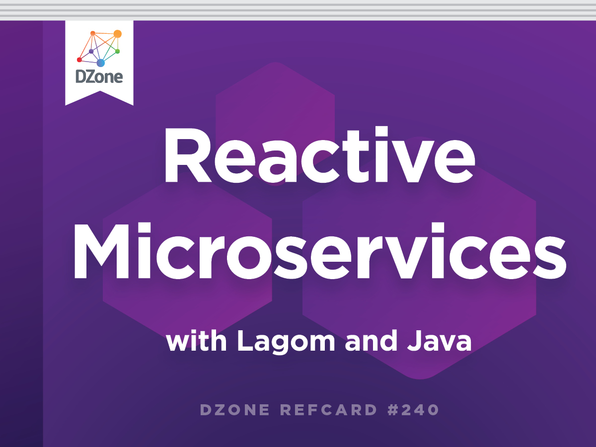

 

 Wow. I haven't blogged here in a while. Good news, the blog isn't dead and not going to die anytime soon. I'm just spending a lot of time blogging over at <a href="https://www.lightbend.com/blog" target="_blank">lightbend.com/blog</a> (Have you seen the monthly <a href="https://www.lightbend.com/blog?query=Tech+Digest" target="_blank">Lightbend Tech Digest</a> yet?) and also help developing additional content around our open source projects. Mostly Lagom. And I am very happy to announce that my first Refcard was published on DZone today: And it is about Lagom, obviously!
 
 
 Refcard #240
 <b><a href="https://dzone.com/refcardz/reactive-microservices-with-lagom-and-java" target="_blank">Reactive Microservices With Lagom and Java</a></b>
 <i>The Reactive Microservices Framework</i>
 
 
 This Refcard helps you with your first steps in Lagom. Lagom is a framework that helps you to build reactive microservices.
 
 
 Most microservices frameworks focus on helping you build fragile, single instance microservices - which, by definition, aren’t scalable or resilient. Lagom helps you build microservices as systems — Reactive systems, to be precise — so that your microservices are elastic and resilient from the start and don’t require extra plumbing around them.
 
 
 Building Reactive Systems can be hard, but Lagom abstracts the complexities away. Akka and Play do the heavy lifting underneath and developers can focus on a simpler event-driven programming model on top while benefitting from a message-driven system under the hood. Lagom provides an opinionated framework that acts like guide rails to speed you along the journey. Lagom tools and APIs simplify development and deployment of a system that includes microservices.
 
 
 Don't forget to check out your weekend reading list:
 
 
<ul>
 <li><a href="" target="_blank">Lagom Documentation</a></li>
 <li>The <a href="https://github.com/lagom" target="_blank">Lagom GitHub</a> project</li>
 <li><a href="https://www.lagomframework.com/get-involved.html" target="_blank">Get involved and contribute</a></li>
 <li><a href="https://info.lightbend.com/COLL-20XX-Reactive-Microservices-Architecture-RES-LP.html" target="_blank">Reactive Microservices Architecture</a> by Jonas Bonér</li>
 <li><a href="https://info.lightbend.com/COLL-20XX-Developing-Reactive-Microservices_RES-LP.html" target="_blank">Developing Reactive Microservices</a> by me.</li>
</ul>