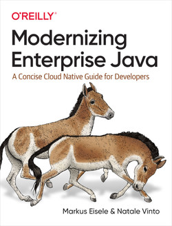

I haven't blogged in&nbsp;4 years, 10 months, and 1 day. A long time. Many things have happened, and I have continued my journey mostly on Twitter and LinkedIn. But there's one thing in particular that I really want on this blog: My new book. Already released on October 21 but is still <a href="https://developers.redhat.com/e-books/modernizing-enterprise-java" rel="nofollow" target="_blank">available as a free PDF download</a> from the Red Hat Developer website.&nbsp;

 

Thank you to my co-author <a href="https://twitter.com/natalevinto" rel="nofollow" target="_blank">Natale Vinto</a> for an amazing experience and result!&nbsp;

While containers, microservices, and distributed systems dominate discussions in the tech world, the majority of applications in use today still run monolithic architectures that follow traditional development processes. This practical book helps developers examine long-established Java-based models and demonstrates how to bring these monolithic applications successfully into the future.

Relying on their years of experience modernizing applications, authors Markus Eisele and Natale Vinto walk you through the steps necessary to update your organization's Java applications. You'll discover how to dismantle your monolithic application and move to an up-to-date software stack that works across cloud and on-premises installations.

<ul style="text-align: left;">
 <li>Learn cloud native application basics to understand what parts of your organization's Java-based applications and platforms need to migrate and modernize</li>
 <li>Understand how enterprise Java specifications can help you transition projects and teams</li>
 <li>Build a cloud native platform that supports effective development without falling into buzzword traps</li>
 <li>Find a starting point for your migration projects by identifying candidates and staging them through modernization steps</li>
 <li>Discover how to complement a traditional enterprise Java application with components on top of containers and Kubernetes</li>
</ul>

  

