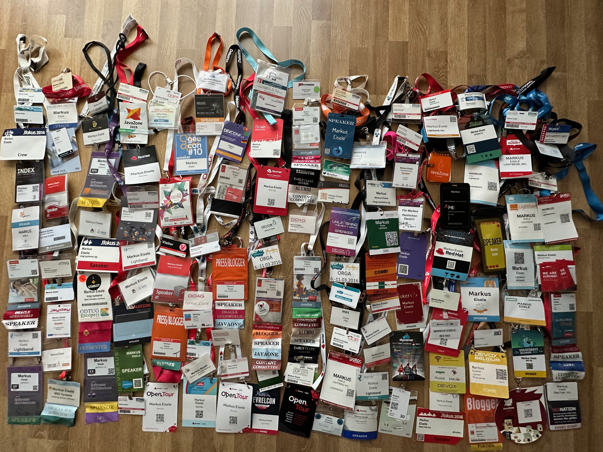

 

Some people have asked me, why I don't travel and speak at conferences anymore and I wanted to write about it anyway. So, here it is:

There are in fact some reasons. And while I initially thought I get away with just tweeting the few points,  
 I realised it’s more.

Also: Don’t think this is a goodbye or my official resignation as public speaker. It’s more my personal decision making list that I apply to every single request that reaches me offering a speaking slot somewhere. I will be around. Probably on-stage or on-cam occasionally and as much or little as you like to hear my wonderful German accent. I repeat:  <b>Not a goodbye!&nbsp;</b>

1. Health. The most important one is that it's not good for my health. I've done this long enough and I'm at the point where I've seen hundreds of events and racked up a distance that covers 25 times around the world. It's just not as much fun anymore as it used to be when I was 10 years younger ;-)&nbsp;

2. CO2. TripIt estimates a total of 250 tCO2 for this just for the last 10 years. And I'm sure I missed some trips. I've done my damage. That's multiple times as much as an individual should have "consumed" during that time.&nbsp;

3. Online. We came a long way with streaming and video. I built out a little studio in my basement and can do a ton of presentations remotely. Yep, I miss the vibe. Yes, I miss seeing my audience. But this is the best I can offer now. And the thing I like the most is, that I can wear what I like and don’t have to put on shoes :)

4. Children. My kids aren't grown up yet. And I've missed way too many days already. So, I prefer to be with them over everything else. Yes, even conferences with amazing people and friends. Something I realised late is that there’s not a lot of legacy we leave behind. The important one for me are the two. I want to make sure they are able to stand on their own feet and get an opportunity to learn what’s necessary. Nobody knows how much time is left. Don’t read too much into this sentence btw. It reads deeper than it probably should.

5. Topics. Our industry is amazing and we keep reinventing the wheel over and over calling it different names. I've seen a lot. And it's harder to excite me year after year. I'd really like to not jump on every single new thing over and over just to be accepted at events. Let's try talking some sense into topics again and cover some basics. Nothing I could get accepted as paper at conferences anywhere. Seems as if we're all just looking for the next cool aid. That's not what I belive enterprise development should be looking for.&nbsp;

6. Budget. Everyone has been waiting for this. Macroeconomics aren't looking good. Money isn't available as it used to. Even coffee is shitty expensive. I want to do my part and not be part of the problem we're all seeing. If there's no reason to go but to talk 45 minutes in front of a crowd but it involves 2+ days of travel? I don't think this is the right thing to do right now.

7. Beer. Or alcohol and parties. I'm not a big social guy anymore. My life changed. The pandemic changed me. I haven't touched a drop of alcohol in a solid year and I don't think I want to anymore. It might have a fair place in social evening events and I am not judging anyone for enjoying it but I can't envision myself drinking water in the midst of beer central. And I also don't want to just stay at my hotel. Maybe we have to rethink how we run the social parts of conferences. Maybe I am just getting old and boring.&nbsp;

8. Schedules. My job changed plenty of times in my career. And I always had tight schedules. But working with an amazing team on tomorrows technologies and things that make developer’s lives easier is consuming a lot of attention. While I’ve been pretty good at working from wherever I wanted whenever I had to, I am enjoying the deeply focussed times more and more. It’s easier to get things done and meet deadlines without a toll on my health and a lot less stress. Also, I can fit my workout schedules into my days and not mess around with jetlag and timezones.&nbsp;

9. Political situation. Thankfully I was born in a country that lets me travel almost everywhere. And I have been traditionally very picky with choosing my destinations. The short list grows smaller year after year with recent events making it even harder to see some of the amazing engineers and developers in the east. I do not want to have to chose where I can and can’t go.&nbsp;

10. Next generation of speakers. I was tempted to start this sentence ranting about my age again ;) But you’d read too much into that again ;) There’s plenty of talented, engaged, curious, motivated, brilliant, young speakers out there that I think belong on stages. Across the world. Give them the opportunity to grow their career. To share what they know being in the stage light. There’s no point in seeing the same old dudes at every event talking the same things. Broaden your horizon. See someone talk who you’ve never listened to.&nbsp;

Turned out, it became not less than 10 reasons for me to be very picky with speaking engagements. And just maybe I have written this more for myself than for anybody else to have a good overview to point people to when I am asked about the why.&nbsp;
