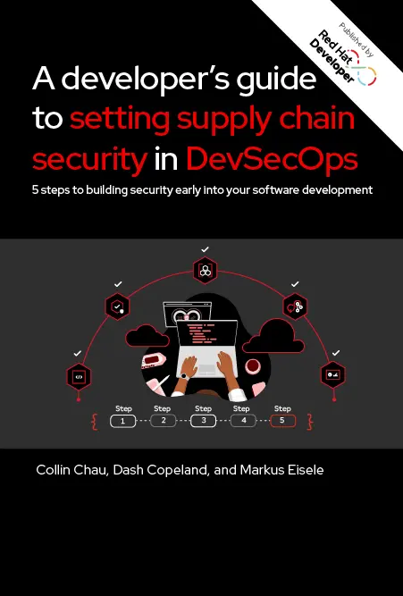

I missed to update you folks on a couple of things. If you are following me on Twitter or LinkedIn this went by your timeline some days ago already. But it is also time to add it to this blog. I have co-authored a little ebook that talks about the importance of DevSecOps for Developers and how it comes together with secure software supply chains.

Developers play a crucial role in implementing DevSecOps practices because they are responsible for writing the code that makes up the software. However, many developers don't have strong security backgrounds and might not be aware of the best practices to code, build, and monitor the software supply chain for their software factory.

This short guide provides a developer's introduction to software supply chain security, including the key principles, tools, and techniques you need to know to better audit and act on vulnerabilities in open source software components. Start integrating security guardrails across your software development life cycles to catch security issues early.

Threats to software supply chain security have forced a sea change in DevOps practices in favor of a DevSecOps strategy where security is a fundamental and ongoing aspect of the software development life cycle. Software engineering leaders mitigate software supply chain risks by focusing on the security of software components and dependencies early in the software development life cycle. They enforce integrated security gates at every phase for consistent, repeatable, and automated operations in the software factory.

The overall market is moving toward application platforms that can provide for the fast, secure, continuous deployment of great software experiences that companies compete by. But the reality is that enterprises often struggle with running these parallel tasks. Their challenges include the following:

<ul style="text-align: left;">
 <li>Maintaining and improving legacy applications and infrastructure is complicated and places strain on already limited IT resources.</li>
 <li>Building and running brand new applications using modern frameworks and cloud-native application architectures increases cognitive load for dev teams.</li>
 <li>Security is often an afterthought that’s handled by security and IT operations teams at the end of the application development life cycle, with little to no collaboration with app development and other teams.</li>
 <li>Disparate application security and DevOps tools, practices, and disjointed processes result in tool sprawl; this impedes collaboration, visibility, and productivity and increases the chance of human error.</li>
</ul>

As a result, organizations often fail to catch security issues early, when they are easier and less expensive to fix. This increases the risk of security breaches and hinders the speed and efficiency of application development and delivery.

Download your free copy from <a href="http://developers.redhat.com" target="_blank">developers.redhat.com</a>
